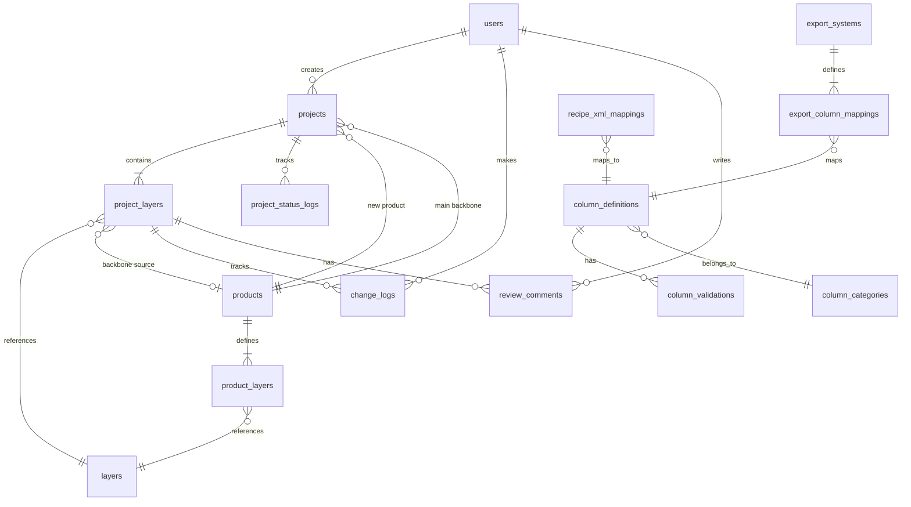

# Process Condition Manager - DB 스키마 설계

> **버전**: v1.0  
> **작성일**: 2025-02-10  
> **저장 전략**: JSONB (조건 데이터) + EAV (변경 이력)

---

## 1. ERD 개요



---

## 2. 테이블 상세

### 2.1 사용자 및 인증

#### `users` — 사용자

| 컬럼 | 타입 | 설명 |
|------|------|------|
| `id` | SERIAL PK | |
| `username` | VARCHAR(50) UNIQUE | 로그인 ID |
| `display_name` | VARCHAR(100) | 표시 이름 |
| `role` | VARCHAR(20) | 'editor' / 'reviewer' / 'admin' |
| `is_active` | BOOLEAN | 활성 여부 |
| `created_at` | TIMESTAMPTZ | |
| `updated_at` | TIMESTAMPTZ | |

---

### 2.2 제품 및 레이어 (마스터 데이터)

#### `products` — 제품 마스터

| 컬럼 | 타입 | 설명 |
|------|------|------|
| `id` | SERIAL PK | |
| `product_name` | VARCHAR(100) UNIQUE | 제품명 (예: PROD-2024X) |
| `description` | TEXT | |
| `is_backbone` | BOOLEAN | backbone으로 사용 가능 여부 |
| `created_at` | TIMESTAMPTZ | |

#### `layers` — 레이어 마스터

| 컬럼 | 타입 | 설명 |
|------|------|------|
| `id` | SERIAL PK | |
| `layer_name` | VARCHAR(100) UNIQUE | 레이어명 (예: AA_PHOTO) |
| `sort_order` | INTEGER | 표시 순서 |
| `created_at` | TIMESTAMPTZ | |

> 레이어는 제품 간 동일한 이름을 공유하므로 별도 마스터로 관리

#### `product_layers` — 제품-레이어 관계 + 양산 조건 데이터

| 컬럼 | 타입 | 설명 |
|------|------|------|
| `id` | SERIAL PK | |
| `product_id` | FK → products | |
| `layer_id` | FK → layers | |
| `conditions` | JSONB | 해당 레이어의 공정 조건 (300개 key-value) |
| `created_at` | TIMESTAMPTZ | |
| `updated_at` | TIMESTAMPTZ | |

> **UNIQUE(product_id, layer_id)**  
> `conditions` 예시: `{"SP_PR_TYPE": "KrF-A01", "SP_PREBAKE_TEMP_C": 110, "SC_EXPOSE_ENERGY_mJ": 35.5, ...}`  
> 이 테이블은 양산 확정된 기존 제품의 조건 데이터 (backbone 소스)

---

### 2.3 프로젝트 (신규 제품 작업 단위)

#### `projects` — 프로젝트 (신규 제품 조건표 작업)

| 컬럼 | 타입 | 설명 |
|------|------|------|
| `id` | SERIAL PK | |
| `product_id` | FK → products | 신규 제품 |
| `main_backbone_id` | FK → products | 메인 backbone 제품 |
| `status` | VARCHAR(20) | 'draft' / 'review' / 'approved' / 'rejected' |
| `created_by` | FK → users | 생성자 |
| `reviewed_by` | FK → users NULL | 검토자 |
| `created_at` | TIMESTAMPTZ | |
| `updated_at` | TIMESTAMPTZ | |
| `approved_at` | TIMESTAMPTZ NULL | 승인 일시 |

#### `project_layers` — 프로젝트 내 레이어별 조건 데이터

| 컬럼 | 타입 | 설명 |
|------|------|------|
| `id` | SERIAL PK | |
| `project_id` | FK → projects | |
| `layer_id` | FK → layers | |
| `backbone_product_id` | FK → products NULL | 이 레이어의 backbone 출처 |
| `conditions` | JSONB | 현재 편집 중인 조건 데이터 |
| `backbone_conditions` | JSONB | backbone 원본 조건 (diff 비교용) |
| `sort_order` | INTEGER | 레이어 표시 순서 |
| `created_at` | TIMESTAMPTZ | |
| `updated_at` | TIMESTAMPTZ | |

> **UNIQUE(project_id, layer_id)**  
> `conditions`와 `backbone_conditions`를 비교하면 변경된 셀을 하이라이트할 수 있음  
> backbone 교체 시 `backbone_product_id`와 `backbone_conditions`가 업데이트됨

---

### 2.4 변경 이력 (EAV 구조)

#### `change_logs` — 셀 단위 변경 이력

| 컬럼 | 타입 | 설명 |
|------|------|------|
| `id` | BIGSERIAL PK | |
| `project_layer_id` | FK → project_layers | |
| `column_name` | VARCHAR(100) | 변경된 컬럼명 (예: SP_PREBAKE_TEMP_C) |
| `old_value` | TEXT NULL | 이전 값 |
| `new_value` | TEXT NULL | 변경된 값 |
| `change_type` | VARCHAR(20) | 'manual' / 'backbone' / 'recipe' |
| `changed_by` | FK → users | |
| `changed_at` | TIMESTAMPTZ | |

> 인덱스: `(project_layer_id, changed_at)`, `(project_layer_id, column_name)`

#### `project_status_logs` — 상태 전환 이력

| 컬럼 | 타입 | 설명 |
|------|------|------|
| `id` | SERIAL PK | |
| `project_id` | FK → projects | |
| `from_status` | VARCHAR(20) | |
| `to_status` | VARCHAR(20) | |
| `changed_by` | FK → users | |
| `comment` | TEXT NULL | 상태 전환 시 코멘트 |
| `changed_at` | TIMESTAMPTZ | |

---

### 2.5 검토/반려 코멘트

#### `review_comments` — 검토자 코멘트

| 컬럼 | 타입 | 설명 |
|------|------|------|
| `id` | SERIAL PK | |
| `project_layer_id` | FK → project_layers | |
| `column_name` | VARCHAR(100) NULL | 특정 셀 코멘트 (NULL이면 레이어 전체) |
| `comment` | TEXT | 코멘트 내용 |
| `is_resolved` | BOOLEAN DEFAULT FALSE | 해결 여부 |
| `created_by` | FK → users | |
| `created_at` | TIMESTAMPTZ | |
| `resolved_at` | TIMESTAMPTZ NULL | |

---

### 2.6 컬럼 메타데이터 (관리자 설정)

#### `column_categories` — 카테고리 그룹

| 컬럼 | 타입 | 설명 |
|------|------|------|
| `id` | SERIAL PK | |
| `category_code` | VARCHAR(10) UNIQUE | 'SP', 'SC', 'OVL', 'DEV' |
| `category_name` | VARCHAR(50) | 'Spin/PR', 'Scanner/Expose' 등 |
| `sort_order` | INTEGER | 탭 표시 순서 |

#### `column_definitions` — 컬럼 정의 및 표시 설정

| 컬럼 | 타입 | 설명 |
|------|------|------|
| `id` | SERIAL PK | |
| `column_name` | VARCHAR(100) UNIQUE | DB/JSONB 키 이름 (예: SP_PREBAKE_TEMP_C) |
| `display_name` | VARCHAR(200) | 프론트 표시명 (예: Prebake Temp (℃)) |
| `category_id` | FK → column_categories | 소속 카테고리 |
| `data_type` | VARCHAR(20) | 'integer' / 'float' / 'string' / 'select' |
| `select_options` | JSONB NULL | data_type이 'select'일 때 선택지 목록 |
| `unit` | VARCHAR(20) NULL | 단위 (℃, rpm, mJ 등) |
| `sort_order` | INTEGER | 카테고리 내 표시 순서 |
| `is_required` | BOOLEAN DEFAULT FALSE | 필수 여부 |
| `created_at` | TIMESTAMPTZ | |
| `updated_at` | TIMESTAMPTZ | |

> `select_options` 예시: `["KrF-A01", "KrF-B02", "ArF-C01", "EUV-E01"]`

#### `column_validations` — 컬럼별 검증 규칙

| 컬럼 | 타입 | 설명 |
|------|------|------|
| `id` | SERIAL PK | |
| `column_id` | FK → column_definitions | |
| `rule_type` | VARCHAR(30) | 'range' / 'required' / 'conditional_required' / 'cross_layer' |
| `rule_config` | JSONB | 규칙 상세 설정 |
| `error_message` | VARCHAR(500) | 오류 시 표시할 메시지 |
| `is_active` | BOOLEAN DEFAULT TRUE | |

> `rule_config` 예시:
> - range: `{"min": 0, "max": 500}`
> - conditional_required: `{"if_column": "SP_ADHESION_USE", "if_value": "Y", "then_required": ["SP_ADHESION_TYPE", "SP_ADHESION_TEMP_C"]}`

---

### 2.7 Recipe XML 매핑 (관리자 설정)

#### `recipe_xml_mappings` — XML ↔ 조건표 매핑

| 컬럼 | 타입 | 설명 |
|------|------|------|
| `id` | SERIAL PK | |
| `xpath` | VARCHAR(300) | XML XPath (예: /Recipe/CoatModule/Spin1/Speed) |
| `column_id` | FK → column_definitions | 매핑 대상 컬럼 |
| `value_transform` | VARCHAR(50) NULL | 값 변환 규칙 (예: 'to_int', 'to_float', 'yn_to_bool') |
| `is_active` | BOOLEAN DEFAULT TRUE | |
| `created_at` | TIMESTAMPTZ | |

---

### 2.8 전산 시스템 출력 (관리자 설정)

#### `export_systems` — 전산 시스템 목록

| 컬럼 | 타입 | 설명 |
|------|------|------|
| `id` | SERIAL PK | |
| `system_name` | VARCHAR(100) UNIQUE | 예: MES-TRACK |
| `format_type` | VARCHAR(10) | 'TYPE_A' / 'TYPE_B' / 'TYPE_C' |
| `description` | TEXT NULL | |
| `additional_config` | JSONB NULL | 유형별 추가 설정 |
| `is_active` | BOOLEAN DEFAULT TRUE | |
| `created_at` | TIMESTAMPTZ | |

> `additional_config` 예시 (Type B):
> `{"equip_source": "equipment_assignments", "equip_vary_columns": ["SC_EXPOSE_ENERGY_mJ", "SC_EXPOSE_FOCUS_um"]}`

#### `export_column_mappings` — 전산별 컬럼 매핑

| 컬럼 | 타입 | 설명 |
|------|------|------|
| `id` | SERIAL PK | |
| `export_system_id` | FK → export_systems | |
| `column_id` | FK → column_definitions | 조건표 컬럼 |
| `target_column_name` | VARCHAR(100) | 전산 시스템 컬럼명 |
| `sort_order` | INTEGER | 출력 순서 |
| `is_required` | BOOLEAN DEFAULT FALSE | |

---

## 3. 핵심 데이터 흐름

### 3.1 프로젝트 생성 (Step 1)

```
1. products에 신규 제품 등록 (또는 기존 선택)
2. projects 레코드 생성 (status='draft', main_backbone_id 설정)
3. product_layers에서 backbone의 모든 레이어 조회
4. project_layers에 복사:
   - conditions = backbone의 conditions (복사)
   - backbone_conditions = backbone의 conditions (원본 보관)
   - backbone_product_id = main_backbone의 product_id
```

### 3.2 Backbone 교체 (Step 2)

```
1. 특정 project_layer의 backbone_product_id를 새 backbone으로 변경
2. 새 backbone의 해당 레이어 conditions를 가져옴
3. project_layer의 conditions와 backbone_conditions를 모두 업데이트
4. change_logs에 기록 (change_type='backbone')
```

### 3.3 Recipe 최신화 (Step 3)

```
1. XML 파일 업로드 → recipe_xml_mappings 기반으로 파싱
2. 파싱 결과와 현재 conditions를 비교하여 diff 생성
3. 사용자가 선택한 항목만 conditions JSONB를 업데이트
4. change_logs에 기록 (change_type='recipe')
```

### 3.4 수동 편집 (Step 4)

```
1. 프론트에서 셀 편집 → API 호출
2. project_layer의 conditions JSONB에서 해당 키 업데이트
3. change_logs에 기록 (change_type='manual')
4. 검증 규칙 실행 → 오류 반환
```

### 3.5 전산 출력 (Step 5)

```
1. export_systems에서 대상 시스템 config 조회
2. export_column_mappings에서 컬럼 매핑 조회
3. project_layers의 conditions에서 필요한 키만 추출
4. format_type에 따라 변환 엔진 실행
5. Excel 파일 생성 → 다운로드
```

---

## 4. 인덱스 전략

```sql
-- 프로젝트 조회
CREATE INDEX idx_projects_product ON projects(product_id);
CREATE INDEX idx_projects_status ON projects(status);

-- 프로젝트 레이어 조회 (가장 빈번한 쿼리)
CREATE INDEX idx_project_layers_project ON project_layers(project_id);
CREATE UNIQUE INDEX idx_project_layers_unique ON project_layers(project_id, layer_id);

-- JSONB 내부 검색 (필요 시)
CREATE INDEX idx_project_layers_conditions ON project_layers USING GIN(conditions);

-- 변경 이력 조회
CREATE INDEX idx_change_logs_project_layer ON change_logs(project_layer_id, changed_at DESC);
CREATE INDEX idx_change_logs_column ON change_logs(project_layer_id, column_name);

-- 코멘트 조회
CREATE INDEX idx_review_comments_project_layer ON review_comments(project_layer_id);
CREATE INDEX idx_review_comments_unresolved ON review_comments(project_layer_id) WHERE is_resolved = FALSE;
```

---

## 5. 데이터 사이즈 추정

| 항목 | 추정치 |
|------|--------|
| 제품 수 | 50~200개 |
| 제품당 레이어 | 30~60개 |
| product_layers 행 수 | 3,000~12,000행 |
| 프로젝트 수 (연간) | 10~30개 |
| project_layers 행 수 | 300~1,800행 |
| JSONB 1건 크기 (300키) | 약 5~15KB |
| change_logs (연간) | 10,000~100,000행 |
| 전체 DB 크기 (연간) | 약 100MB~1GB |

> PostgreSQL이 충분히 감당할 수 있는 규모. 성능 이슈 없을 것으로 예상.
