# PCM Data Flow Architecture

Generated: 2026-02-27
Version: 3.0.0 (SPEC-DEVICE-001 + SPEC-PROJECT-002 + SPEC-RBAC-001 + SPEC-EQP-002)

---

## 1. Project Creation Flow

### V1: Product-Based Creation (Legacy)

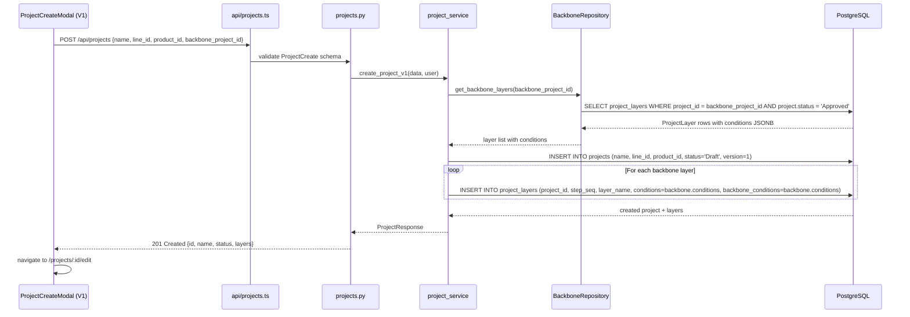

### V2: Device-Ref Based Creation (SPEC-DEVICE-001 / SPEC-PROJECT-002)

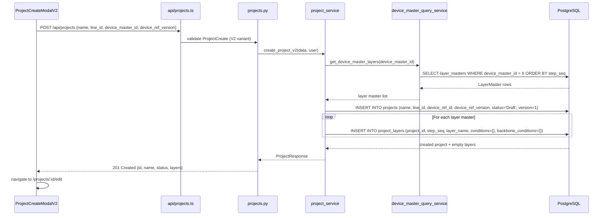

---

## 2. Backbone Copy Flow

Triggered when a user replaces a specific layer's conditions with backbone source.

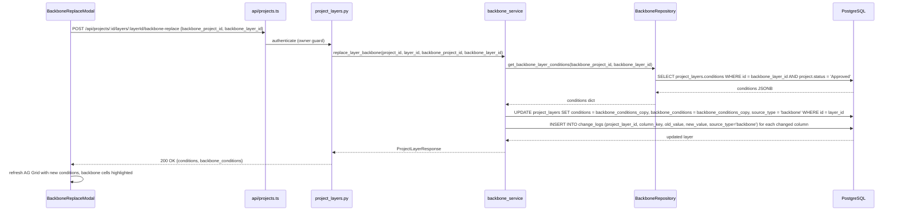

---

## 3. Condition Editing + Auto-Save Flow

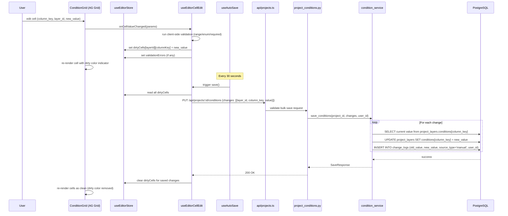

---

## 4. Validation Flow

### Single-Layer Validation

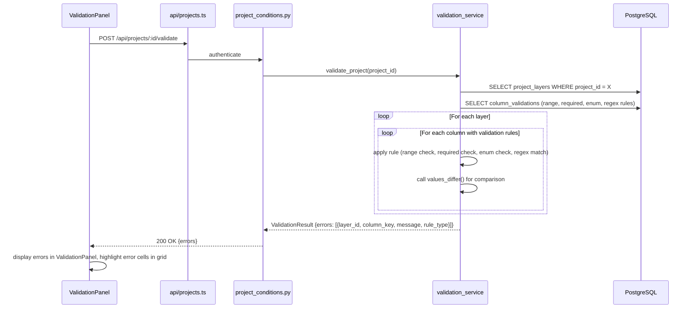

### Cross-Layer Validation

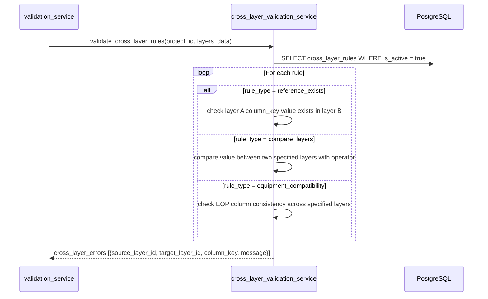

---

## 5. Status Transition Flow (Draft → Review → Approved → Archived)

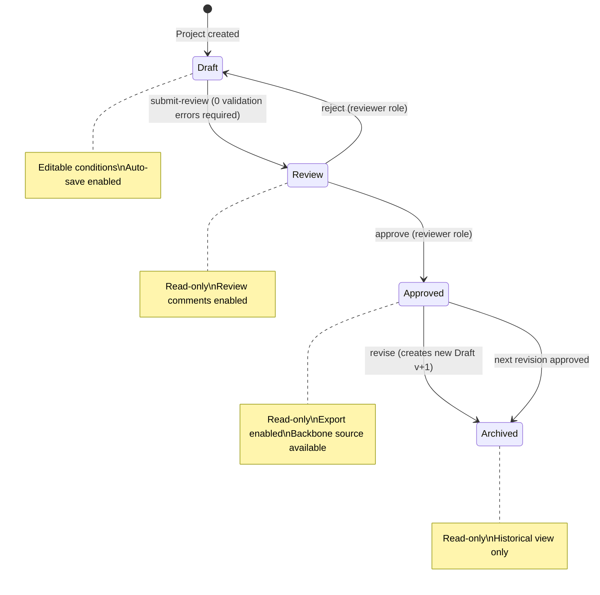

**Submit for Review** (`POST /api/projects/:id/submit-review`):
1. `project_status_service` calls `validation_service.validate_project()`
2. If errors > 0: returns 400 with validation error list
3. If errors == 0: updates `project.status = 'Review'`
4. Inserts `project_status_logs` record (Draft → Review, user_id, timestamp)

**Approve** (`POST /api/projects/:id/approve`):
1. `require_reviewer` RBAC guard
2. Updates `project.status = 'Approved'`
3. Inserts status log (Review → Approved)
4. Project now eligible as backbone source for new projects

**Reject** (`POST /api/projects/:id/reject`):
1. `require_reviewer` RBAC guard
2. Updates `project.status = 'Draft'` (allows further editing)
3. Inserts status log (Review → Draft, with reject reason)

**Revise** (`POST /api/projects/:id/revise`):
1. `project_service.create_revision()`
2. Original project status → 'Archived'
3. New project created: copies all project_layers with conditions, increments version
4. New project status = 'Draft', linked to same product/device, new `revision_reason` stored
5. Returns new project ID

---

## 6. Export Flow (Type A / B / C)

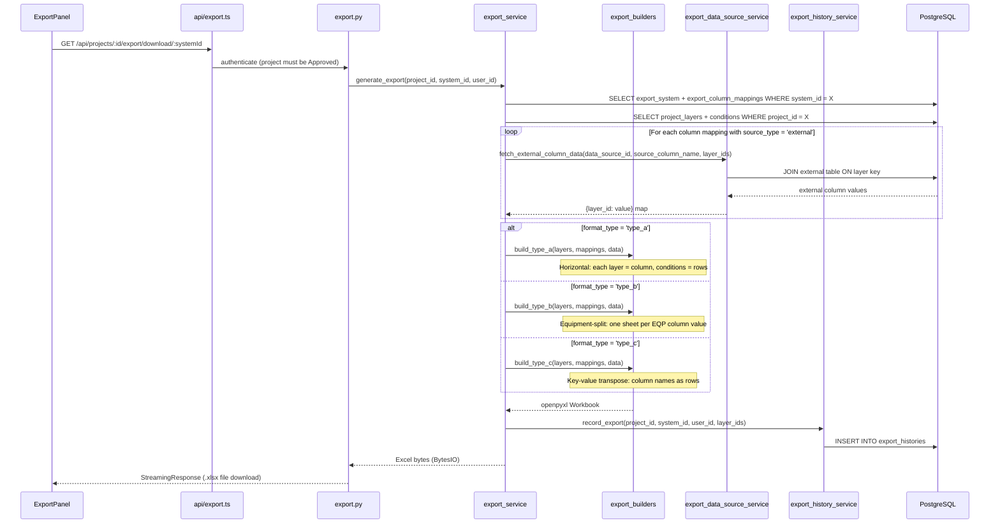

---

## 7. Recipe XML Import + Diff Flow

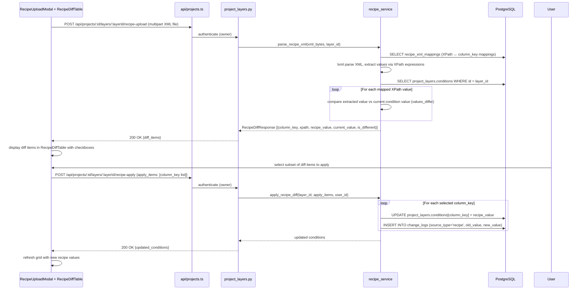

---

## 8. Authentication Flow

### Login

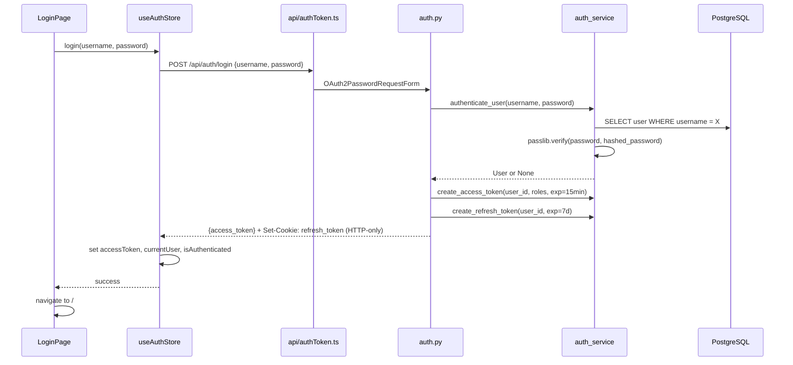

### Token Refresh (Axios Interceptor)

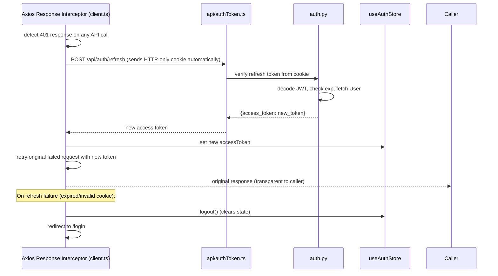

### Logout

```mermaid
sequenceDiagram
    participant UI as Header
    participant Store as useAuthStore
    participant API as api/authToken.ts
    participant Router as auth.py

    UI->>Store: logout()
    Store->>API: POST /api/auth/logout
    API->>Router: clear refresh token cookie (Set-Cookie: refresh_token=; MaxAge=0)
    Router-->>Store: 200 OK
    Store->>Store: clear accessToken, currentUser
    Store-->>UI: redirect to /login
```

---

## 9. Device Master Sync Flow (SPEC-DEVICE-001)

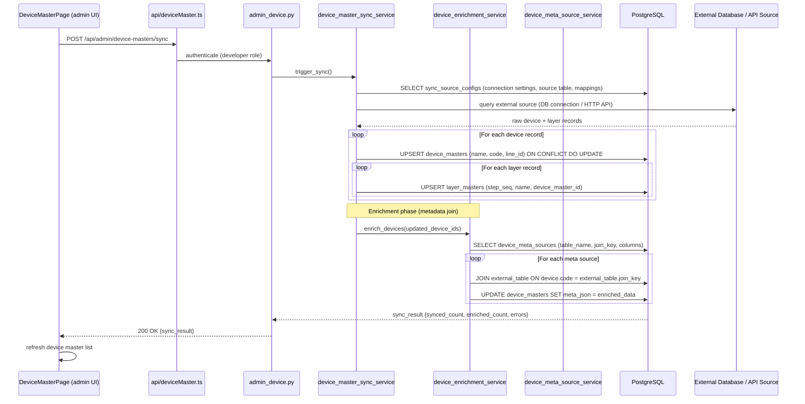

**V2 Project Creation with Device Master**:

After sync, device masters are available for V2 project creation:

```
DeviceMasterPage (admin) confirms device records are synced and correct
     ↓
ProjectCreateModalV2 (user)
  GET /api/device-masters → list available device masters
  GET /api/device-masters/:id/layers → get associated layer masters
  User selects device master + confirms layer list
  POST /api/projects {device_master_id, device_ref_version, ...}
     ↓
project_service.create_project_v2()
  - Creates Project with device_ref_id, device_ref_version FK fields
  - Creates ProjectLayer for each LayerMaster with empty conditions {}
  - User fills in conditions via ConditionEditorPage
```

---

## 10. Backbone Comparison Flow

Allows editors to review differences between current conditions and backbone baseline.

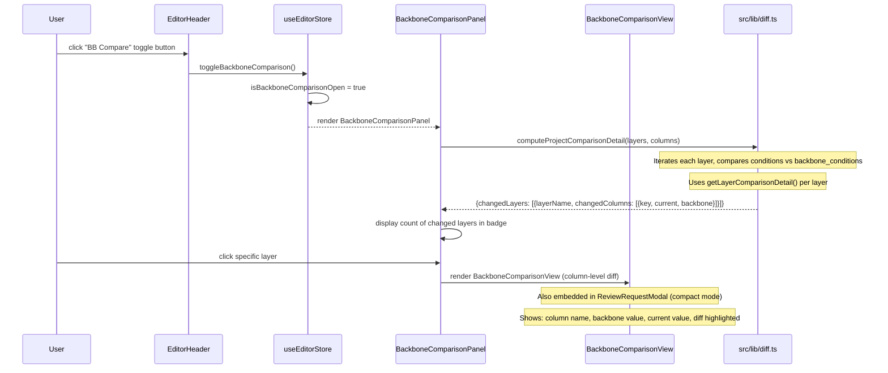

---

## 11. Change History Flow

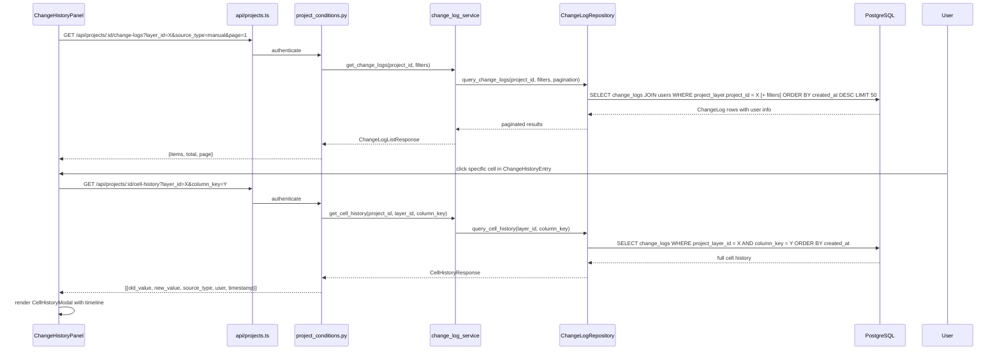
