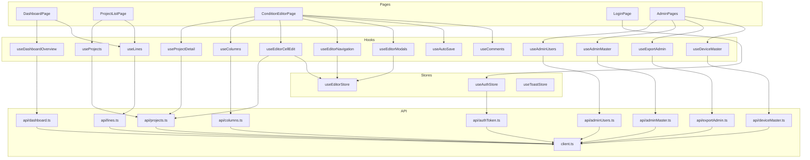

# PCM Dependency Graph

Generated: 2026-02-27
Version: 3.0.0 (SPEC-DEVICE-001 + SPEC-PROJECT-002 + SPEC-RBAC-001 + SPEC-EQP-002)

---

## Backend Router → Service → Repository → Model Chain

### Text Representation

```
auth.py
  └─► auth_service
        └─► User model

users.py
  └─► get_current_user (dependency)
        └─► User model

lines.py
  └─► Line model (direct ORM query)

columns.py
  └─► ColumnDefinition, ColumnValidation models (direct query)

products.py
  └─► Product, Layer, ProductLayer models (direct query)

equipments.py
  └─► Equipment model (direct query, filtered by line_id)

projects.py
  └─► project_service
        ├─► BackboneRepository
        │     └─► Project, ProjectLayer models
        ├─► device_master_query_service
        │     └─► DeviceMaster, LayerMaster models
        ├─► Project, ProjectLayer, ColumnDefinition models

project_conditions.py
  ├─► condition_service
  │     └─► ProjectLayer, ChangeLog models
  ├─► validation_service
  │     └─► ColumnValidation, ColumnDefinition models
  ├─► cross_layer_validation_service (via validation_service)
  │     └─► ProjectLayer, ColumnValidation models
  ├─► change_log_service
  │     └─► ChangeLogRepository
  │           └─► ChangeLog, ProjectStatusLog models
  ├─► project_analytics_service
  │     └─► ChangeLogRepository
  │           └─► ChangeLog models
  └─► diff_service
        └─► ProjectLayer models

project_layers.py
  ├─► backbone_service
  │     └─► BackboneRepository
  │           └─► Project, ProjectLayer models
  └─► recipe_service
        └─► RecipeXmlMapping, ProjectLayer models

project_lifecycle.py
  ├─► project_service
  ├─► project_status_service
  │     └─► ProjectStatusLog, Project models
  ├─► project_analytics_service
  │     └─► ChangeLogRepository
  └─► change_log_service
        └─► ChangeLogRepository

dashboard.py
  └─► dashboard_service
        └─► DashboardRepository
              └─► Project, ProjectLayer, User models

comments.py
  └─► comment_service
        └─► CommentRepository
              └─► ReviewComment, User models

admin.py
  ├─► admin_service
  │     └─► ColumnValidation, CrossLayerRule, SelectOption, ChangeLog models
  └─► export_history_service
        └─► ExportHistory model

admin_users.py
  └─► admin_user_service
        └─► User model

admin_master.py
  └─► admin_master_service
        └─► Line, Product, Layer, ColumnDefinition, ColumnCategory, Equipment models

admin_device.py
  ├─► device_enrichment_service
  │     └─► DeviceMaster, DeviceMetaSource models
  ├─► device_master_sync_service
  │     └─► SyncSourceConfig, DeviceMaster, LayerMaster models
  ├─► sync_source_config_service
  │     └─► SyncSourceConfig model
  └─► device_meta_source_service
        └─► DeviceMetaSource model

device_masters.py
  └─► device_master_query_service
        └─► DeviceMaster, LayerMaster models

export.py
  ├─► export_service
  │     ├─► export_builders (pure Excel functions)
  │     ├─► export_data_source_service
  │     │     └─► ExportDataSource model
  │     └─► ExportSystem, ExportColumnMapping, ProjectLayer models
  ├─► export_history_service
  │     └─► ExportHistory model
  └─► export_validation_service
        └─► ProjectLayer, ColumnDefinition models

export_admin.py
  └─► export_admin_service
        └─► ExportSystem, ExportColumnMapping models

export_data_source.py
  └─► export_data_source_service
        └─► ExportDataSource model
```

---

### Mermaid Diagram: Backend Router → Service → Repository

```mermaid
graph TD
    subgraph Routers
        R1[projects.py]
        R2[project_conditions.py]
        R3[project_layers.py]
        R4[project_lifecycle.py]
        R5[dashboard.py]
        R6[export.py]
        R7[admin_device.py]
        R8[admin_master.py]
        R9[comments.py]
        R10[auth.py]
    end

    subgraph Services
        S1[project_service]
        S2[condition_service]
        S3[validation_service]
        S4[project_status_service]
        S5[project_analytics_service]
        S6[backbone_service]
        S7[recipe_service]
        S8[change_log_service]
        S9[dashboard_service]
        S10[export_service]
        S11[export_builders]
        S12[device_master_query_service]
        S13[device_master_sync_service]
        S14[comment_service]
        S15[auth_service]
        S16[admin_master_service]
        S17[diff_service]
    end

    subgraph Repositories
        REPO1[BackboneRepository]
        REPO2[ChangeLogRepository]
        REPO3[CommentRepository]
        REPO4[DashboardRepository]
    end

    subgraph Models
        M1[Project / ProjectLayer]
        M2[User]
        M3[ColumnDefinition / Validation]
        M4[ChangeLog / StatusLog]
        M5[Equipment]
        M6[DeviceMaster / LayerMaster]
        M7[ExportSystem / Mapping]
        M8[ReviewComment]
    end

    R1 --> S1
    R2 --> S2
    R2 --> S3
    R2 --> S8
    R2 --> S5
    R2 --> S17
    R3 --> S6
    R3 --> S7
    R4 --> S1
    R4 --> S4
    R4 --> S5
    R4 --> S8
    R5 --> S9
    R6 --> S10
    R7 --> S13
    R7 --> S12
    R8 --> S16
    R9 --> S14
    R10 --> S15

    S1 --> REPO1
    S6 --> REPO1
    S5 --> REPO2
    S8 --> REPO2
    S9 --> REPO4
    S14 --> REPO3

    REPO1 --> M1
    REPO2 --> M4
    REPO3 --> M8
    REPO4 --> M1
    REPO4 --> M2

    S1 --> M1
    S2 --> M1
    S3 --> M3
    S4 --> M4
    S10 --> S11
    S10 --> M7
    S12 --> M6
    S13 --> M6
    S15 --> M2
    S16 --> M5
```



---

## Frontend Page → Hook → API → Store Chain

### Text Representation

```
LoginPage
  └─► useAuthStore.login()
        └─► api/authToken.ts (POST /api/auth/login)

DashboardPage
  ├─► useDashboardOverview → api/dashboard.ts (GET /api/dashboard)
  ├─► useLines → api/lines.ts (GET /api/lines)
  └─► useRefreshDashboard (invalidate query cache)

ProjectListPage
  ├─► useProjects → api/projects.ts (GET /api/projects)
  ├─► useLines → api/lines.ts
  └─► URL state sync (useSearchParams: ?status=X&line_id=Y)

ConditionEditorPage
  ├─► useProjectDetail → api/projects.ts (GET /api/projects/:id)
  ├─► useColumns → api/columns.ts (GET /api/columns)
  ├─► useUsers → api/users.ts (GET /api/users)
  ├─► useComments → api/comments.ts (GET /api/projects/:id/comments)
  ├─► useEditorCellEdit
  │     ├─► useEditorStore (dirty cells, grid data)
  │     └─► api/projects.ts (PUT /api/projects/:id/conditions bulk save)
  ├─► useEditorNavigation
  │     └─► useEditorStore (layer index, error navigation)
  ├─► useEditorModals
  │     └─► useEditorStore (modal open state)
  ├─► useValidateProjectMutation → api/projects.ts (POST /api/projects/:id/validate)
  ├─► useDeleteLayer → api/projects.ts (DELETE /api/projects/:id/layers/:layerId)
  ├─► useAutoSave (30s interval → useEditorCellEdit.save)
  └─► useConfirm → useToastStore (confirm dialog)

AdminLayout
  └─► useAuthStore (role check for tab visibility)

UserManagementPage
  └─► useAdminUsers → api/adminUsers.ts (GET/POST/PUT/PATCH /api/admin/users)

MasterDataPage
  └─► useAdminMaster → api/adminMaster.ts (CRUD /api/admin/lines, products, etc.)

DeviceMasterPage
  └─► useDeviceMaster → api/deviceMaster.ts (GET /api/device-masters)
      useAdminUsers (sync trigger mutation)

ExportSystemsPage
  └─► useExportAdmin → api/exportAdmin.ts (CRUD /api/admin/export-systems)

ExportDataSourcesPage
  └─► useExportDataSources → api/exportDataSource.ts (CRUD /api/admin/export-data-sources)

ValidationRulesPage
  └─► useAdminValidations → api/adminValidations.ts (CRUD validations + cross-layer rules)

AuditLogPage
  └─► useAdminAudit → api/adminAudit.ts (GET /api/admin/audit-logs)
```

---

### Mermaid Diagram: Frontend Page → Hook → API



---

## External Dependencies

### Backend (requirements.txt)

| Package | Purpose | Critical |
|---------|---------|---------|
| fastapi | REST API framework | Yes |
| uvicorn | ASGI server | Yes |
| sqlalchemy[asyncio] | Async ORM | Yes |
| asyncpg | PostgreSQL async driver | Yes |
| alembic | Database migrations | Yes |
| pydantic | Request/response validation | Yes |
| python-jose[cryptography] | JWT generation/validation | Yes |
| passlib[bcrypt] | Password hashing | Yes |
| openpyxl | Excel export (.xlsx generation) | Yes |
| lxml | XML parsing (Recipe XML, XPath) | Yes |
| pytest | Test runner | Dev |
| pytest-asyncio | Async test support | Dev |
| httpx | Async HTTP client for tests | Dev |
| pytest-mock | Mock fixtures | Dev |
| pytest-cov | Coverage reporting | Dev |

### Frontend (package.json)

| Package | Purpose | Critical |
|---------|---------|---------|
| react | UI library | Yes |
| react-dom | DOM rendering | Yes |
| react-router-dom | Client-side routing (v7) | Yes |
| @tanstack/react-query | Server state management | Yes |
| zustand | Client state management | Yes |
| ag-grid-community | Condition table grid | Yes |
| axios | HTTP client | Yes |
| tailwindcss | CSS utility framework (v4) | Yes |
| lucide-react | Icon components | Yes |
| vite | Build tool + dev server | Yes |
| typescript | Type checking | Yes |
| vitest | Unit test runner | Dev |
| @testing-library/react | Component testing | Dev |

---

## Cross-Cutting Dependencies

### Authentication Flow

```
All protected routers
  └─► app/dependencies/auth.py
        ├─► get_current_user (decodes JWT, fetches User from DB)
        ├─► require_active_user (checks is_active flag)
        ├─► require_admin_or_developer (checks roles array contains 'admin' OR 'developer')
        ├─► require_ops_write (checks roles contains 'admin')
        ├─► require_system_write (checks roles contains 'developer')
        └─► require_project_owner (checks project.created_by == current_user.id)
```

Frontend auth cross-cutting:

```
src/api/client.ts
  ├─► Injects Authorization: Bearer {accessToken} header on all requests
  ├─► On 401 response: calls POST /api/auth/refresh
  ├─► On refresh success: retries original request with new token
  └─► On refresh failure: calls useAuthStore.logout(), redirects to /login
```

### Database Session Factory

```
app/database.py
  ├─► async_session (AsyncSession factory) — used by all services
  ├─► Base (DeclarativeBase) — used by all models
  └─► engine (AsyncEngine) — lifecycle managed by FastAPI lifespan
```

All services receive an `AsyncSession` via FastAPI Depends injection pattern:

```python
async def get_db() -> AsyncGenerator[AsyncSession, None]:
    async with async_session() as session:
        yield session
```

### Configuration

```
app/config.py (Pydantic BaseSettings)
  ├─► DATABASE_URL (asyncpg URL from env)
  ├─► DATABASE_URL_SYNC (psycopg2 URL for Alembic from env)
  ├─► SECRET_KEY (JWT signing key from env)
  ├─► CORS_ORIGINS (comma-separated list from env)
  └─► APP_NAME (application name)
```

### Constants Module

```
app/constants.py
  ├─► STATUS_TRANSITIONS dict — valid from→to status pairs
  ├─► VALIDATION_RULE_TYPES list — range/enum/required/regex/cross_layer
  ├─► CATEGORY_CODES list — SP/SC/OVL/DEV/EQP
  └─► SOURCE_TYPES list — manual/backbone/recipe
```

Used by: project_status_service, validation_service, admin_service, cross_layer_validation_service

### values_differ() Utility

```
app/utils/comparison.py (values_differ)
  ├─► Normalizes numeric types (int/float comparison without false positives)
  ├─► Handles None/empty string equivalence
  └─► Used by: condition_service, validation_service, diff_service, export_validation_service
```

---

## Potential Circular Dependency Analysis

### Backend

| Risk | Modules | Status | Mitigation |
|------|---------|--------|-----------|
| LOW | project_service imports device_master_query_service | No cycle | V2 creation delegates to device service; no reverse import |
| LOW | export_service imports export_builders | No cycle | export_builders is pure functions module with no service imports |
| LOW | admin_service imports export_history_service | No cycle | export_history_service only imports ExportHistory model |
| NONE DETECTED | All service → repository → model chains | Clean | Repositories only import models; services only import repositories and models |

### Frontend

| Risk | Modules | Status | Mitigation |
|------|---------|--------|-----------|
| LOW | useEditorStore imported by multiple hooks and components | No cycle | Store has no imports of hooks or components |
| LOW | useAuthStore imported by client.ts (interceptor) | No cycle | Axios interceptor accesses store state; store does not import client |
| NONE DETECTED | All page → hook → api chains | Clean | API modules only import client.ts; no reverse imports |

### Architectural Safeguards

- Models never import services (one-way dependency)
- Repositories only import models (no service imports)
- Services may import other services but not routers
- Frontend API modules only import `client.ts` (no cross-API module imports)
- Stores do not import hooks (hooks read/write stores unidirectionally)
