# PCM Dependency Graph

Visual and textual representation of module dependencies, highlighting critical paths and circular dependency risks.

## Backend Dependency Layers

### Layer 1: External Dependencies

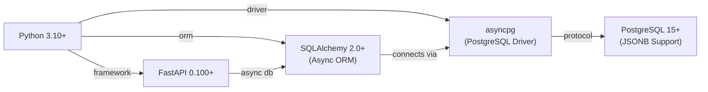

### Layer 2: Core Infrastructure Dependencies

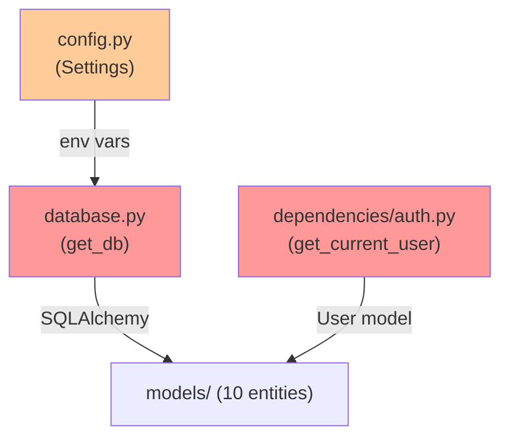

High fan-in modules requiring careful changes:
- `database.get_db` - 18+ importers
- `dependencies.auth.get_current_user` - 10+ importers
- `dependencies.auth.require_admin` - 8+ importers

### Layer 3: Repository Layer Dependencies

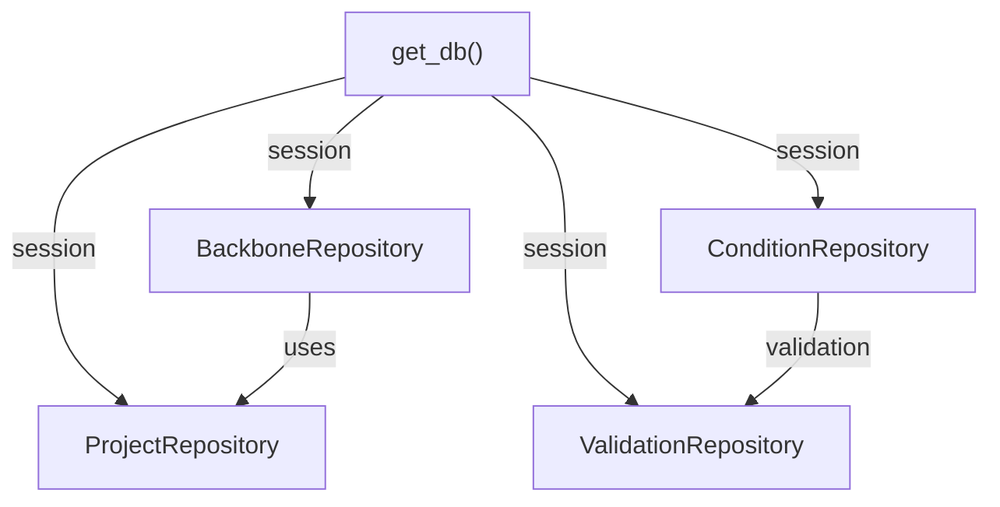

### Layer 4: Service Layer Dependencies

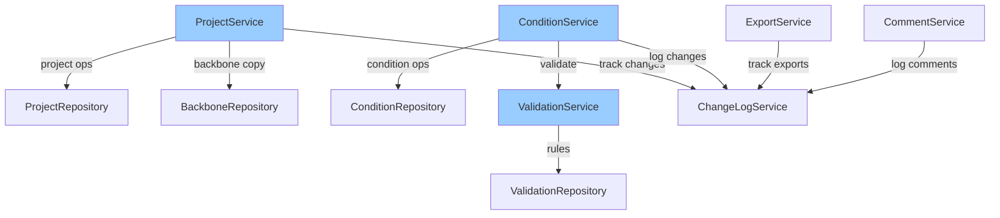

### Layer 5: Router to Service Dependencies

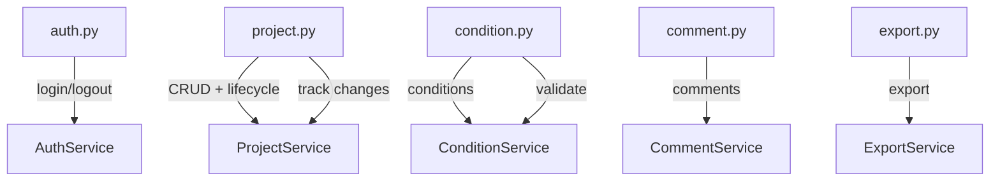

### Complete Backend Dependency Stack

```
Routers (HTTP Layer)
    ↓ HTTP request
Services (Business Logic)
    ↓ operations
Repositories (Data Access)
    ↓ queries
Models (ORM)
    ↓ SQL
PostgreSQL Database
```

**Cross-cutting Dependencies:**
- Auth → All routers (dependency injection)
- Database → All repositories (session management)
- ChangeLogService → ProjectService, ConditionService, CommentService (audit trail)

## Frontend Dependency Layers

### Layer 1: Core Dependencies

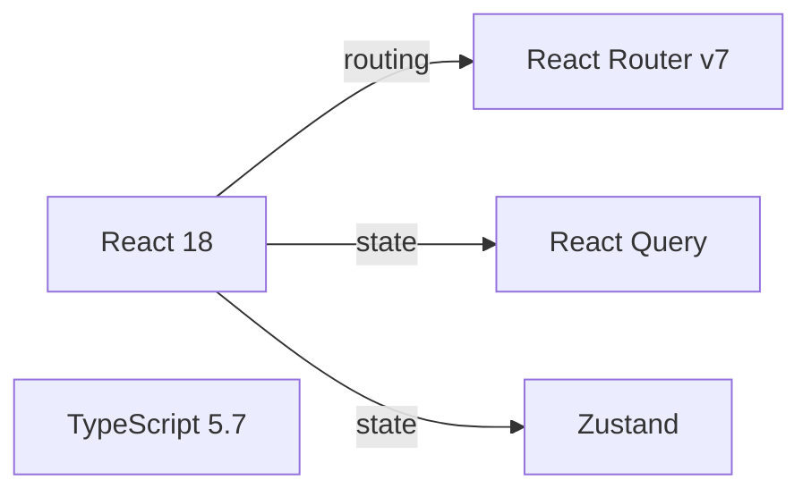

### Layer 2: Data Layer Dependencies

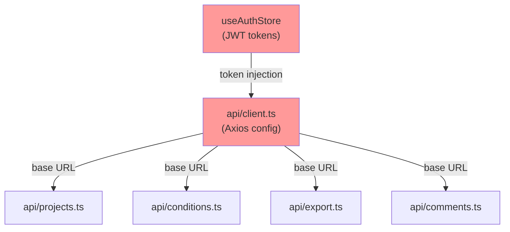

High fan-in modules:
- `client.ts` - 19+ API modules depend on it
- `useAuthStore` - 20+ components
- `useToastStore` - 15+ components

### Layer 3: Hook Dependencies

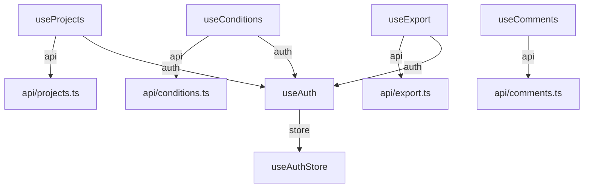

### Layer 4: Component Dependencies

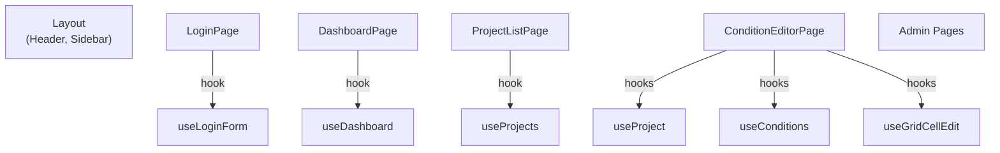

### Layer 5: Page Component Tree

```
App.tsx (Router)
├── Layout (wrapper)
│   ├── Header
│   ├── Sidebar
│   └── main content
│       ├── LoginPage
│       ├── DashboardPage
│       ├── ProjectListPage
│       ├── ConditionEditorPage
│       │   ├── ConditionGrid (AG Grid)
│       │   ├── GridCellEditor
│       │   ├── RecipeImportPanel
│       │   ├── CommentPanel
│       │   └── ExportPanel
│       ├── UserManagementPage
│       ├── MasterDataPage
│       └── ... (6 more admin pages)
```

## Cross-System Dependencies

### Authentication Flow Dependencies

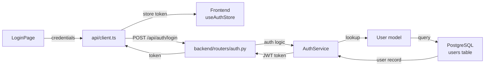

Key dependency: All authenticated requests require token from Frontend → stored in useAuthStore → injected by api/client.ts

### Condition Editing Flow Dependencies

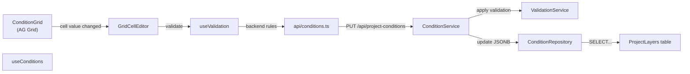

### Backbone Copy Flow Dependencies

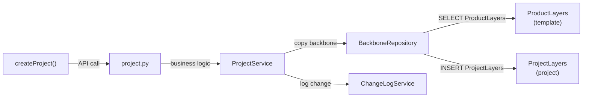

### Export Flow Dependencies

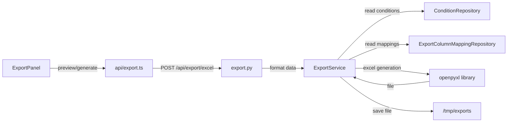

## Dependency Risk Analysis

### Critical Paths (High Priority for Maintenance)

1. **Authentication Critical Path**
   - `dependencies/auth.py` → `User model` → `users table`
   - Impacts: All 18 routers (100% of API)
   - Risk: Breaking change = system-wide outage
   - Mitigation: Comprehensive unit tests, backward-compatible schema changes

2. **Database Session Critical Path**
   - `database.get_db()` → `AsyncSession` → `PostgreSQL`
   - Impacts: All repositories (100% of data access)
   - Risk: Connection pooling failure = cascading failures
   - Mitigation: Connection pooling configuration, health checks

3. **JSONB Operations Critical Path**
   - `comparison.compare_dicts()` → JSONB merge → `ProjectLayers.conditions`
   - Impacts: Condition editing, backbone copy, recipe import
   - Risk: Data corruption from incorrect merge logic
   - Mitigation: Comprehensive diff testing with edge cases

### Circular Dependency Risks

**Actual Circular Dependencies:** None detected

**Potential Risks:**
1. CommentService could depend on ProjectService AND ProjectService could depend on CommentService
   - **Mitigation:** Keep CommentService independent, use event-based logging

2. ExportService depends on ProjectService for data, ProjectService logs to ChangeLogService which ExportService also uses
   - **Mitigation:** ChangeLogService is read-only for ExportService

### Fan-In Risk Modules

**Backend:**

| Module | Importers | Risk | Mitigation |
|--------|-----------|------|-----------|
| `database.get_db` | 18 | Breaking change affects all routers | Type-safe Dependency class, version compatibility |
| `auth.get_current_user` | 10 | Auth change breaks protected endpoints | Interface stability, unit tests |
| `auth.require_admin` | 8 | Role check failure = security breach | Centralized RBAC rules, audit logging |
| `models.User` | 14 | Schema change requires migration | Alembic migrations, backward compatibility |
| `utils.comparison` | 4 | Diff logic affects condition merging | Comprehensive test suite with edge cases |

**Frontend:**

| Module | Importers | Risk | Mitigation |
|--------|-----------|------|-----------|
| `useAuthStore` | 20 | Token/user state corruption | Zustand actions testing, localStorage validation |
| `useToastStore` | 15 | Notification storms, UI blocking | Toast queue limit, auto-dismiss, user dismissal |
| `client.ts` | 19 | Network config broken = API inaccessible | Axios interceptor testing, fallback mechanisms |
| `useProjects` | 5 | Project data stale | React Query cache invalidation, polling strategy |

### Dependency Version Constraints

**Backend:**
- FastAPI 0.100+ (async support required)
- SQLAlchemy 2.0+ (async ORM, sqlalchemy.ext.asyncio)
- asyncpg required for PostgreSQL async driver
- python-jose for JWT operations
- Pydantic v2 for schema validation

**Frontend:**
- React 18+ (hooks API)
- React Router v7 (newer routing model)
- TypeScript 5.7+ (strict type checking)
- React Query for server state
- Zustand for client state
- AG Grid Community for data grid

### Breaking Change Analysis

**High-Risk Changes:**
1. **Removing `database.get_db` parameter** - Would break all 18 routers
2. **Changing `User` model primary key** - Would invalidate foreign keys
3. **Modifying JWT token format** - Would invalidate existing tokens
4. **Changing column_id to column_name** - Would break validation rules

**Low-Risk Changes:**
1. **Adding new optional columns to models** - Safe with default values
2. **Adding new router endpoints** - Backward compatible
3. **Adding new export format types** - Optional feature

## Dependency Visualization

### Backend Service Dependency Graph

```
        Routers (18)
           ▲  ▲  ▲
           │  │  │
       ┌───┴──┴──┴─────────┐
       │                    │
   Services (23)        Utils (3)
       │                    │
       │   ┌────────────────┘
       │   │
  Repositories (4)
       │
       ▼
    Models (10)
       │
       ▼
  PostgreSQL DB
```

### Frontend Component Dependency Graph

```
    App.tsx (Router)
       │
    Layout
       │
    ┌──┴────────────┬──────────────┬──────────────┐
    │               │              │              │
 Pages (12)    Components (50+)  Hooks (30+)  Stores (3)
    │               │              │              │
    └───────────────┴──────────────┴──────────────┘
            │
         API (19)
            │
         Types (10+)
            │
        Backend APIs
```

## Import Dependency Summary

**Backend Total Dependencies:**
- SQLAlchemy/asyncpg: 1
- FastAPI: 1
- Pydantic: 2
- Python-jose: 1
- Standard library: Multiple

**Frontend Total Dependencies:**
- React: 1
- React Router: 1
- Zustand: 1
- React Query: 1
- Axios: 1
- AG Grid Community: 1
- Tailwind CSS: 1
- TypeScript: 1

**No Circular Dependencies Detected** ✓

## Dependency Health Recommendations

1. **Document all breaking changes** via CHANGELOG
2. **Use semantic versioning** for API versions
3. **Maintain backward compatibility** in schemas
4. **Monitor dependency security** via automated scanning
5. **Upgrade dependencies quarterly** with testing
6. **Add @MX:ANCHOR tags** to high fan-in modules
7. **Implement deprecation warnings** before breaking changes
8. **Test dependency injection** thoroughly
9. **Version APIs** to support multiple versions
10. **Use adapter pattern** for major dependency changes

## Critical Path Monitoring

Monitor these critical paths for performance:
1. Condition save → Database commit → Client notification (typical latency: <500ms)
2. Project create → Backbone copy → Project initialization (typical latency: <1s)
3. Export generation → File writing → Download (typical latency: <5s for 100 projects)
4. Recipe import → Diff calculation → Grid update (typical latency: <2s)

Set alerts for latency increases >2x baseline to detect dependency issues early.
