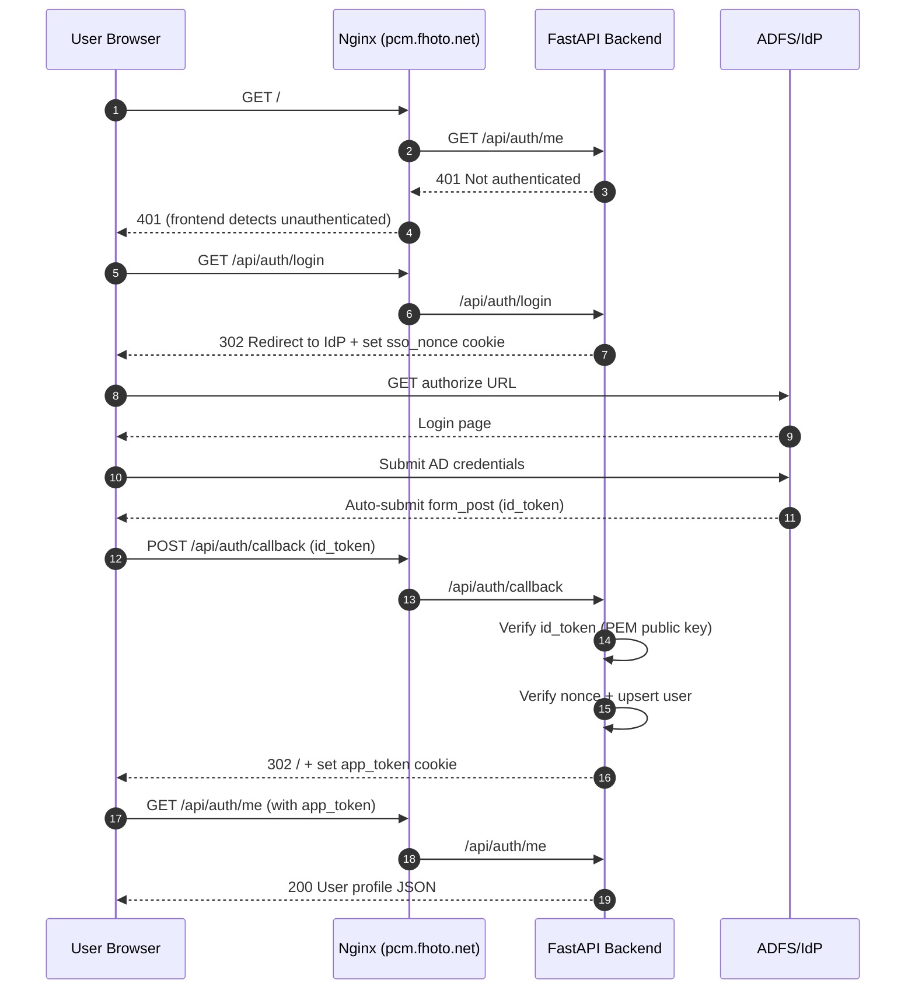

# PCM (Process Condition Manager)

반도체 Photo 공정의 공정조건표를 웹 기반으로 관리하는 통합 시스템

## 프로젝트 소개

PCM은 반도체 제조 공정 중 Photo 공정의 복잡한 공정조건표를 효율적으로 관리하기 위한 웹 애플리케이션입니다.

제품당 약 **300개의 파라미터 컬럼**과 **30~60개의 레이어**로 구성된 대규모 조건 데이터를 편집, 검증, 승인, 출력하는 전체 라이프사이클을 지원합니다. 기존 Excel 기반 관리의 한계를 극복하고, 실시간 협업, 변경 이력 추적, 체계적인 승인 프로세스를 통해 공정 관리의 정확성과 효율성을 향상시킵니다.

## 주요 기능

### 프로젝트 관리
- **Backbone 기반 프로젝트 생성**: 기존 양산 제품의 조건표를 기반으로 신규 프로젝트 초안 자동 생성
- **상태 워크플로우**: Draft → Review → Approved → Archived 상태 관리
- **검색 및 필터링**: 제품명, 상태, 작성자, 작성일 등 다양한 조건으로 프로젝트 검색

### Backbone 관리
- **전체 Backbone 복사**: 선택한 제품의 전체 조건표를 복사하여 초안 생성
- **레이어별 Backbone 교체**: 특정 레이어만 다른 제품의 조건으로 교체 가능
- **변경 이력 자동 기록**: 모든 셀 변경 사항이 자동으로 추적됨

### 조건표 편집
- **AG Grid 기반 고성능 편집기**: 대규모 데이터(300컬럼 x 60레이어)를 효율적으로 표시 및 편집
- **카테고리별 탭 구성**: SP, SC, OVL, DEV 4개 카테고리로 컬럼 그룹핑
- **자동 임시저장**: 30초 간격 자동 저장으로 데이터 유실 방지
- **명시적 저장**: 저장 버튼 클릭 시 서버 반영 및 변경 이력 기록

### 실시간 검증
- **셀 단위 실시간 검증**: 각 셀 편집 시 즉시 검증 규칙 적용
- **다양한 검증 규칙**:
  - Range 검증: 숫자 값의 최소/최대 범위 체크
  - Required 검증: 필수 입력 항목 체크
  - Conditional Required: 특정 조건 하의 필수 입력 체크
  - Pattern 검증: 정규식 기반 형식 검증
- **Cross-Layer 검증**: 레이어 간 참조 존재 확인, 값 비교, 설비 호환성 검증
- **시각적 피드백**: 검증 오류 셀은 빨간색으로 표시, 크로스레이어 오류 구분 표시
- **검증 오류 목록**: 전체 오류 목록 확인 및 해당 셀로 바로 이동

### Recipe XML 반영
- **XML 업로드**: 설비에서 추출한 Recipe XML 파일 업로드
- **Diff 생성**: 매핑 테이블 기반으로 XML 데이터와 현재 조건표 차이 자동 계산
- **선택적 적용**: Diff 결과 확인 후 필요한 변경사항만 선택하여 반영
- **변경 이력 기록**: Recipe XML 반영 변경사항 자동 추적

### 변경 이력 추적
- **통합 타임라인**: 셀 변경과 상태 전환을 시간순으로 통합하여 슬라이드아웃 패널에서 조회
- **필터링**: 레이어, 변경 유형(수동/Backbone/Recipe/상태 변경), 사용자별 필터 지원
- **셀 단위 이력 조회**: 우클릭 컨텍스트 메뉴에서 특정 셀의 변경 이력 모달 표시
- **변경 소스 구분**: manual(직접 편집), backbone(Backbone 복사/교체), recipe(Recipe XML 반영)
- **셀 네비게이션**: 타임라인 항목 클릭 시 해당 셀로 자동 이동 및 하이라이트

### 승인 프로세스
- **상태 전환**: Draft → Review → Approved/Rejected 워크플로우
- **검토 요청**: Review 요청 시 검증 오류 0건 필수
- **코멘트**: 프로젝트/레이어/셀 레벨 검토 코멘트 작성 및 조회
- **AG Grid 통합**: 셀 우클릭으로 코멘트 작성, 코멘트 있는 셀 하이라이트

### Revision 관리
- **버전 관리**: 승인된 조건표의 버전 번호 자동 관리
- **Revision 생성**: Approved 상태에서 개정 시 새 Draft(버전+1) 생성, 기존은 Archived로 전환
- **버전 히스토리**: 동일 제품의 모든 버전 추적 및 비교, Read-Only 모드로 과거 버전 열람

### 전산 출력
- **3종 출력 포맷**: Type A(수평), Type B(설비 분할), Type C(키-값 전치)
- **미리보기**: 다운로드 전 출력 결과 미리보기
- **Excel 다운로드**: 단건/벌크 다운로드 (ZIP) 지원
- **출력 전 검증**: 데이터 품질 검증 리포트 제공
- **출력 이력**: 누가 언제 무엇을 출력했는지 감사 추적
- **외부 데이터 소스**: 외부 시스템 연동 Export Pipeline

### 인증 및 권한
- **ADFS/OpenID SSO 인증**: `/api/auth/login` → IdP Redirect → `/api/auth/callback`(form_post)
- **앱 세션 쿠키 인증**: `app_token`(HttpOnly, SameSite, 환경별 Secure) 기반 세션 유지
- **역할 기반 접근 제어 (RBAC)**: admin(전체), reviewer(승인/반려), editor(본인 프로젝트)
- **전체 엔드포인트 보호**: 모든 API에 인증 적용

#### SSO 인증 흐름 (시각화)


### 대시보드
- **상태 카드**: 전체 프로젝트 상태별 현황
- **내 프로젝트**: 본인이 생성한 프로젝트 목록
- **검토 대기**: 리뷰어에게 할당된 검토 대기 프로젝트
- **활동 타임라인**: 최근 변경 활동 조회

### 관리자 기능
- **사용자 관리**: CRUD, 역할 배정, 비밀번호 초기화, 비활성화
- **마스터 데이터**: Line/Product/Layer/Column/Category CRUD
- **선택 옵션**: 드롭다운 컬럼의 선택지 관리
- **감사 로그**: 전체 변경 이력 필터링 조회
- **라인별 필터링**: 프로젝트 목록 및 대시보드에서 라인별 필터 지원

## 기술 스택

### Backend
- **Python 3.12**: 최신 Python 기능 활용
- **FastAPI**: 고성능 비동기 웹 프레임워크
- **SQLAlchemy 2.0**: 비동기 ORM
- **PostgreSQL 16**: JSONB를 활용한 유연한 데이터 저장
- **Alembic**: 데이터베이스 마이그레이션 관리

### Frontend
- **React 18**: 최신 React 기능 및 성능 최적화
- **TypeScript**: 타입 안전성 보장
- **Vite**: 빠른 개발 서버 및 빌드
- **AG Grid Community**: 고성능 대용량 데이터 그리드
- **TanStack Query**: 서버 상태 관리
- **Zustand**: 클라이언트 상태 관리
- **Tailwind CSS**: 유틸리티 우선 CSS 프레임워크

### Infrastructure
- **Docker Compose**: 일관된 개발/배포 환경 (dev + prod 구성)
- **Nginx**: 리버스 프록시
- **JWT (python-jose)**: 토큰 기반 인증
- **bcrypt (passlib)**: 비밀번호 해싱

## 시작하기

### 사전 요구사항

- Docker & Docker Compose
- Node.js 20+
- Git

### 설치 및 실행

1. 저장소 복제
```bash
git clone https://github.com/Middleages/process-condition-manager.git
cd process-condition-manager
```

2. 전체 서비스 실행
```bash
docker-compose up -d
```

3. 접속
- 프론트엔드: http://localhost
- 백엔드 API: http://localhost/api
- API 문서: http://localhost/api/docs

## 개발 명령어

### Docker 관련

```bash
# 전체 서비스 실행 (데몬 모드)
docker-compose up -d

# 백엔드만 실행 (hot reload, 로그 확인)
docker-compose up backend

# 프론트엔드만 실행
docker-compose up frontend

# 전체 서비스 중지
docker-compose down

# 데이터베이스 포함 전체 삭제
docker-compose down -v
```

### Backend 개발

```bash
# Alembic 마이그레이션 생성
docker-compose exec backend alembic revision --autogenerate -m "description"

# Alembic 마이그레이션 적용
docker-compose exec backend alembic upgrade head

# 백엔드 테스트 실행
docker-compose exec backend pytest

# 백엔드 테스트 커버리지
docker-compose exec backend pytest --cov=app
```

### Frontend 개발

```bash
# 프론트엔드 개발 서버 (로컬)
cd frontend
npm install
npm run dev

# 프론트엔드 테스트
npm test

# 프론트엔드 빌드
npm run build
```

## 프로젝트 구조

```
process-condition-manager/
├── backend/                    # FastAPI 백엔드
│   ├── app/
│   │   ├── main.py            # FastAPI 앱 진입점
│   │   ├── config.py          # 설정 관리
│   │   ├── constants.py       # 도메인 상수 (상태 전환, 규칙 타입, 카테고리)
│   │   ├── database.py        # DB 연결 및 세션
│   │   ├── models/            # SQLAlchemy ORM 모델
│   │   ├── dependencies/      # FastAPI 인증 의존성
│   │   ├── repositories/      # 데이터 접근 계층 (N+1 최적화)
│   │   ├── routers/           # API 엔드포인트 (19개 모듈)
│   │   ├── services/          # 비즈니스 로직 (24개 모듈)
│   │   ├── schemas/           # Pydantic 스키마 (17개 모듈)
│   │   ├── seed/              # 시드 데이터 패키지
│   │   └── utils/             # 유틸리티 함수
│   ├── alembic/               # DB 마이그레이션
│   ├── requirements.txt
│   └── Dockerfile
├── frontend/                   # React 프론트엔드
│   ├── src/
│   │   ├── main.tsx           # React 진입점
│   │   ├── App.tsx            # 라우터 설정
│   │   ├── api/               # API 클라이언트
│   │   ├── components/        # React 컴포넌트
│   │   │   ├── editor/        # 조건표 편집기 (AG Grid, 검증, 코멘트)
│   │   │   ├── admin/         # 관리자 패널 (사용자, 마스터, 설정)
│   │   │   ├── export/        # 전산 출력 (미리보기, 다운로드, 이력)
│   │   │   ├── auth/          # 인증 (로그인)
│   │   │   └── ui/            # 공용 UI 컴포넌트
│   │   ├── hooks/             # 커스텀 훅 (24개)
│   │   ├── pages/             # 페이지 컴포넌트 (14개)
│   │   ├── stores/            # Zustand 상태 관리
│   │   ├── types/             # TypeScript 타입 (7개 도메인 파일)
│   │   └── lib/               # 유틸리티 (validation, diff)
│   ├── package.json
│   └── Dockerfile
├── nginx/                      # Nginx 리버스 프록시
├── docs/                       # 프로젝트 참고 문서 (13종)
├── scripts/                    # 운영 스크립트 (DB 백업/복원)
├── docker-compose.yml          # 개발 환경
├── docker-compose.prod.yml     # 프로덕션 환경
└── .claude/docs/               # 설계 문서 (PRD, DB 스키마 등)
```

## 개발 단계

### Phase 1 (MVP) - ✅ 완료
- 프로젝트 생성 및 Backbone 복사
- AG Grid 기반 조건표 편집 UI
- 기본 검증 시스템 (Range, Required)
- 자동 임시저장 + 명시적 벌크 저장
- 변경 이력 기록
- pytest + Vitest 테스트

### Phase 2 - ✅ 완료
- 레이어별 Backbone 교체 (SPEC-001)
- Recipe XML 업로드, Diff, 선택 적용 (SPEC-001)
- 관리자 설정: XML 매핑 CRUD, 검증 규칙 관리 (SPEC-001)
- 조건부 필수값 검증 (SPEC-002)
- Revision 기능: 버전 생성, Archived 상태 (SPEC-002)

### Phase 3 - ✅ 완료
- 승인 워크플로우: Review Request, Approve/Reject, 코멘트 (SPEC-003)
- 변경 이력 패널: 타임라인, 셀 히스토리, 필터링 (SPEC-004)
- 버전 히스토리: 드롭다운, Read-Only 모드 (SPEC-004)
- 전산 출력: Type A/B/C 3종 포맷, 미리보기, Excel 다운로드 (SPEC-005)
- 버전 히스토리 개선 + 변경 로그 정확도 향상 (SPEC-006)

### Phase 4 - ✅ 완료
- JWT 인증/인가: Access/Refresh Token, RBAC (SPEC-AUTH-001)
- Cross-Layer 검증 엔진: 참조 존재, 값 비교, 설비 호환성 (SPEC-CROSS-001)
- 전산 출력 확장: Admin UI, 설비 할당, 검증 리포트, 출력 이력 (SPEC-EXPORT-001)
- 외부 데이터 소스 연동 Export Pipeline (SPEC-EXPORT-002)
- 대시보드: 상태 카드, 내 프로젝트, 검토 대기, 활동 타임라인 (SPEC-DASHBOARD-001)
- Admin 확장: 사용자/마스터 데이터/선택 옵션/감사 로그 관리 (SPEC-ADMIN-001)
- 라인별 필터링: 프로젝트 목록 + 대시보드
- ErrorBoundary + 404 페이지
- 코드베이스 리팩토링 (SPEC-REFACTOR-001/002/003)

## 핵심 도메인 개념

- **공정조건표**: 행=레이어(30~60개), 열=파라미터(~300개). 4개 카테고리(SP/SC/OVL/DEV)로 그룹핑
- **Backbone**: 기존 양산 제품의 조건표. 신규 제품 생성 시 복사하여 초안 생성
- **레이어별 Backbone 교체**: 특정 레이어만 다른 제품의 조건으로 교체 가능
- **Recipe XML**: 설비에서 추출한 XML. 매핑 테이블 기반으로 조건표에 반영
- **전산 출력**: Approved 조건표를 사내 전산 시스템별 포맷(Type A/B/C)으로 변환하여 Excel 다운로드

## 워크플로우

```
Draft → Review → Approved → (Revision 생성 시) Archived
  ↑        ↓
  └── Rejected
```

- **Draft → Review**: 검증 오류 0건 필수
- **Review → Approved/Rejected**: 검토자 권한 필요
- **Approved → Revision**: 새 Draft(v+1) 생성, 기존은 Archived

## 비즈니스 가치

- **작업 효율성 향상**: Excel 기반 수작업 대비 프로젝트 생성 시간 80% 단축
- **품질 향상**: 실시간 검증을 통한 오류 사전 방지로 불량률 60% 감소
- **이력 추적**: 모든 변경 이력 자동 기록으로 감사 및 문제 추적 시간 70% 단축
- **협업 강화**: 실시간 상태 공유 및 승인 프로세스를 통한 팀 생산성 40% 향상

## 프로젝트 규모

| 항목 | 수치 |
|------|------|
| Python 파일 | 128개 (20,911 LOC) |
| TypeScript 파일 | 150개 (17,631 LOC) |
| 총 코드 | ~38,500 LOC |
| API 엔드포인트 | 19개 라우터 모듈 |
| DB 테이블 | 20+ 테이블 |
| 개발 기간 | 12일 (2026-02-11 ~ 02-22) |
| 커밋 | 104개, PR 21개 |

## 참고 문서

프로젝트 참고 문서는 `docs/` 폴더에 있습니다. `docs/README.md`에서 목차를 확인하세요.

| 문서 | 용도 |
|------|------|
| `docs/01-quick-start.md` | 처음 시작할 때 |
| `docs/02-architecture-overview.md` | 전체 구조 파악 |
| `docs/03-common-modifications.md` | 코드 수정할 때 |
| `docs/04-frontend-guide.md` | 프론트엔드 수정 |
| `docs/05-backend-guide.md` | 백엔드 수정 |
| `docs/06-database-guide.md` | DB 작업할 때 |
| `docs/07-troubleshooting.md` | 문제 발생 시 |
| `docs/08-glossary.md` | 용어 확인 |
| `docs/09-modification-checklist.md` | 수정 전 체크리스트 |
| `docs/10-production-deploy.md` | 서버 배포할 때 |
| `docs/DEVELOPMENT-LOG.md` | 개발 과정 일지 |

## 라이선스

이 프로젝트는 현재 라이선스가 지정되지 않았습니다.

---

**최종 업데이트**: 2026-02-22
**문서 버전**: 2.0.0
