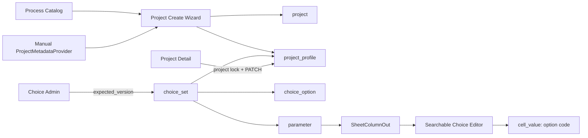

# Phase 2.6 Project Profile + Managed Choice Design

- **Status:** Approved
- **Approved:** 2026-07-14
- **Placement:** Phase 2.5 이후, Phase 3 검증 엔진 이전
- **Depends on:** Phase 2.5 route/UI 구조, Phase 2 잠금·셀 저장·붙여넣기 계약
- **Detailed UI contract:** [`DESIGN.md`](../../../DESIGN.md)

## 1. Purpose

Phase 2.6은 두 기반을 추가한다.

1. 프로젝트 생성 시 복사되고 이후 프로젝트 안에서 독립적으로 편집되는 고정 Project Profile
2. 프로젝트 필드와 조건표 파라미터가 재사용하는 관리자 제어 ChoiceSet

이 작업은 Phase 3보다 먼저 완료한다. Phase 3의 choice 검증이 기존의 파라미터 종속
`parameter_option`이 아니라 최종 ChoiceSet 계약 위에서 구현되어야 하기 때문이다.

가장 중요한 범위 경계는 다음과 같다.

- 자동 연동 또는 자동 초기값은 **Project Profile에만** 존재한다.
- 조건표의 `cell_value`는 전부 사용자가 직접 입력한다.
- 따라서 셀에는 자동값 출처, 자동/수동 상태, override 여부를 저장하지 않는다.
- 이번 Phase에서는 실제 PARTID 원천 DB를 연결하지 않는다.
- 실제 원천 대신 교체 가능한 provider 경계와 수동 입력 흐름만 완성한다.

## 2. Approved decisions

| ID | Decision |
|---|---|
| P26-D1 | Project Profile 필드 집합은 고정한다. 관리자 정의 EAV/JSON 필드 시스템을 만들지 않는다. |
| P26-D2 | `device_ref`는 모델, API, 화면에서 제외한다. |
| P26-D3 | 프로젝트 식별자는 기존 `(line_id, process_id, part_id)`를 유지하고 수정할 수 없다. |
| P26-D4 | 생성 화면은 기존 식별정보·프로젝트명에 Device Type, Project Category, Comment만 추가한다. |
| P26-D5 | 나머지 Profile은 생성 후 프로젝트 상세에서 편집한다. |
| P26-D6 | 향후 원천 DB 값은 생성 시 한 번 Project Profile에 복사한다. 원천과 이후 동기화하지 않는다. |
| P26-D7 | 원천에서 복사된 모든 Profile 값도 프로젝트 안에서는 사람이 수정할 수 있다. |
| P26-D8 | 이번 Phase는 수동 provider만 사용한다. 실제 PARTID 조회는 후속 계약이다. |
| P26-D9 | 조건표 셀은 모두 수동 입력이며 `text`, 소수 지원 `number`, 관리형 `choice`만 사용한다. |
| P26-D10 | 업무용 choice는 코드 상수가 아니라 ChoiceSet 관리 화면에서 관리한다. 앱 동작을 분기하는 시스템 enum만 코드에 남긴다. |
| P26-D11 | 셀과 Profile에는 내부 DB ID가 아니라 사람이 읽을 수 있는 안정적 option code를 저장한다. label은 별도로 변경할 수 있다. |
| P26-D12 | ChoiceSet은 여러 파라미터와 고정 Project Profile 필드가 공유할 수 있다. |
| P26-D13 | 예상 최대 ChoiceSet은 수백 항목이다. 한 세트를 한 번 로드·캐시하고 code/label을 로컬 검색한다. |
| P26-D14 | Choice 변경은 모든 Draft에 즉시 반영한다. 비활성 기존값은 보존·표시하고 경고만 하며 승인도 허용하되, 신규 선택은 막는다. 승인본은 향후 승인 시점 스냅샷을 쓴다. |
| P26-D15 | Project Profile 편집은 기존 프로젝트 단위 잠금을 사용한다. |
| P26-D16 | 현재 보존할 운영 데이터가 없으므로 in-place 데이터 이관은 비목표다. Phase 적용 시 개발 DB를 초기화한다. |
| P26-D17 | 새 외부 UI·상태·검색 의존성을 추가하지 않는다. |

## 3. Goals and non-goals

### Goals

- 프로젝트 기본정보를 고정된 검색·조회 가능한 스키마로 저장한다.
- 짧은 프로젝트 생성 흐름을 유지하면서 상세에서 전체 Profile을 편집한다.
- 파라미터마다 쉼표 문자열로 관리하던 선택지를 재사용 가능한 ChoiceSet으로 교체한다.
- 수백 개 선택지를 키보드로 빠르게 검색·선택할 수 있게 한다.
- option label을 바꿔도 저장된 프로젝트·셀·이력이 깨지지 않게 한다.
- Phase 3의 choice 검증과 Phase 5의 승인 스냅샷이 사용할 최종 정의 경계를 만든다.

### Non-goals

- 실제 PARTID DB, 테이블, join, 인증 또는 네트워크 연결
- Project Profile 값을 다시 원천과 동기화하는 기능
- Layer/Shot/노광 집계 자동 계산
- Project Profile 필드 추가·삭제 관리 UI
- 조건표 셀 자동 입력 또는 자동 override 상태
- Phase 3 검증 엔진
- 승인, Revision, 출력
- 레거시 운영 데이터 이관

### Preserved contracts

- 기존 프로젝트 목록·생성·상세·시트 route
- Process 구조 선택과 백본 프로젝트 복사
- 레이어별 백본 교체
- 프로젝트 단위 edit lock과 fencing token
- 셀 자동저장·write queue·dirty unload flush
- 붙여넣기 review/apply/cancel
- 조건 행 CRUD·POR
- Draft는 live 레지스트리, 향후 Approved는 frozen snapshot

## 4. Architecture



### Boundaries

- `project` owns identity, lifecycle, name, and timestamps.
- `project_profile` owns fixed business facts copied for that project.
- `ProjectMetadataProvider` owns only creation-time seed lookup.
- `choice_set` and `choice_option` own business-controlled choices.
- `parameter` references a ChoiceSet only when `value_type=choice`.
- `cell_value` continues to own only the current manually entered string value.
- frontend Choice caches are keyed by `choiceSetCode + version`.

## 5. Data model

### 5.1 `project`

Keep:

- `id`
- `line_id`
- `process_id`
- `part_id`
- `name`
- `status`
- `created_at`
- `updated_at`
- UNIQUE `(line_id, process_id, part_id)`

Remove the obsolete `description` field in the fresh-start schema. Its user-facing replacement is
`project_profile.comment`.

### 5.2 `project_profile`

`project_id` is both the primary key and an `ON DELETE CASCADE` foreign key to `project.id`.
Every project owns exactly one Profile row.

| Column | Storage | UI editor | Notes |
|---|---|---|---|
| `project_id` | integer PK/FK | none | project identity |
| `process_name` | text, required | text | selected Process display snapshot; editable after creation |
| `device_type_code` | string(128), required | searchable choice | fixed ChoiceSet `device_type` |
| `project_category_code` | string(128), required | searchable choice | fixed ChoiceSet `project_category` |
| `comment` | nullable text | textarea | creation core field |
| `active_direction_code` | nullable string(128) | searchable choice | fixed ChoiceSet `active_direction` |
| `gate_direction_code` | nullable string(128) | searchable choice | fixed ChoiceSet `gate_direction` |
| `gross_die` | nullable text | text | no numeric assumption yet |
| `pitch_x`, `pitch_y` | nullable text | decimal spin | canonical decimal string |
| `shot_x`, `shot_y` | nullable text | decimal spin | canonical decimal string |
| `slit_occupancy`, `lens_occupancy` | nullable text | decimal spin | unit deferred |
| `map_offset_x`, `map_offset_y` | nullable text | decimal spin | negative value allowed |
| `scribe_lane_x`, `scribe_lane_y` | nullable text | decimal spin | canonical decimal string |
| `shot_count`, `full_shot` | nullable text | text | calculation/source contract deferred |
| `layer_total` | nullable text | text | shown in project list |
| `euv`, `imm`, `arf`, `krf` | nullable text | text | layer summaries |
| `iline`, `soh`, `pspi` | nullable text | text | layer summaries |
| `metal_layer_count` | nullable text | text | layer summary |
| `created_at`, `updated_at` | timestamptz | none | audit timestamps |

Process name, Device Type, and Project Category are required at the database and API layers. All
other Profile values are nullable. A project cannot be created until the two required ChoiceSets
contain active options; schema bootstrap itself does not require a Profile row until project creation.

Decimal spin values use one language-neutral contract:

- trim surrounding whitespace; blank input clears an optional Profile field or cell to `null`,
- accept `^-?(?:\d+(?:\.\d*)?|\.\d+)$` after trimming,
- reject a leading `+`, exponent notation, locale separators, underscores, `NaN`, and infinities,
- accept at most 256 input characters and 128 digits, excluding sign and decimal point,
- remove redundant integer leading zeros and fractional trailing zeros,
- add the missing zero around a decimal point and normalize every negative zero to `0`,
- store the canonical result as text.

Golden vectors shared by backend and frontend tests are:

| Input | Stored value |
|---|---|
| `" 001.5000 "` | `"1.5"` |
| `".5"` | `"0.5"` |
| `"1."` | `"1"` |
| `"-0.000"` | `"0"` |
| `"+1"`, `"1e3"`, `"1,000"`, `"NaN"`, `"Infinity"` | rejected |

The same contract replaces the current `float()`-only number-cell check and is used by Profile spin
fields, single-cell writes, batch writes, paste staging, and numeric parameter bounds. Python uses
`Decimal` and TypeScript uses string normalization; neither converts through binary float/`Number`.
No path may validate one spelling and persist another.

No units, bounds, or calculation rules are invented in Phase 2.6.

### 5.3 `choice_set`

| Column | Constraint |
|---|---|
| `id` | integer PK |
| `code` | string(64), unique, immutable, indexed |
| `display_name` | string(128), required |
| `description` | nullable string(512) |
| `is_active` | boolean, default true |
| `version` | integer, starts at 1 and increments for every set or option mutation |
| `created_at`, `updated_at` | timestamptz |

### 5.4 `choice_option`

| Column | Constraint |
|---|---|
| `id` | integer PK |
| `choice_set_id` | FK, indexed, cascade with set |
| `code` | trimmed non-empty string(128), immutable |
| `label` | non-empty string(128), mutable |
| `sort_order` | integer, default 0 |
| `is_active` | boolean, default true |

Constraints:

- UNIQUE `(choice_set_id, code)`
- hard deletion is not exposed by the API
- option code comparison is exact; admin UI warns on case-only near-duplicates
- internal numeric IDs never appear as stored business values

### 5.5 `parameter`

Keep `value_type = text | number | choice` and add nullable `choice_set_id`.

Rules:

- `choice` requires an active ChoiceSet.
- `text` and `number` must have `choice_set_id = NULL`.
- `choice_set_id` is immutable after parameter creation in Phase 2.6.
- number always uses the decimal spin editor.
- choice always uses the searchable managed-choice editor.
- `min_value` and `max_value` move from binary float to nullable `NUMERIC`; APIs serialize them as
  canonical decimal strings and require `min_value <= max_value` when both exist.
- legacy `parameter_option` is removed by the fresh-start schema transition.

The legacy input vocabulary collapses to this model; it does not create more runtime editor types:

| Legacy term | Phase 2.6 meaning |
|---|---|
| `자동`, `자동_spin` | not a sheet editor type; automatic initialization belongs only to Project Profile |
| `직접입력_spin` | `number` |
| `직접입력(text)`, text-like `combobox(custom)`, `입력없음(text)` | `text` |
| `combobox_custom(choice)`, `combobycode`, `lookup`, `searchlookup` | `choice` backed by a managed ChoiceSet |

Because this is a fresh-start transition, the table is a configuration contract rather than a
legacy-row backfill algorithm.

### 5.6 `cell_value`

No schema change.

- text cell stores text
- number cell stores normalized decimal text
- choice cell stores `choice_option.code`
- all values are manually entered
- no source, automatic, override, or copied-profile metadata is added

### 5.7 change events

Add `PROJECT_PROFILE_UPDATE` to `ChangeEventType`.

Its payload contains:

```json
{
  "changes": {
    "device_type_code": {
      "old": {"code": "FOUNDRY", "label": "Foundry"},
      "new": {"code": "SPECIAL", "label": "Special customer"}
    },
    "pitch_x": {"old": "10.5", "new": "10.75"}
  }
}
```

Choice cell `CELL_UPDATE` events keep `old_value` and `new_value` as stable codes and add
`old_label` / `new_label` snapshots to the JSON payload. This makes debugging and later history UI
independent of future label changes.

`PROJECT_CREATE` records the selected metadata provider identifier, the raw Profile seed it returned,
and the final raw Profile values after explicit request fields win. It never records credentials,
connection strings, or query text. This one-time payload preserves enough evidence to diagnose a
future provider mapping without adding source/override state to sheet cells.

### 5.8 parameter snapshot version 2

The existing snapshot serializer moves from version 1 to version 2. Instead of nesting duplicated
options under each parameter, it writes a top-level `choice_sets` list. That list contains the union
of:

- every ChoiceSet referenced by an active choice parameter, and
- the four fixed Profile sets: `device_type`, `project_category`, `active_direction`, and
  `gate_direction`.

Each entry records set `code`, `display_name`, `version`, and **all active and inactive options** with
`code`, `label`, `sort_order`, and `is_active`. Sets are sorted by set code; options are sorted by
`(sort_order, code)`; parameters retain their existing canonical parameter-code order. Choice
parameters reference the top-level set by immutable code. Including inactive options preserves the
label of an already stored inactive code, including Profile choices, if a Draft is later approved.
Phase 2.6 produces the deterministic serializer and tests; Phase 5 still owns writing it onto an
approved project.

## 6. Choice lifecycle

### Creation and reuse

Administrators create a ChoiceSet once and select it when creating a choice parameter. Fixed Project
Profile fields reference these set codes:

- `device_type`
- `project_category`
- `active_direction`
- `gate_direction`

The migration/schema bootstrap creates the four sets without inventing business options. Development
fixtures add representative options only in development/test data.

### Draft behavior

- option add: immediately selectable in every Draft consumer
- label edit: immediately visible in every Draft consumer; stored codes do not change
- option deactivate: existing codes remain resolvable, display `사용 중지됨`, and produce a
  non-blocking warning; new entry is blocked
- set deactivate: existing values remain readable; parameter/profile creation cannot bind or select it

“Immediately visible in Draft” means no project revision or reload is required, not push delivery.
An in-app Choice mutation invalidates the affected cache immediately. Every combobox open and window
focus refetches the lightweight ChoiceSet summary; while a sheet is focused, summaries for its
distinct sets use a 60-second refetch interval. A newer version invalidates option pages before the
editor opens, so a focused Draft discovers a registry change within 60 seconds. SSE or WebSocket
delivery is not introduced.

### Approved behavior

Phase 5 resolves parameter and fixed Profile choice codes through snapshot v2, not the live
ChoiceSet. A future label edit therefore cannot change an Approved document. An already-stored known
code remains approval-eligible after deactivation; it is a warning, not a Review-gate error. Unknown
codes remain errors.

### Versioning and conflicts

Every mutation of an existing set or its options carries `expected_version`; initial ChoiceSet
creation is the only exception. A mismatch returns 409 with the latest set summary. The client
preserves the draft and offers a reload. Bulk import and reorder increment the version once per
successful transaction.

Option reads may carry `version`. A consumer that already knows a version, including a sheet, sends
it on the first page. A mismatch returns 409 before any items. An admin page with no known version may
omit it and keys the aggregate only by the version returned in the first response. Every later cursor
also embeds that version. The client never inserts a response under a different version's cache key.

## 7. API contracts

All paths remain under `/api`.

### 7.1 Project creation

Extend `ProjectCreate`:

```text
line_id: string
process_id: string
part_id: string
name: string
device_type_code: string
project_category_code: string
comment?: string | null
backbone_project_id?: integer | null
manual_overrides: ManualOverrideIn[] = []

ManualOverrideIn {
  target_layer_key: string
  source_layer_key: string
}
```

`manual_overrides` remains the existing backbone layer-match override list; it is unrelated to
Profile source overrides. The response remains `ProjectOut`, removes obsolete `description`, and adds
`profile: ProjectProfileOut` while preserving the existing `layers` contract.

Creation is one transaction:

1. validate immutable identity and duplicate policy,
2. validate core Choice codes,
3. resolve `process_name` from the selected Process Catalog entry,
4. call `ProjectMetadataProvider.load_seed(line_id=..., process_id=..., part_id=...)`,
5. merge provider seed, then explicit Device Type, Category, and Comment; assign Process Catalog
   `process_name` separately so a provider cannot replace it,
6. create project and Profile,
7. create Process-derived layers and optional backbone cells,
8. append project-create event,
9. commit.

Provider failure, no-match, or ambiguous-match aborts before any project is visible. The manual
provider used in Phase 2.6 always returns an empty seed.

### 7.2 Project Profile

- `GET /api/projects/{project_id}/profile`
- `PATCH /api/projects/{project_id}/profile`

`PATCH`:

- requires the existing `X-Lock-Token` header,
- uses explicit-field semantics: omitted means unchanged, explicit `null` clears an optional field,
- rejects clearing `process_name`, `device_type_code`, or `project_category_code`,
- validates all fields before applying any change,
- writes one `PROJECT_PROFILE_UPDATE` event,
- updates `project.updated_at`,
- returns the complete resolved Profile.

Identity fields are not part of the request schema.
Both Profile endpoints return `ProjectProfileOut`.

Every field below defaults to **unset** in `ProjectProfilePatchIn`; `?` means it may be supplied, not
that a required stored field accepts `null`:

```text
ProjectProfilePatchIn {
  process_name?: string
  device_type_code?: string
  project_category_code?: string
  comment?: string | null
  active_direction_code?: string | null
  gate_direction_code?: string | null
  gross_die?: string | null
  pitch_x?: string | null
  pitch_y?: string | null
  shot_x?: string | null
  shot_y?: string | null
  slit_occupancy?: string | null
  lens_occupancy?: string | null
  map_offset_x?: string | null
  map_offset_y?: string | null
  scribe_lane_x?: string | null
  scribe_lane_y?: string | null
  shot_count?: string | null
  full_shot?: string | null
  layer_total?: string | null
  euv?: string | null
  imm?: string | null
  arf?: string | null
  krf?: string | null
  iline?: string | null
  soh?: string | null
  pspi?: string | null
  metal_layer_count?: string | null
}
```

Required strings are trimmed and must remain non-empty; Choice codes are trimmed and then compared
exactly. Optional text trims only outer whitespace and converts blank to `null`. Optional decimal
spin fields use the §5.2 decimal contract and convert blank to `null`.

Choice output uses:

```text
ChoiceValueOut {
  code: string
  label: string
  is_active: boolean
}

ProjectProfileOut {
  project_id: integer
  process_name: string
  device_type: ChoiceValueOut
  project_category: ChoiceValueOut
  comment: string | null
  active_direction: ChoiceValueOut | null
  gate_direction: ChoiceValueOut | null
  gross_die: string | null
  pitch_x: string | null
  pitch_y: string | null
  shot_x: string | null
  shot_y: string | null
  slit_occupancy: string | null
  lens_occupancy: string | null
  map_offset_x: string | null
  map_offset_y: string | null
  scribe_lane_x: string | null
  scribe_lane_y: string | null
  shot_count: string | null
  full_shot: string | null
  layer_total: string | null
  euv: string | null
  imm: string | null
  arf: string | null
  krf: string | null
  iline: string | null
  soh: string | null
  pspi: string | null
  metal_layer_count: string | null
  created_at: datetime
  updated_at: datetime
}
```

### 7.3 Project list

`ProjectSummaryOut` adds:

- `device_type: ChoiceValueOut`
- `project_category: ChoiceValueOut`
- `layer_total: string | null`
- `updated_at: datetime`

List query adds optional `device_type_code` and `project_category_code` filters. Codes are trimmed and
matched exactly. The existing case-insensitive free-text query also matches Comment and resolved
choice code/label, but Comment is not rendered as a table column.

### 7.4 ChoiceSet administration

- `GET /api/choice-sets?include_inactive=`
- `POST /api/choice-sets`
- `GET /api/choice-sets/{set_code}`
- `PATCH /api/choice-sets/{set_code}`
- `GET /api/choice-sets/{set_code}/options?q=&version=&cursor=&limit=&include_inactive=`
- `POST /api/choice-sets/{set_code}/options`
- `PATCH /api/choice-sets/{set_code}/options/{option_code}`
- `PUT /api/choice-sets/{set_code}/option-order`
- `POST /api/choice-sets/{set_code}/import/preview`
- `POST /api/choice-sets/{set_code}/import`

Requests and common outputs are fixed as:

```text
ChoiceSetCreateIn {
  code: string
  display_name: string
  description?: string | null
}

ChoiceSetPatchIn {
  expected_version: integer
  display_name?: string
  description?: string | null
  is_active?: boolean
}

ChoiceOptionCreateIn {
  expected_version: integer
  code: string
  label: string
  sort_order?: integer = 0
  is_active?: boolean = true
}

ChoiceOptionPatchIn {
  expected_version: integer
  label?: string
  sort_order?: integer
  is_active?: boolean
}

ChoiceOptionOrderIn {
  expected_version: integer
  ordered_codes: string[]
}

ChoiceImportIn {
  expected_version: integer
  csv_text: string
}

ChoiceSetSummaryOut {
  code: string
  display_name: string
  description: string | null
  is_active: boolean
  version: integer
  option_count: integer
  active_option_count: integer
  parameter_usage_count: integer
  profile_usage_fields: string[]
  created_at: datetime
  updated_at: datetime
}

ChoiceOptionOut {
  code: string
  label: string
  sort_order: integer
  is_active: boolean
}

ChoiceOptionMutationOut {
  choice_set: ChoiceSetSummaryOut
  option: ChoiceOptionOut
}

ChoiceImportRowOut {
  line: integer
  code: string
  action: "create" | "update" | "error"
  message: string | null
}

ChoiceImportPreviewOut {
  set_code: string
  base_version: integer
  created_count: integer
  updated_count: integer
  error_count: integer
  rows: ChoiceImportRowOut[]
}

ChoiceImportApplyOut {
  choice_set: ChoiceSetSummaryOut
  created_count: integer
  updated_count: integer
  error_count: 0
  rows: ChoiceImportRowOut[]
}
```

Create set returns `ChoiceSetSummaryOut` with version 1. Set PATCH and reorder return the updated
summary. Option create/PATCH returns `ChoiceOptionMutationOut`. List/get return summaries without
inline option arrays. `expected_version` always lives in the JSON body, never a custom header.

| Endpoint | Success response |
|---|---|
| list sets | `ChoiceSetSummaryOut[]` |
| create/get/PATCH set | `ChoiceSetSummaryOut` |
| list options | `ChoiceOptionPageOut` |
| create/PATCH option | `ChoiceOptionMutationOut` |
| reorder | `ChoiceSetSummaryOut` |
| import preview | `ChoiceImportPreviewOut` |
| import apply | `ChoiceImportApplyOut` |

Set-list `include_inactive` defaults to false. Create endpoints return 201; all other successful
endpoints above return 200.

The import format is:

```csv
code,label,sort_order,is_active
FOUNDRY,Foundry,10,true
SPECIAL,Special customer,20,true
```

Preview reports every row. Apply is atomic and is rejected if any row is invalid or if
`expected_version` is stale. Duplicate input codes are errors; existing options absent from the CSV
remain unchanged. One successful apply increments the set version exactly once.

Options pagination returns:

```text
ChoiceOptionPageOut {
  set_code: string
  version: integer
  items: ChoiceOptionOut[]
  next_cursor: string | null
}
```

`include_inactive` defaults to false; sheet and admin detail consumers request true. `limit` defaults
to 100 and is capped at 500. The opaque cursor carries the set version and ordering position. Results
are ordered by `(sort_order, code)`, and `q` is a case-insensitive code/label substring search. A
supplied first-page `version` must equal the current version. If the set changes before any page or
between pages, the request returns 409 `choice_set_changed`; the client discards the partial
aggregate and restarts from the first page. This prevents a cache from combining options from
different versions.

Every version conflict uses the existing error envelope:

```text
ChoiceSetChangedError {
  code: "choice_set_changed"
  message: "선택지 집합이 다른 관리자에 의해 변경되었습니다."
  details: {
    set_code: string
    expected_version: integer
    actual_version: integer
    choice_set: ChoiceSetSummaryOut
  }
}
```

`ordered_codes` must contain every active and inactive option code exactly once. Invalid request
shape, immutable-code edits, blank labels, duplicate codes, and attempts to activate an option in an
inactive set return 422 without a partial write.

### 7.5 Parameter administration

`ParameterCreate` adds `choice_set_code: string | null`; `ParameterOut` returns
`choice_set: ChoiceSetSummaryOut | null` instead of an embedded options array. `min_value` and
`max_value` become canonical decimal strings in both directions. Parameter PATCH cannot change
`choice_set_code` in Phase 2.6. The editor selects a set from active ChoiceSets; it no longer edits
comma-delimited options.

### 7.6 Sheet

`SheetColumnOut` replaces `choice_options` with:

- `choice_set_code: string | null`
- `choice_set_version: integer | null`

The row/cell payload remains the same. Frontend loads each distinct ChoiceSet once, sends the column
version on the first options request, and caches all pages under
`(setCode, responseVersion, includeInactive=true)`.

Server write validation is hard and atomic for value type: number must satisfy the §5.2 grammar and
is persisted normalized; a new choice value must be a matching active code. Unknown/inactive choice
writes and malformed numbers return 422 for the full batch. Clearing a cell remains valid. An already
stored known inactive code remains readable and generates a non-blocking warning; it need not be
rewritten to remain approval-eligible. Phase 3 range, required, and pattern rules are separate soft
Draft validation and may be stored with violations.

### 7.7 Provider boundary

```python
class ProjectMetadataProvider(Protocol):
    async def load_seed(
        self,
        *,
        line_id: str,
        process_id: str,
        part_id: str,
    ) -> ProjectProfileSeed: ...
```

`ProjectProfileSeed` may contain any nullable Profile field plus Device Type, Project Category, and
Comment defaults. It contains neither project identity nor `process_name`; Process Catalog alone owns
that display snapshot. Explicit create-request Device Type, Category, and Comment win over seed
values. Phase 2.6 registers `ManualProjectMetadataProvider`, which returns an empty seed. A later
adapter owns actual connection, query, cardinality, and field mapping.

## 8. UI and interaction

### 8.1 Project creation

The W1 final information step contains:

- read-only LINE and Process selected earlier,
- PARTID,
- project name,
- required searchable Device Type,
- required searchable Project Category,
- optional Comment.

If a required ChoiceSet has no active options, the form explains that an administrator must configure
it and links to its management route. It never falls back to arbitrary text.

### 8.2 Project list

Columns:

1. project name
2. LINE / Process
3. PARTID
4. Device Type
5. Category
6. Layer Total
7. status
8. updated time

At narrower desktop widths, Layer Total and updated time collapse before identity and classification.
Comment is search-only and does not consume a table column.

### 8.3 Project detail and edit

The detail renders a definition grid grouped as:

- identity: LINE, Process ID, PARTID (read-only)
- product: Process name, Device Type, Category, Comment
- direction: Active Direction, Gate Direction
- die/shot: Gross Die, Pitch, Shot, Occupancy
- wafer position: Map Offset, Scribe Lane
- layer summary: total and exposure/material counts

`기본정보 편집` opens a right Drawer:

1. acquire project lock,
2. refetch Profile,
3. render grouped two-column inputs,
4. trap focus and guard dirty navigation,
5. PATCH all changed fields atomically,
6. refresh list/detail caches,
7. release on save, cancel, or close after pending writes settle.

A lock conflict names the holder, keeps the detail readable, and provides retry. The drawer does not
open an editable stale draft without a lock.

### 8.4 Choice administration

Routes:

- `/parameters`
- `/parameters/choice-sets`
- `/parameters/choice-sets/:setCode`

The set list shows code, name, active state, option count, parameter usage count, fixed Profile usage,
version, and updated time. Set metadata creation/editing may use the established Drawer pattern.

The set detail is a full page because it can contain hundreds of options. It provides:

- code/label search,
- compact option table,
- add/edit/deactivate,
- keyboard reorder controls,
- usage and blast-radius warning,
- CSV preview/apply dialog.

### 8.5 Sheet choice editor

The existing Glide custom-cell boundary stays in place. A DOM overlay implements an accessible
combobox without a new package.

- single click or Enter opens
- input receives focus
- code and label both filter
- Arrow Up/Down moves the active option
- Enter selects
- Escape cancels
- Home/End jump within results
- selected active option is announced
- inactive stored value is shown with `사용 중지됨`
- the cell displays label; tooltip and diagnostics display `code · label`
- a failed option request leaves the raw stored code readable and exposes retry

Use `role=combobox`, `aria-expanded`, `aria-controls`, `aria-activedescendant`, `role=listbox`, and
`role=option`. Canvas remains the grid semantic owner; no parallel fake HTML table is introduced.

## 9. Concurrency, audit, and error handling

### Project Profile

- existing project lock and fencing token cover Profile updates
- all Profile changes are atomic
- validation failure preserves the drawer draft
- lock loss switches the drawer to read-only and retains unsaved values for copy/recovery
- identity cannot be changed through Profile endpoints

### Choice administration

- optimistic `expected_version` avoids global locks
- a stale mutation returns 409 and the latest version
- the client keeps its draft and never silently overwrites another administrator
- deactivate, reorder, import, and label edit are transactions
- usage count and impacted parameter/Profile fields are shown before deactivation

### Choice consumers

- existing inactive code: readable
- new inactive/unknown code: 422 domain error
- label request failure: show stored code, not a blank cell
- cache version change: invalidate and reload the set
- paste review uses the same active-code validator as single-cell editing

### Provider

The manual provider cannot fail on external I/O. A future real provider must distinguish not-found,
ambiguous, unavailable, and malformed source data. All are pre-commit project-create failures.

## 10. Fresh-start schema transition

There is no current production data to preserve. Phase 2.6 therefore optimizes for a clean final
schema rather than a compatibility bridge.

- add a new Alembic revision for `project_profile`, `choice_set`, `choice_option`, and
  `parameter.choice_set_id`
- remove `project.description` and `parameter_option`
- do not write a legacy option/cell/Profile backfill
- reset local app DB volumes before running the Phase 2.6 schema
- recreate development/demo data through the maintained seed script
- update fixtures to create ChoiceSets before choice parameters and projects

The Alembic upgrade runs a preflight check **before its first schema-changing DDL**. It refuses the
transition if any row exists in an application-owned mutable table, including
`parameter_category`, `parameter`, `parameter_option`, `project`, `sheet_layer`,
`layer_condition`, `cell_value`, `change_event`, or `edit_lock`. `alembic_version` and the separate
read-only ingest database are not part of the check. The operator must reset the disposable app DB or
stop and commission a preservation migration. This deliberately reset-only rule also prevents an
old choice parameter from surviving without the new required `choice_set_id`.

## 11. Performance and caching

- expected set size: hundreds, not tens of thousands
- options endpoint is paginated, but frontend combines all pages once per response version
- one project sheet fetches each distinct ChoiceSet once, never once per cell or column instance
- `SheetOut` does not embed duplicated option arrays
- local filtering compares normalized code and label
- option table and combobox result rendering limit DOM work to visible/filtered results
- server validates by indexed `(choice_set_id, code)` lookup
- project list joins one Profile row and resolves its two returned Choice fields without N+1 queries

If measured set size later reaches thousands, the existing `q/cursor/limit` endpoint permits the
combobox to switch to debounced server search without changing stored values or API identity.

## 12. Verification and acceptance criteria

### Backend

- Profile row is created transactionally with every project.
- new project requires active Device Type and Project Category codes.
- Profile PATCH supports omit, set, and explicit clear for nullable fields; it rejects clearing
  or blanking Process Name, Device Type, or Project Category.
- Profile PATCH requires the correct `X-Lock-Token`.
- identity cannot be changed through Profile APIs.
- Profile event records old/new raw values and choice label snapshots.
- Choice code and set code are immutable.
- stale ChoiceSet versions return 409 without partial writes.
- CSV preview is side-effect free; apply is atomic.
- inactive existing option resolves with a non-blocking warning and remains approval-eligible;
  inactive or unknown new writes fail.
- the shared decimal normalizer is used by Profile spin fields, single-cell writes, batch writes,
  paste, and numeric bounds; all golden vectors pass in Python and TypeScript.
- cell number and choice validation use the final registry contract.
- parameter snapshot version 2 is deterministic, retains active and inactive option labels, and
  includes both parameter-referenced sets and all four fixed Profile sets.
- a ChoiceSet mutation between paginated option requests returns `choice_set_changed`; retry starts
  from page one without combining versions.
- Choice/Profile request and response schemas round-trip without dropping explicit null versus unset.
- Alembic preflight runs before DDL and rejects any non-empty application-owned mutable table.

### Frontend

- create wizard preserves prior W1 route/dirty/stale-request behavior.
- required profile Choice fields block submission with actionable copy.
- list filters and direct project links remain restorable.
- detail groups every fixed Profile field and excludes Device Ref.
- drawer acquire/refetch/edit/save/release order is deterministic.
- drawer preserves drafts across validation, network, and lock errors.
- ChoiceSet list/detail routes restore selection and search state.
- option import preview/apply and version conflicts preserve drafts.
- combobox supports mouse, keyboard, focus return, and screen-reader semantics.
- code and label are both searchable and visible in diagnostics.
- inactive stored choices remain readable but cannot be newly selected.
- an open Draft discovers newer ChoiceSet versions on editor open, window focus, and within 60
  seconds while the sheet remains focused; the first options page is never cached under a stale key.
- paste and single-cell validation agree.

### Regression and visual evidence

- full frontend lint/typecheck/Vitest/build
- full backend Ruff/Pyright/pytest
- migration from an empty revision-0003 database and clean database creation
- existing project/backbone/layer/lock/autosave/paste/condition tests
- browser QA for project create/list/detail/Profile drawer
- browser QA for ChoiceSet list/detail/import
- browser QA for sheet choice selection and inactive values
- 1024, 1440, and 1920 viewport evidence
- no new runtime dependencies

## 13. Completion criteria

Phase 2.6 is complete only when:

1. Project Profile exists for every project and is fully readable/editable under the project lock.
2. project creation captures Device Type, Category, and Comment without lengthening the flow with all
   Profile fields.
3. project list and detail expose the approved Profile subset/full view.
4. ChoiceSet administration replaces comma-delimited parameter option editing.
5. choice parameters and fixed Profile choice fields reuse managed sets.
6. sheet choice cells store stable codes and use an accessible searchable editor.
7. inactive-value, concurrency, CSV, paste, and debugging contracts pass.
8. the clean-schema transition and reset requirement are documented and verified.
9. Phase 3 can implement choice validation without another option-model migration.

## 14. Explicitly deferred contracts

The following work is deliberately excluded rather than left ambiguous:

- actual PARTID metadata source database, credentials, tables, joins, and cardinality
- source-to-Profile field mapping
- field units and domain bounds
- Layer/Shot automatic calculations
- provider refresh/re-sync after creation
- legacy production-data migration
- ChoiceSet audit-history UI beyond version conflict and project/cell events
- approved-project snapshot persistence and Revision behavior

These items require separate approved designs or the already planned later phases. None blocks the
manual Project Profile and managed Choice implementation described here.
