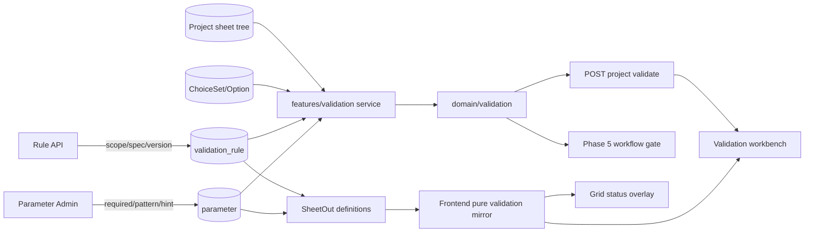

# Phase 3 Validation Engine Design

- **Status:** Approved
- **Approved:** 2026-07-15
- **Placement:** Phase 2.6 이후, Phase 4 변경 이력 이전
- **Depends on:** Phase 2 편집·잠금·자동저장 계약, Phase 2.5 workbench 계약, Phase 2.6 Project Profile·Managed Choice 계약
- **Detailed UI contract:** [`DESIGN.md`](../../../DESIGN.md)

## 1. Purpose

Phase 3은 조건표의 값을 저장 가능한지 판정하는 hard input boundary와, 저장된 Draft가 업무
규칙을 만족하는지 판정하는 validation boundary를 분리한다.

- malformed number와 새 invalid/inactive choice는 계속 저장 전에 거부한다.
- required, range, pattern, 관계 규칙 위반은 Draft 저장을 허용하고 issue로 표시한다.
- 프론트는 편집 즉시 같은 규칙을 provisional하게 평가한다.
- 서버는 저장된 프로젝트 전체를 같은 순수 도메인 엔진으로 최종 판정한다.
- Phase 5 Review/Approval gate는 HTTP 우회 호출 없이 이 엔진을 직접 재사용한다.

엔진은 두 종류의 규칙을 처리한다.

1. 파라미터 정의 하나만으로 판단 가능한 `required`, `range`, `pattern`, `choice`
2. 다른 셀을 참조하는 typed relation rule인 `required_if`, `value_exists_in_prior_por`

범용 수식 언어나 임의 코드를 만들지 않는다. 실제로 확인된 업무 규칙을 안전한 선언형
JSON union으로 표현하고, 새 규칙 family는 명시적인 domain type과 fixture를 추가해 확장한다.

## 2. Approved decisions

| ID | Decision |
|---|---|
| P3-D1 | validation domain은 FastAPI·Pydantic·SQLAlchemy·DB에 의존하지 않는 순수 Python 타입과 함수로 구현한다. |
| P3-D2 | parameter에 `required`, `pattern`, `pattern_hint`를 추가한다. `pattern`과 사용자 안내인 `pattern_hint`는 함께 존재하거나 함께 비어야 한다. |
| P3-D3 | pattern은 Python/JavaScript 공통의 bounded portable subset만 허용하며 전체 문자열 일치로 평가한다. |
| P3-D4 | 관계 규칙은 범용 AST가 아니라 discriminator를 가진 typed declarative JSON으로 저장한다. Phase 3 rule family는 `required_if`, `value_exists_in_prior_por` 두 개다. |
| P3-D5 | 규칙은 전역이 기본이며 선택적인 `line_id`, `process_id`, 현재 layer 속성 scope를 가진다. |
| P3-D6 | `value_exists_in_prior_por`는 현재 layer의 모든 조건 행을 검사하고, 앞선 모든 layer의 POR 행에서 후보 값을 모은다. |
| P3-D7 | source 값이 비면 prior-POR 관계 규칙은 skip한다. 비어 있음 자체는 `required` 또는 `required_if`가 담당한다. |
| P3-D8 | prior-POR 일치는 number는 Decimal 동등성, text는 대소문자 구분 문자열 동등성, choice는 option code 동등성을 사용한다. |
| P3-D9 | prior-POR 위반 issue는 현재 행의 source parameter 셀 하나에 anchor한다. 검색한 과거 셀 전체를 오류로 칠하지 않는다. |
| P3-D10 | `required_if`는 같은 조건 행에서 typed exact equality로 조건을 판단하고 required target 셀에 issue를 anchor한다. |
| P3-D11 | 검증 결과는 저장하지 않고 매번 계산한다. 20,000셀 규모에서 먼저 선형 평가와 온디맨드 API를 사용한다. |
| P3-D12 | 프론트는 Sheet가 제공한 정의와 규칙으로 모든 Phase 3 규칙을 즉시 mirror 평가하되, 서버 결과가 최종 판정이다. |
| P3-D13 | 셀 저장 성공 뒤 idle debounce로 서버 전체 검증을 실행하며, 명시적 검증은 자동저장 완료 뒤 실행한다. |
| P3-D14 | issue API는 raw backend message를 반환하지 않는다. stable code와 typed details를 프론트 message mapper가 행동 지향 한국어로 바꾼다. |
| P3-D15 | validation rule은 immutable code와 monotonic version을 가지며, 수정은 `expected_version`으로 lost update를 방지한다. |
| P3-D16 | snapshot schema를 v3로 올려 parameter validation metadata와 승인 시 적용된 relation rule을 함께 동결한다. |
| P3-D17 | 검증 응답과 Sheet definition은 exact validation definition을 나타내는 `basis_hash`를 제공한다. |
| P3-D18 | Phase 3에는 validation rule API와 개발 fixture를 제공하지만 rule-builder UI와 임의 production business seed는 만들지 않는다. |
| P3-D19 | 모든 조건 행을 검증한다. cross-layer 후보 참조만 POR로 제한한다. |
| P3-D20 | Phase 4에는 복사·layer 교체 시점의 immutable backbone baseline과 현재 조건표 전체 diff를 별도 handoff한다. |

## 3. Goals and non-goals

### Goals

- 잘못된 값을 편집 직후 셀과 workbench에서 발견한다.
- 저장을 허용하는 business issue와 저장 자체를 거부하는 malformed input을 구분한다.
- 서버·프론트가 동일한 fixture에서 동일한 issue를 만든다.
- DB 없이 domain validation 테스트를 실행한다.
- 모든 이전 layer의 POR 값 집합과 현재 모든 조건 행을 효율적으로 비교한다.
- 사용자 화면에는 원인과 다음 행동을 설명하고 내부 판정문을 노출하지 않는다.
- Phase 5가 판정 근거를 동결하고 재현할 수 있는 version/basis 계약을 제공한다.

### Non-goals

- 범용 수식 언어, 문자열 DSL, 사용자 정의 코드 실행
- aggregate `sum`, `avg`, 임의 arithmetic, nested boolean expression
- validation result cache 또는 issue persistence
- rule-builder 관리자 UI
- Project Profile 필드 검증 엔진 통합
- 승인 상태 머신, Review/Approval UI, Revision
- backbone baseline diff 구현; 이 문서는 Phase 4 handoff 계약만 고정한다.
- production parameter code를 추측한 business rule seed

### Preserved contracts

- `cell_value.value_text`는 nullable TEXT이고 모든 sheet cell은 수동 입력이다.
- number는 canonical decimal string으로 저장한다.
- choice는 stable option code를 저장한다.
- 비활성 기존 choice는 보존 가능하고 신규 선택은 불가능하다.
- Draft는 live registry를 사용한다.
- 프로젝트 단위 edit lock, fencing token, autosave queue, paste staging은 유지한다.
- grid library는 `frontend/src/grid` adapter 뒤에 남는다.

## 4. Architecture



### 4.1 Backend boundaries

`backend/app/domain/validation/` owns only pure contracts and evaluation:

- parameter definition types
- project/layer/condition/cell input types
- validation rule typed union
- portable pattern parser/validator
- standalone and relation evaluators
- stable issue construction and sorting
- validation definition canonicalization for hashing

`backend/app/features/validation/` owns application orchestration:

- active rule CRUD and optimistic concurrency
- project, registry, ChoiceSet, and rule loading
- live versus snapshot definition selection
- model/Pydantic-to-domain conversion
- whole-project validation API
- configuration failure translation

The domain package does not import `app.models`, `app.features`, FastAPI, Pydantic, or SQLAlchemy.
Phase 5 imports the domain/application validation boundary rather than making an HTTP request.

### 4.2 Frontend boundaries

- `frontend/src/shared/domain/validation/` owns the pure TypeScript mirror and shared fixture runner.
- `frontend/src/features/sheets/` owns validation generations, API orchestration, workbench state, and message mapping.
- `frontend/src/grid/` receives already aggregated cell statuses and remains unaware of rule JSON or API types.
- existing hard edit/paste validator remains the only boundary that can reject a candidate before it enters the dirty buffer.

## 5. Data model

### 5.1 Parameter validation metadata

Add to `parameter`:

| Column | Storage | Default | Constraint |
|---|---|---|---|
| `required` | boolean, non-null | false | valid for all value types |
| `pattern` | nullable string(256) | null | text parameters only; portable grammar |
| `pattern_hint` | nullable string(256) | null | required exactly when pattern exists |

Existing `min_value` and `max_value` remain the range definition and are valid only for number
parameters. `unit`, `min_value`, and `max_value` must be null for non-number parameters. Choice
parameters continue to require exactly one ChoiceSet, and non-choice parameters cannot bind one.

The parameter update API uses `model_fields_set` semantics so omission means “unchanged” while an
explicit `null` can clear pattern, hint, min, max, unit, description, or category where allowed.
Clearing pattern clears pattern_hint in the same atomic update; supplying only one half is rejected.

Parameter deactivation is rejected while an active validation rule references its code. An
administrator first deactivates or rewrites dependent rules, preventing active rules from anchoring
issues to a hidden column.

### 5.2 `validation_rule`

```text
validation_rule
  id              integer PK
  code            string(64), UNIQUE, immutable
  name            string(128)
  description     string(512), nullable
  severity        error | warning
  scope           JSONB
  spec            JSONB
  version         integer, default 1, >= 1
  is_active       boolean, default true
  created_at      timestamptz
  updated_at      timestamptz
```

SQLite tests use the repository's JSON variant; PostgreSQL uses JSONB. Code follows the existing
lowercase `^[a-z][a-z0-9_]*$` identity rule. API requests use `extra="forbid"` at every object level.

A PATCH includes `expected_version`. The repository locks the row, compares versions, and increments
version exactly once when canonical persisted content changes. A canonical no-op returns the current
row without incrementing. Code never changes. “Delete” is represented only by `is_active=false`.

### 5.3 Snapshot v3

Snapshot v3 extends the existing deterministic snapshot:

```json
{
  "version": 3,
  "categories": [],
  "parameters": [
    {
      "code": "mask_type",
      "value_type": "text",
      "required": false,
      "pattern": "[A-Z]{2}-[0-9]{4}",
      "pattern_hint": "영문 대문자 2자리-숫자 4자리"
    }
  ],
  "choice_sets": [],
  "validation_rules": [],
  "validation_basis_hash": "sha256:..."
}
```

At approval, Phase 5 passes rules already filtered to the project identity but preserves their layer
scope, code, version, severity, and spec. Canonical ordering is rule code order. Approved/Archived
validation and presentation never consult live rule definitions. Revision returns to live v3 inputs.

No stored approval snapshots exist before Phase 5, so this version bump needs no in-place snapshot
rewrite.

## 6. Pure domain contracts

The names below describe responsibilities, not mandatory file names.

### 6.1 Inputs

```text
ParameterDefinition
  code, display_name, value_type
  required, pattern, pattern_hint
  min_value, max_value
  choice_set_code, choices(code -> active state)
  sort_order

ProjectContext
  project_id, line_id, process_id

LayerInput
  key, layer_id, step_seq, eqp_type, area_name, sort_order
  conditions[]

ConditionInput
  id, label, condition_index, is_por
  values(parameter_code -> string|null)

ValidationRuleDefinition
  code, name, severity, version, scope, spec
```

Rows and definitions are immutable domain values for one evaluation. Numeric bounds and numeric
cell values are parsed with `Decimal`; no binary float participates.

### 6.2 Output

```text
ValidationIssue
  key
  code
  rule_code|null
  rule_version|null
  severity
  condition_id
  layer_key
  parameter_code
  details
```

Issue order is deterministic:

1. error before warning
2. layer sort key
3. condition index and condition ID
4. parameter sort order and code
5. rule code and issue code

`key` is derived from the issue family, rule identity when present, condition ID, and parameter code.
It is stable between client and server for the same sheet definition and values.

## 7. Portable pattern contract

### 7.1 Matching

- pattern applies only to text parameters.
- null/blank values skip pattern; required handles absence.
- matching covers the complete stored value.
- no runtime flags exist.
- maximum pattern length is 256 code points.
- every bounded repetition upper limit is at most 256.
- at most 16 top-level alternatives and 64 atoms per alternative are allowed.
- at most 16 quantified atoms may appear in one alternative.
- the computed maximum match length of one alternative is at most 1,024 code points.
- adjacent quantified atoms whose accepted character sets overlap are rejected; dot overlaps every set.

### 7.2 Allowed grammar

A pattern is a top-level alternation of sequences. A sequence contains literals, dot atoms, or
explicit character classes, each optionally followed by `?`, `{m}`, or `{m,n}`.

Allowed examples:

```text
[A-Z]{2}-[0-9]{4}
Y|N
[A-Za-z0-9_.-]{1,64}
가|나|다
```

Forbidden constructs:

- anchors `^`, `$`
- unbounded repetition `*`, `+`
- capturing or non-capturing groups
- lookahead or lookbehind
- backreferences and named references
- inline flags
- engine-dependent shorthand such as `\d`, `\w`, `\s`, `\p`
- open repetition such as `{2,}`
- malformed/descending/out-of-range repetitions

Escapes are accepted only for literal metacharacters. The backend parser validates and canonicalizes
the rule at parameter write time. Python uses full-match semantics. JavaScript wraps the validated
pattern for start/end matching and additionally requires the matched length to equal the input
length, avoiding JavaScript `$` matching before a final newline. Both runtimes run the same contract
vectors, including final-newline and Unicode cases. The restricted grammar deliberately trades
expressiveness for deterministic Python/JavaScript behavior and bounded runtime. A value longer
than every branch maximum fails without invoking the host regex engine. Adversarial
bounded patterns are part of the performance fixture; a pattern that exceeds any stated complexity
limit is rejected at write time rather than entrusted to the host regex engine.

The UI never displays the pattern. It maps `pattern_mismatch` and `pattern_hint` to
`<pattern_hint> 형식으로 입력해 주세요.`

## 8. Standalone rule semantics

### 8.1 Absence

Normal write paths trim surrounding whitespace and persist blank as null. The defensive domain
boundary treats null or an empty canonical value as absent without otherwise changing text content.

### 8.2 Required

A required parameter produces `required` error on every condition row where the value is absent.
Required is always blocking severity and is not configurable per parameter.

### 8.3 Range

- applies only when a number value is present
- min and max are inclusive
- min-only and max-only definitions are valid
- below min produces `range_min`; above max produces `range_max`
- a defensive malformed stored number produces `number_malformed`
- normal PATCH candidates cannot create malformed number storage

### 8.4 Pattern

A present text value that does not full-match produces `pattern_mismatch`. Pattern does not imply
required.

### 8.5 Choice

- a known active option produces no issue
- a known inactive option produces non-blocking `choice_inactive` warning
- an unknown stored code produces blocking `choice_unknown` error
- a new unknown or inactive candidate remains a hard write rejection before this evaluator

## 9. Relation rule schema

### 9.1 Scope

```json
{
  "line_ids": ["L1"],
  "process_ids": ["PROC_ALPHA"],
  "layers": {
    "layer_ids": ["ACT"],
    "step_seqs": ["020"],
    "eqp_types": ["PHOTO"],
    "area_names": ["PHOTO"]
  }
}
```

Every field is optional. An omitted field imposes no restriction. Values inside one array are OR;
different fields are AND. Empty arrays and duplicate values are rejected instead of being assigned
surprising semantics. Strings are trimmed and must remain non-empty.

Project filters apply once. Layer filters apply to the current layer being validated, not to prior
candidate layers. Candidate layer filtering is not a Phase 3 feature. `part_id`, source project,
condition label, and arbitrary profile predicates are intentionally excluded.

### 9.2 `required_if`

```json
{
  "schema_version": 1,
  "type": "required_if",
  "when_parameter_code": "use_equipment",
  "equals": "y",
  "required_parameter_code": "equipment_code"
}
```

Evaluation for each current condition row:

1. read the when value
2. compare it with the canonical typed literal
3. if unequal or absent, emit nothing
4. if equal and target is absent, emit `required_if` on the target cell

The literal is canonicalized at rule write time. A number literal uses the decimal canonicalizer. A
choice literal must be a known option code when the rule is written; later option deactivation does
not change the stable literal identity. Text equality is case-sensitive.

### 9.3 `value_exists_in_prior_por`

```json
{
  "schema_version": 1,
  "type": "value_exists_in_prior_por",
  "source_parameter_code": "mask_type",
  "candidate_parameter_code": "previous_mask"
}
```

Write-time constraints:

- source and candidate parameters exist and are active
- they share the same value type
- choice parameters bind the same ChoiceSet
- source and candidate codes may be equal, although different codes are the normal use case

Evaluation order is deterministic by `(sort_order, layer_key)`. For each current layer:

1. evaluate every current condition row against the candidate set accumulated from strictly earlier
   layers
2. skip a row when its source value is absent
3. create one `value_not_found_in_prior_por` issue on the current source cell when no typed-equal
   candidate exists
4. after evaluating the current layer, add the current layer POR row's non-empty candidate value for
   later layers

Adding the current POR value only after evaluation prevents a layer from satisfying itself. A layer
without POR contributes no candidate. Multiple earlier layers may contribute the same value; the
set deduplicates it. The first applicable layer has an empty prior set and therefore fails for a
present source unless its scope excludes that layer.

This is O(conditions + layers) per rule after value lookup, not a fresh scan of every earlier layer
for each current row.

## 10. Rule administration validation

Rule create/update performs these steps before persistence:

1. strict JSON shape and schema version validation
2. code, name, description, severity, and scope normalization
3. referenced parameter lookup including type and ChoiceSet compatibility
4. literal canonicalization for `required_if`
5. active reference validation
6. canonical JSON serialization and no-op detection
7. row lock, `expected_version` comparison, write, version increment

A malformed active rule must never silently disappear during project validation. Defensive loading
of corrupted database JSON fails with stable `validation_configuration_invalid`, blocks Phase 5
gates, and gives users the safe message `검증 규칙을 불러오지 못했습니다. 관리자에게 확인을 요청해
주세요.` Raw parser errors remain server diagnostics only.

## 11. Sheet and validation APIs

### 11.1 Sheet response additions

`SheetColumnOut` adds:

- `min_value`, `max_value`
- `required`
- `pattern`, `pattern_hint`

`SheetRowOut` adds explicit `layer_sort_order` and `condition_index`. Existing `layer_key`,
`condition_id`, and `is_por` remain.

`SheetOut` adds:

- active rules applicable to the project identity, including remaining layer scope
- `validation_basis_hash`

Choice definitions remain deduplicated resources loaded once per ChoiceSet. Sheet columns do not
embed option arrays.

### 11.2 Rule API

```http
GET   /api/validation-rules?include_inactive=false
POST  /api/validation-rules
GET   /api/validation-rules/{code}
PATCH /api/validation-rules/{code}
```

There is no hard-delete route and no Phase 3 rule-builder UI. The same authenticated admin boundary
used for parameter registry management applies until Phase 5 supplies final RBAC.

### 11.3 Whole-project validation

```http
POST /api/projects/{project_id}/validate
```

The request has no body and validates the server's committed project state. It does not require an
edit lock because it is read-only, but normal project read authorization applies.

```json
{
  "summary": {
    "error_count": 3,
    "warning_count": 1
  },
  "issues": [],
  "evaluated_at": "2026-07-15T00:00:00Z",
  "basis_hash": "sha256:...",
  "rule_versions": {
    "prior_mask": 3,
    "equipment_required": 1
  }
}
```

`basis_hash` is a SHA-256 digest over canonical active parameter validation definitions, ChoiceSet
codes/versions, and applicable canonical rule definitions. It identifies the definition basis, not
the cell-value generation. The client uses its own mutation generation to reject stale data results.

Issues are not persisted. Zero issues is a successful 200 response. Missing project is 404.
Configuration corruption fails the request and never masquerades as zero issues.

### 11.4 Cell PATCH behavior

The existing hard boundary remains:

- malformed number: reject the whole atomic batch
- new unknown/inactive choice: reject the whole atomic batch
- unchanged known inactive choice: accept

Required, range, pattern, and both relation issues never reject Draft PATCH. `CellsPatchOut` remains
focused on persisted cells and batch identity instead of returning a misleading partial validation
view. The frontend starts a coalesced whole-project validation after durable mutation success.

## 12. Frontend evaluation and server confirmation

### 12.1 Provisional evaluation

After a single edit or accepted paste value enters the display rows, the pure TypeScript evaluator
runs against:

- current display rows, including dirty values
- Sheet validation column metadata
- applicable typed relation rules
- complete cached ChoiceSet options including inactive entries

The local evaluator produces the same issue shape and deterministic order as the backend. It runs
on committed edit/paste application, not every keystroke inside an open editor.

### 12.2 Generation safety

The sheet feature tracks separate edit/persist/validation generations.

- every accepted local edit advances the display generation
- a validation request captures the latest durably persisted generation
- a response is authoritative only when project ID, mounted sheet authority, and persisted generation
  still match
- obsolete requests are canceled when possible and ignored unconditionally when they return
- a rule-definition `basis_hash` mismatch triggers a Sheet definition refetch before the server result
  is adopted

This follows the existing lock and autosave fencing style; a late response cannot clear newer local
issues.

### 12.3 Automatic and explicit validation

- successful cell mutation schedules server validation after 500ms idle
- multiple successful batches coalesce
- explicit `검증` waits for the autosave queue to become durably idle
- if persistence failed or dirty work cannot be saved, explicit validation is blocked with
  `저장 후 검증해 주세요.`
- read-only users with no dirty state may validate the committed project

The local result supplies immediate feedback. The matching server result becomes authoritative.

## 13. Issue and message contract

### 13.1 Stable issue codes

| Code | Default severity | Anchor |
|---|---|---|
| `required` | error | missing parameter cell |
| `number_malformed` | error | number cell |
| `range_min` | error | number cell |
| `range_max` | error | number cell |
| `pattern_mismatch` | error | text cell |
| `choice_unknown` | error | choice cell |
| `choice_inactive` | warning | choice cell |
| `required_if` | rule severity | required target cell |
| `value_not_found_in_prior_por` | rule severity | current source cell |

Parameter standalone error severity is fixed. Relation severity is stored with the rule. Phase 5
blocks only error issues.

### 13.2 Typed details

Details are a closed union. Examples include canonical bounds, pattern hint, when/target parameter
codes, candidate parameter code, and searched layer count. Backend exception text, SQL detail,
pattern source, and stack information are forbidden.

### 13.3 Frontend messages

The mapper combines issue code, parameter display names, and typed details.

- required: `노광량 값을 입력해 주세요.`
- range: `노광량은 10 이상 20 이하로 입력해 주세요.`
- pattern: `영문 대문자 2자리-숫자 4자리 형식으로 입력해 주세요.`
- required-if: `사용 여부가 y이면 장비 값을 입력해 주세요.`
- prior-POR: `이 값은 앞선 레이어의 이전 마스크 값에 먼저 있어야 합니다. 앞선 POR 값을 추가하거나 현재 값을 수정해 주세요.`
- inactive choice: `현재 값은 비활성 선택지입니다. 승인에는 영향을 주지 않지만 새로 선택할 수 없습니다.`

An unknown future issue code maps to `입력 조건을 확인해 주세요.` and is logged for developers;
its raw server representation is not rendered.

## 14. Grid status and workbench UX

### 14.1 Composite status

Replace the mutually exclusive cell status state with an aggregate that can carry:

- validation severity and issue count
- dirty flag
- future comment flag/count

Visual priority is:

```text
paste staging > validation error > validation warning > dirty > comment
```

Validation owns the cell surface color. Dirty and comment use independent markers so an invalid
unsaved cell does not lose either fact. Severity is never communicated by color alone; tooltip,
accessible text, and workbench labels carry it.

### 14.2 Workbench lifecycle

The Phase 2.5 content-gated workbench mounts only when:

- at least one provisional/authoritative issue exists, or
- the user has completed at least one explicit validation in the current Sheet session

A successful zero-issue explicit validation may therefore show a success strip without reserving
space before any validation activity.

Collapsed state shows error count, warning count, server confirmation state, and retry affordance.
Expanded state follows the approved S1-C contract:

- resizable inner panel and focusable `role="separator"`
- keyboard arrow resizing with current value semantics
- responsive 3/4/5-column tile flow at 1024/1440/1920 widths
- 48–52px collapsed tile with full accessible description
- error/warning filter
- Enter/Space activation and `aria-expanded`

A tile activation changes a hidden category first when necessary, then scrolls, selects, and focuses
the exact cell through the grid adapter. It does not expose Glide coordinates outside the adapter.

### 14.3 Failure states

- server revalidation failure keeps the last successful authoritative result and overlays
  `최신 상태 확인 실패 · 다시 시도`
- local provisional issues continue to update while the server is unavailable
- basis mismatch refetches definitions; it does not merge issues from different rule versions
- configuration failure shows a project-level safe alert and never a false green success state

## 15. Phase 5 integration contract

Draft and Review use live definitions. Approved and Archived use snapshot v3. A Revision returns to
live definitions.

A Review request calls the validation application service and rejects any error. Because registry or
rule definitions can change while a project waits in Review, Approval must either observe the same
`basis_hash` as the successful gate or re-run validation inside the approval transaction. The
approval transaction stores:

- parameter/ChoiceSet/relation-rule snapshot v3
- validation `basis_hash`
- active rule code/version map
- normal status change event data

This prevents a rule change between Review and Approval from silently approving a project under an
unknown basis.

## 16. Performance design

### 16.1 Complexity

- standalone rules: O(rows × active parameters)
- `required_if`: O(rows) per rule
- `value_exists_in_prior_por`: O(rows + layers) per rule with cumulative typed sets
- issue sorting: O(issues log issues)

Implementations that scan all earlier layers for every row are rejected even if small fixtures pass.
Choice lookup uses prebuilt maps and does not query per cell.

### 16.2 Reference targets

On the documented reference environment:

- pure evaluation of 20,000 cells and 50 relation rules: target ≤ 500ms
- repository load plus whole-project endpoint: target ≤ 1.5s

CI uses a wider non-flaky regression ceiling while evidence records reference-environment medians and
p95 samples. If real data exceeds the target, optimize loading/indexing first. Issue persistence or
cache invalidation infrastructure is not introduced without measurement.

## 17. Testing strategy

### 17.1 Shared golden fixture

A language-neutral JSON contract fixture is read by pytest and Vitest. It covers:

- required null and present values
- inclusive min/max and arbitrary precision decimals
- malformed stored number defense
- every allowed/forbidden portable pattern construct
- pattern full-match behavior
- active, inactive, and unknown choice codes
- required-if true, false, and absent conditions
- all earlier POR membership, non-POR exclusion, empty source skip
- first layer/no POR/no candidate behavior
- every project/layer scope field and AND/OR semantics
- same-type and ChoiceSet compatibility failures
- deterministic issue keys, details, and ordering

Both runtimes must produce byte-equivalent normalized issue arrays for every evaluation vector.

### 17.2 Backend tests

- pure domain tests run without DB imports
- parameter create/update/clear metadata rules
- migration upgrade and constraint behavior on PostgreSQL
- rule CRUD, strict JSON, immutable code, no-op/version increments, stale expected version
- dependent parameter deactivation rejection
- whole-project API scope and response basis
- soft issue cell PATCH succeeds; hard malformed/choice PATCH remains atomic rejection
- snapshot v3 deterministic serialization
- Phase 5 service-level reusable boundary contract

### 17.3 Frontend tests

- shared fixture parity
- local edit and paste provisional evaluation
- generation cancellation and obsolete response rejection
- basis mismatch definition refetch
- composite status priority without state loss
- message mapper never renders raw backend text or pattern
- last successful result survives network failure
- hidden-category issue tile reaches the cell
- workbench content gate, filters, resize keyboard, tile accessibility

### 17.4 Browser evidence

Run a real Chromium flow for:

1. invalid range edit → immediate issue → successful autosave → server confirmation
2. correction → provisional clear → authoritative clear
3. `required_if` trigger and target-cell jump
4. prior-POR miss, earlier POR correction, and issue removal
5. inactive choice warning without Review-blocking severity
6. explicit validation waiting for autosave
7. 1024/1440/1920 workbench layouts
8. keyboard-only tile activation, separator resizing, and visible focus
9. console errors and failed network requests

## 18. Migration and rollout

Use the next Alembic revision after `0004_project_profile_managed_choices`.

1. add parameter validation columns with safe defaults
2. create `validation_rule`
3. add constraints and indexes
4. update snapshot serializer to v3
5. extend APIs and admin parameter form
6. add pure engines and shared fixtures
7. add validation orchestration/API
8. connect frontend evaluator and workbench

Existing parameters remain valid because required defaults false and pattern fields default null. There
are no stored approval snapshots to migrate. Production validation rules start empty; contract/dev
fixtures use generic parameter codes rather than inventing business configuration.

A rollback can drop the new rule table/columns before production rules or snapshot v3 exist. After
approval snapshots exist, rollback requires preserving v3 JSON and is not treated as a blind schema
downgrade.

## 19. Phase 4 backbone baseline diff handoff

This is an approved follow-up requirement, not Phase 3 implementation scope.

### 19.1 Baseline identity

The comparison baseline is the exact source value copied at project creation or the most recent
layer-backbone replacement. It is not the source project's later live value. Every matched target
layer stores the latest baseline in nullable `sheet_layer.backbone_snapshot` JSONB. “Versioned” means
the payload carries a schema version; a later layer replacement atomically replaces this current
baseline while the normal replacement event preserves that a replacement occurred. The snapshot
contains:

- source project and source layer identity
- capture time and snapshot schema version
- every source condition identity, label, order, and POR flag
- every non-null parameter code/value

An unmatched or “backbone 없이 시작” layer has no baseline. Existing rows with no trustworthy
snapshot report `baseline_unavailable`; they must not silently compare against mutable live source
values. Historical comparison against superseded layer-replacement baselines is not part of this
feature; the diff always uses the latest copy/replacement baseline for each current layer.

### 19.2 Comparison scope

Compare every baseline/current condition row and every parameter cell. Prefer the copied
`source_condition_id` lineage for row matching. A current row without lineage is added; a baseline
row without a current descendant is removed.

Cell classifications are:

- `added`: baseline absent, current present
- `changed`: both present and unequal
- `cleared`: baseline present, current absent
- `removed`: owning baseline condition no longer exists
- `unchanged`: typed-equal values

The UI presents project summary → layer → condition → cell drill-down and supports jumping from a
current-cell diff to the grid. Phase 4 adds the capture migration, creation/replacement writes,
comparison API, and UI before Phase 5 Review.

## 20. Rejected alternatives

### Generic expression AST

Rejected because type inference, null semantics, blame-cell selection, safe user messages, and two
runtime implementations would create a small interpreter before real rules justify it.

### Python regex or unrestricted JavaScript regex

Rejected because the two engines diverge and unbounded constructs introduce ReDoS risk. Server-only
pattern validation also fails the immediate-feedback goal.

### Named pattern templates only

Rejected because every new format would require deployment. The bounded portable grammar retains
controlled registry flexibility.

### Code-defined relation rules

Rejected because every business rule addition would require deployment and violate metadata-driven
configuration.

### Persisted validation results

Rejected because invalidation would have to cover cells, parameters, choices, rules, POR changes,
condition structure, and project identity. On-demand linear evaluation is simpler until measurement
proves otherwise.

### Partial validation returned by Cell PATCH

Rejected because a submitted cell can affect other rows and relation rules. Returning only local
issues would look authoritative while being incomplete. The durable mutation remains small and is
followed by coalesced whole-project validation.

### Live-source backbone comparison

Rejected because later changes to the source project would rewrite the apparent history of the
current project. Phase 4 uses copy-time immutable baselines.

## 21. Risks and mitigations

| Risk | Mitigation |
|---|---|
| Python/TypeScript evaluator drift | one shared golden fixture; server authoritative; basis mismatch refetch |
| regex engine divergence or expensive input | bounded grammar, no unbounded repetition/groups/backreferences, length caps |
| stale validation clears newer issue | persisted generation fencing and request cancellation |
| active rule references hidden parameter | block dependent parameter deactivation; defensive configuration failure |
| rule changes during Review | basis hash plus Approval recheck/snapshot v3 |
| validation creates edit latency | local pure evaluation on committed edits; server debounce after durable save |
| prior-layer rule becomes quadratic | cumulative candidate set and reference performance fixture |
| workbench hides dirty/comment state | composite status and independent markers |
| unknown issue leaks internals | closed typed details and safe mapper fallback |
| scope silently matches nothing | strict non-empty arrays, admin API preview/test fixture, deterministic matching |

## 22. Exit criteria mapping

| Existing criterion | Design evidence |
|---|---|
| EC1 immediate cell feedback + server confirmation | TypeScript mirror, durable-save validation, generation fence, composite status |
| EC2 cross-layer fixture scenario | prior-POR shared fixtures and browser flow |
| EC3 DB-free domain tests | pure `domain/validation` inputs/functions and pytest suite |
| EC4 whole-sheet API + issue panel jump | POST validate contract, workbench, grid adapter navigation |
| EC5 actionable Korean messages | stable issue codes, typed details, pattern hint, frontend mapper |

Additional completion gates:

- snapshot v3 and basis hash are deterministic
- no active rule can reference a deactivated parameter
- 20,000-cell reference performance evidence is recorded
- lint, typecheck, backend/frontend tests, migration tests, production builds, static boundary checks,
  and Chromium QA pass
- Phase 4 plan contains immutable all-row backbone diff handoff
