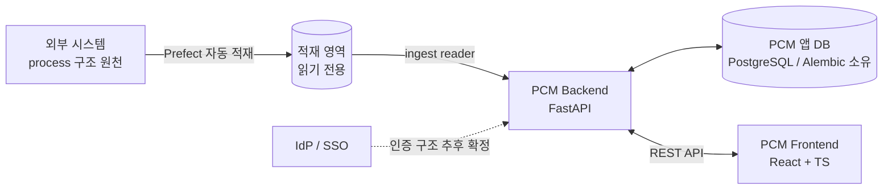

# 01. 아키텍처

## 1. 아키텍처 원칙

### P1. 구조는 데이터다 (Metadata-Driven)

시스템의 어떤 코드도 특정 process, layer, 파라미터 이름을 알지 못한다.

- **layer 구성**은 적재 데이터에서 읽어 파생한다. process마다 layer 개수/이름/순서가 다르며, 이는 코드가 아니라 조회 결과다.
- **파라미터 정의**는 관리자가 제어하는 레지스트리(메타데이터 테이블)에 존재한다. 컬럼 추가/변경은 코드 배포 없이 레지스트리 수정으로 끝나야 한다.
- 상위 기능(백본, 편집기, 검증, 이력, 승인, 출력)은 전부 레지스트리와 구조 판독기를 **통해서만** 컬럼과 layer를 안다.

> 위반 감지 기준: "파라미터가 하나 추가되면 코드 수정이 필요한가?" — 필요하다면 이 원칙을 위반한 것이다.

### P2. 적재 데이터는 읽기 전용 외부 세계다 (Ingest Boundary)

- Prefect가 외부 시스템에서 적재하는 데이터는 PCM 입장에서 **읽기 전용 원천(source of truth for structure)**이다. PCM은 절대 쓰지 않는다.
- 적재 영역과 PCM 앱 영역은 스키마(또는 DB)를 분리하고, PCM 앱 스키마만 Alembic이 소유한다.
- 적재 데이터 접근은 단일 판독 모듈(`ingest reader`)로 한정한다. 적재 스키마가 바뀌어도 이 모듈만 고치면 된다(Anti-Corruption Layer).

### P3. 기능은 수직 슬라이스로 쌓는다

- 로드맵의 각 Phase는 "동작 확인 가능한 기능 한 덩어리"를 끝까지(DB → API → UI) 관통해서 완성한 뒤 다음으로 넘어간다.
- 전체 뼈대를 먼저 다 만들고 나중에 실무에 끼워 맞추는 방식(기존 실패 패턴)을 금지한다.

### P4. 교체 가능한 것은 어댑터 뒤에 둔다

- **그리드 라이브러리**: 프론트엔드는 그리드를 직접 쓰지 않고 자체 어댑터 인터페이스를 통해 사용한다. Phase 1 PoC 후 교체하거나, 이후 한계에 부딪혀도 어댑터만 재구현하면 된다.
- **인증(SSO)**: 인증 구조 상세가 미확정이므로, "요청 → 사용자 컨텍스트" 변환을 담당하는 인증 어댑터 경계만 Phase 0에 확보하고 내부 구현은 확정 후 채운다.

### P5. 이력은 이벤트로 남긴다

- 셀 변경, 상태 전환, 백본 적용 등 모든 변경은 append-only 이벤트로 기록한다. 변경 이력·감사 추적·Revision 비교가 전부 이 이벤트 스트림 위에서 동작한다.

## 2. 시스템 컨텍스트



- 적재 영역은 같은 PostgreSQL 인스턴스의 별도 DB 또는 별도 스키마일 수 있다. **읽기 전용 커넥션(별도 engine)**으로 접근하여 앱 DB와 트랜잭션·권한을 분리한다.
- 업무의 시작점: 외부 DB에 process 구조 생성 → Prefect 적재 → PCM에서 해당 process로 프로젝트 생성.

## 3. 백엔드 구조

계층은 얇게, 경계는 명확하게. 기존 코드의 routers/services/repositories 4계층 틀은 유지하되, **도메인 규칙을 한 곳에 모으는 것**이 핵심 차이다.

```
backend/app/
  core/            # 설정, DB 세션(앱용/적재용 분리), 인증 어댑터, 공통 예외
  ingest/          # 적재 데이터 판독기 (P2의 ACL) — 구조/백본 데이터 읽기 전용
  domain/          # 순수 도메인 규칙 (프레임워크 의존 없음)
    parameters/    #   파라미터 레지스트리 규칙, 타입/카테고리, 스냅샷 정책
    validation/    #   검증 엔진 (Phase 3)
    workflow/      #   상태 전환 규칙 (Phase 5)
  features/        # 기능별 수직 슬라이스: router + service + repository + schema
    projects/
    backbone/
    sheets/        #   조건표 편집 (Phase 2)
    history/       #   변경 이력 (Phase 4)
    approval/      #   승인 (Phase 5)
    export/        #   출력 (Phase 6)
  models/          # SQLAlchemy 모델 (앱 DB만)
```

원칙:

- **features/ 는 서로 import하지 않는다.** 공유가 필요한 규칙은 domain/으로 내린다. (기존 "기능 하나 고치면 다른 기능이 깨짐" 문제의 직접적 처방)
- **domain/ 은 FastAPI·SQLAlchemy를 모른다.** 순수 함수/클래스로 두어 단독 테스트 가능하게 한다.
- **ingest/ 밖에서 적재 테이블을 조회하는 코드를 금지**한다.
- 편집 잠금(D-09)은 projects feature의 애플리케이션 서비스 수준에서 구현한다(프로젝트 단위 lock 레코드 + 만료).

## 4. 프론트엔드 구조

```
frontend/src/
  app/             # 라우팅, 전역 프로바이더, 인증 가드
  api/             # API 클라이언트 (자동 생성 또는 수기 타입)
  grid/            # 그리드 어댑터 (P4) — 라이브러리 직접 노출 금지
  features/        # 기능별 슬라이스: pages + components + hooks + store
    projects/
    backbone/
    sheet-editor/
    ...
  shared/          # 공통 UI, 유틸
```

- **서버 상태는 TanStack Query**, 편집 중 버퍼(더티 셀, 붙여넣기 스테이징)만 로컬 스토어(Zustand)로 관리한다. 전역 스토어에 서버 데이터를 복제하지 않는다.
- **그리드 어댑터 인터페이스**가 제공해야 하는 능력: 동적 컬럼 정의(레지스트리 기반), 셀 타입별 에디터(숫자/문자/선택지), 범위 선택 + TSV 붙여넣기, 컬럼 그룹/고정/가상화, 셀 상태 표시(검증 오류·더티·코멘트). 상세 평가 기준은 [03-grid-evaluation.md](./03-grid-evaluation.md).
- 100~200 컬럼 가독성 전략: 카테고리 탭/필터(레지스트리의 카테고리 속성 기반), 핵심 컬럼 고정(pinning), 헤더 툴팁(레지스트리의 설명 필드), 컬럼 검색-점프. 카테고리가 관리자 설정 가능하므로 탭 구성도 동적으로 생성된다.

## 5. 횡단 관심사

| 관심사 | 방침 |
|--------|------|
| 인증/인가 | SSO는 Phase 0부터. 상세 구조 확정 전까지 `core/auth` 어댑터 경계 + 개발용 스텁으로 개발 진행. RBAC 역할 모델은 인증 구조 확정 시 함께 결정 |
| 마이그레이션 | Alembic, 앱 스키마만 대상. 적재 영역은 Prefect(외부) 소유 |
| 테스트 | domain/은 순수 단위 테스트, features/는 API 레벨 테스트 중심. 적재 판독기는 fixture 스키마로 계약 테스트 |
| 배포 | 사내망(폐쇄망). 모든 의존성은 사내 미러 또는 이미지에 번들. CDN 의존 금지 |
| 문서 | 각 Phase 완료 시 `plan/` 하위 해당 문서 갱신. ADR이 필요한 결정은 README의 결정 로그에 추가 |
