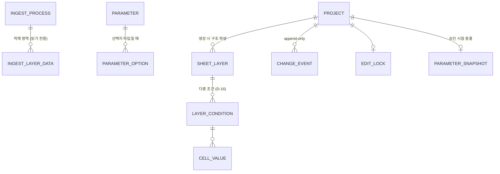

# 02. 데이터 모델

## 1. 개념 모델



두 세계로 나뉜다.

- **적재 영역(읽기 전용)**: 외부 시스템 → Prefect가 만든 process 구조와 조건 데이터. layer 구성의 원천. PCM은 판독만 한다.
- **PCM 앱 영역(Alembic 소유)**: 파라미터 레지스트리, 프로젝트, 조건표(시트), 이벤트, 잠금.

## 2. 파라미터 레지스트리 (시스템의 축)

전 process 공통 컬럼 세트. 관리자가 제어하며, 지속적으로 추가/변경된다.

```
parameter
  id            PK
  code          UNIQUE  -- 시스템 내부 식별자. 생성 후 불변
  display_name          -- 사용자에게 보이는 컬럼명. 변경 가능
  description           -- 헤더 툴팁 등 UI 노출용 설명
  value_type            -- number | text | choice
  category_id   FK      -- 카테고리 (관리자 설정 가능)
  unit, min, max        -- number 타입 부가 속성 (검증 엔진이 사용)
  sort_order
  is_active             -- soft delete. 하드 삭제 금지
  created_at, updated_at

parameter_category
  id, code, display_name, sort_order, is_active

parameter_option        -- choice 타입의 선택지
  id, parameter_id FK, value, display_name, sort_order, is_active
```

설계 규칙:

- **`code`는 불변, `display_name`은 가변.** 셀 값과 이벤트는 전부 `code`로 파라미터를 참조한다. 컬럼명 변경이 데이터에 영향을 주지 않는다. (기존 "컬럼명이 꼬이는" 문제의 구조적 차단)
- **하드 삭제 금지.** `is_active=false`로 비활성화만 한다. 과거 스냅샷·이력이 항상 정의를 역참조할 수 있어야 한다.
- 검증 규칙 중 파라미터 단독 규칙(range, required, pattern)은 레지스트리 속성으로 두고, cross-layer 규칙은 Phase 3에서 별도 테이블로 확장한다.

## 3. 파라미터 스냅샷 정책 (결정 D-08, 정책 a)

| 프로젝트 상태 | 파라미터 세트 |
|---------------|----------------|
| Draft / Review | **live** — 항상 현재 레지스트리(`is_active=true`)를 따른다. 새 파라미터가 추가되면 즉시 빈 컬럼으로 나타난다 |
| Approved / Archived | **frozen** — 승인 시점에 레지스트리 전체(정의+선택지)를 `parameter_snapshot`(JSONB)으로 동결. 이후 레지스트리가 어떻게 바뀌어도 당시 모습 그대로 렌더링 |

- 조회 API는 프로젝트 상태에 따라 live 레지스트리 또는 스냅샷 중 하나를 컬럼 정의로 반환한다. 프론트는 구분할 필요 없이 받은 정의로 그리드를 구성한다.
- Revision 생성(Approved → 새 Draft) 시 새 Draft는 다시 live를 따른다.

## 4. 프로젝트와 조건표

```
project
  id PK
  process_key           -- 적재 영역의 process 식별자 (판독기 통해 해석)
  name, status          -- draft | review | approved | archived
  version               -- Revision 번호
  parameter_snapshot    -- JSONB, 승인 시점에만 기록 (그 전 NULL)
  created_by, approved_at, ...

sheet_layer             -- 프로젝트 생성 시 적재 데이터의 layer 구성에서 파생
  id PK, project_id FK
  layer_key, layer_name
  stepseq, layer_no     -- 매칭 키 (D-15) — 구조 속성 보존
  area, sort_order

layer_condition         -- 같은 layer/step의 다중 조건 행 (D-16)
  id PK, layer_id FK
  condition_label       -- 구분용 라벨 (C1, C2, ... 또는 사용자 지정)
  is_por                -- POR 여부 (por_yn). layer당 최대 1개
  sort_order
  -- 제약: partial unique index UNIQUE(layer_id) WHERE is_por = true

cell_value              -- 조건표 본문: narrow(long) 테이블
  id PK
  condition_id FK       -- layer_condition 참조 (행 = 조건 행, layer가 아님)
  parameter_code        -- parameter.code 참조 (FK 아님: 스냅샷 독립성)
  value_text            -- TEXT 저장(NULL 허용 = 셀 비우기), value_type에 따라 해석
  UNIQUE (condition_id, parameter_code)
```

> Phase 2 구현 정정: 컬럼명은 `value`가 아니라 `value_text`다. `updated_by`/`updated_at`는 두지 않는다 — 셀 단위 변경 이력은 아래 `change_event`(구조화 컬럼, P2-D7)가 전담하므로 `cell_value` 자체에 감사 컬럼을 중복 보관하지 않는다(현재 값의 "누가·언제"가 필요하면 `change_event`를 `condition_id`+`parameter_code`로 조회).

### 다중 조건과 POR (D-16)

- 같은 layer/step에 **여러 조건 행**이 존재할 수 있다. 시트의 행 단위는 layer가 아니라 **조건 행**이며, UI는 같은 layer의 조건 행들을 그룹핑해 표시한다 (같은 layer·step임이 드러나야 함).
- **POR(Process of Record)은 layer당 최대 1개** — `is_por` 플래그와 partial unique 제약으로 DB가 강제한다. POR 이양은 트랜잭션 안에서 (기존 POR 해제 + 새 POR 지정) + `change_event(por_change)` 기록으로 처리한다.
- 프로젝트 생성/백본 복사 시 layer당 기본 조건 1행으로 시작하며, 백본 layer에 다중 조건이 있으면 그대로 복사한다(POR 플래그 포함 — 정책은 phase-1 P1-D8). 조건 행 추가/복제/삭제는 Phase 2 편집기 기능.
- 검증(Phase 3)·승인 게이트(Phase 5)·출력(Phase 6)이 전 조건 행을 대상으로 할지 POR만 대상으로 할지는 각 Phase 결정 항목으로 관리한다.

### narrow 테이블 vs JSONB 트레이드오프

| 기준 | narrow 테이블 (채택) | layer당 JSONB |
|------|---------------------|----------------|
| 파라미터 추가/삭제 | 스키마 무변경, 행 추가만 | 스키마 무변경 |
| 셀 단위 이력/잠금/검증 상태 | 셀이 행이므로 자연스러움 | 별도 구조 필요 |
| 부분 업데이트(셀 몇 개 저장) | UPSERT로 정확히 그 셀만 | 문서 전체 재기록 |
| 시트 전체 로드 | 1 프로젝트 = 100개 미만 layer × 약 200 param = 최대 약 20,000행 (조건 1행 기준 — 다중 조건 layer만큼 증가). 단일 쿼리로 시작하되 그리드 PoC에서 체감 성능을 확인한다 | 더 빠르나 차이 미미 |
| 규모 | 프로젝트당 최대 약 2만 행. 수천 프로젝트여도 수천만 행 수준 — PostgreSQL 인덱스와 bulk I/O 전략으로 관리 가능 | — |

**채택: narrow 테이블.** 셀 단위 이력(Phase 4)과 검증(Phase 3)이 셀=행 구조와 정확히 맞물린다. 시트 로드는 `(project) → layers → cell_values` 단일 조인 쿼리로 처리하고, API는 그리드가 쓰기 좋은 layer×parameter 매트릭스로 변환해 반환한다.

## 5. 변경 이벤트 (append-only)

```
change_event
  id PK (bigserial)
  project_id FK
  event_type            -- project_create | backbone_copy | backbone_layer_replace
                        --  | cell_update | condition_add | condition_remove | por_change
                        --  | status_change | revision_create | ...
  condition_id, parameter_code, old_value, new_value  -- 셀 이벤트(cell_update) 전용 구조화 컬럼(P2-D7)
  actor, created_at
  payload JSONB         -- 이벤트별 부가 정보 (벌크 이벤트의 batch_id, layer_key,
                        -- condition_remove의 삭제 스냅샷, por_change의 old/new condition_id 등)
```

- UPDATE/DELETE 금지. 변경 이력 화면(Phase 4), 감사 추적, Revision 비교가 전부 이 테이블 하나를 조회한다.
- 벌크 작업(백본 복사, 엑셀 붙여넣기)은 셀 이벤트를 배치 insert하되 `payload`에 배치 식별자(`batch_id`)를 남겨 묶어 볼 수 있게 한다. 엑셀 붙여넣기로 저장된 셀 이벤트는 `payload.origin = "paste"`로 수동 편집과 구분한다(P2-D7).
- Phase 2 구현 정정: 계획 초안의 `layer_key` 컬럼과 `source` 컬럼은 두지 않는다. `layer_key`는 조건/POR 이벤트의 `payload`에 싣고, 이벤트의 출처 구분은 `event_type` 자체(및 셀 이벤트의 `payload.origin`)로 충분해 별도 `source` 컬럼을 두지 않았다.

## 6. 편집 잠금 (결정 D-09, lock_token은 P2-D6)

```
edit_lock
  project_id PK/FK
  locked_by, lock_token, locked_at, expires_at   -- TTL + 하트비트 갱신
```

- `lock_token`(P2-D6, Phase 2 구현): 획득 시 서버가 발급하는 불투명 토큰. 소유는 "사용자 + 토큰"으로 식별해 같은 계정의 다른 탭도 한쪽만 편집하도록 구분하고, TTL 만료 후 탈취된 잠금에 이전 세션이 뒤늦게 쓰는 사고를 막는다. 편집 계열 API는 헤더(`X-Lock-Token`)로 토큰을 검증한다.

- 프로젝트 단위 단일 잠금. 편집 화면 진입 시 획득, 주기적 하트비트로 연장, 이탈/만료 시 해제.
- 잠금 보유자가 아니면 편집 API는 409를 반환하고, UI는 읽기 전용 + "누가 편집 중" 표시.

## 7. 적재 영역 판독 (ingest reader 계약)

적재 데이터는 **구조만** 담는다 — process별 layer/step 목록(partid, processid, stepseq, area 같은 컬럼). **조건 값은 적재에 존재하지 않으며, 값의 원천은 기존 프로젝트(백본)다** (D-14). 적재 스키마의 실제 형태는 Prefect 파이프라인 확정 시 반영하고, 판독 계약만 먼저 고정한다:

| 판독 기능 | 반환 |
|-----------|------|
| process 목록 조회 | process_key(partid+processid 조합 등), 표시 속성, 최종 적재 시각 |
| process의 layer 구성 조회 | layer_key, layer_name, stepseq(순서), **layer_no(layer number)**, area 등 구조 속성 |

- ~~조건 값 조회 (백본 소스)~~ — **D-14로 폐기.** 백본 복사는 기존 프로젝트의 `cell_value` → 신규 프로젝트의 `cell_value` 복사이며 적재 영역과 무관하다. 원천 파라미터 매핑 테이블도 백본 용도로는 불필요하다 (Recipe XML 매핑은 별개 주제로 후속 Phase에서 다룸).
- `stepseq`와 `layer_no`는 layer 매칭 키(D-15)이므로 판독 계약의 필수 반환 항목이다. 적재 스키마 확정 시 두 컬럼의 실재·형식을 확인한다.
- 접근은 읽기 전용 커넥션(별도 engine, 같은 인스턴스의 타 DB 허용 — D-11)으로만 한다.

## 8. 백본 (D-14 · D-15)

- **백본 = 기존 프로젝트.** 신규 프로젝트 생성 시 (a) process에서 구조(`sheet_layer`)를 파생하고, (b) 선택한 백본 프로젝트의 `cell_value`를 layer 매칭으로 복사한다. 파라미터 축은 전 프로젝트 공통(레지스트리)이므로 파라미터 매핑은 필요 없다 — 매칭은 layer 축에서만 일어난다.
- **layer 매칭 규칙 (D-15)**: 자동 매칭 키는 `stepseq + layer_no` 조합 (layer 이름은 매칭 키로 부적합). 자동 매칭 실패분은 생성 미리보기에서 **사용자가 수동 매칭**으로 백본 layer를 직접 지정할 수 있다. 수동 매칭 결과는 생성 요청에 오버라이드로 포함된다.
- 최종 미매칭 layer는 빈 값으로 시작한다. 이후 레이어별 백본 교체(소스: 다른 프로젝트의 layer) 또는 엑셀 붙여넣기로 채운다.
- 백본 프로젝트가 하나도 없는 부트스트랩 상황은 "백본 없이 시작"(전체 빈 값)으로 처리한다. 레거시 시스템 데이터 이관은 별도 검토 항목(D-15 비고)으로, 이 모델의 전제가 아니다.
