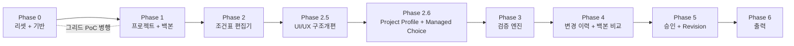

# 04. 구축 로드맵

구축 순서는 결정 D-02를 따른다: **프로젝트+백본 → 편집기+데이터모델 → 검증 → 이력 → 승인 → 출력**.

각 Phase는 수직 슬라이스(P3)로 완성한다 — DB부터 UI까지 관통해 **실제로 동작을 확인한 뒤** 다음 Phase로 넘어간다. 완료 기준(Exit Criteria)을 만족하지 못하면 다음 Phase를 시작하지 않는다.

Phase별 세부 작업 계획(작업 분해·의존 관계·결정 항목)은 `phase-N-tasks.md`로 관리한다: [Phase 0](./phase-0-tasks.md) · [Phase 1](./phase-1-tasks.md) · [Phase 2](./phase-2-tasks.md) · [Phase 2.5 UI/UX 설계](../docs/superpowers/specs/2026-07-13-phase-2-5-ui-ux-design.md) · [Phase 2.6 Project Profile + Managed Choice 설계](../docs/superpowers/specs/2026-07-14-phase-2-6-project-profile-managed-choice-design.md) · [Phase 3](./phase-3-tasks.md) · [Phase 4](./phase-4-tasks.md) · [Phase 5](./phase-5-tasks.md) · [Phase 6](./phase-6-tasks.md)

---

## Phase 0 — 리셋 + 기반

기존 코드 제거와 새 골격 수립. **여기서 파라미터 레지스트리와 적재 판독기를 세우는 것이 전부의 기초다.**

**범위:**
- 기존 backend/frontend/airflow/spec 등 레거시 코드 제거 (plan/, 참고용 docs 일부만 보존 여부 결정 후 정리)
- 새 골격: FastAPI + React/TS + PostgreSQL, Docker Compose, 로컬 개발 환경
- DB 이중 커넥션: 앱 DB(Alembic 소유) + 적재 영역 읽기 전용 engine
- **파라미터 레지스트리**: 테이블 + 관리자 CRUD API + 최소 관리 UI (code 불변, soft delete, 타입/카테고리/선택지)
- **적재 판독기(ingest reader)**: 판독 계약 3종 구현 (process 목록 / layer 구성 / 조건 값). 실제 적재 스키마 확정 전에는 fixture 데이터로 계약 테스트
- 인증 어댑터 경계 + 개발용 스텁 (SSO 상세는 확정분 수신 후 구현)
- CI: lint + typecheck + test

**완료 기준:**
- [ ] 관리자가 UI에서 파라미터를 추가/수정/비활성화할 수 있다
- [ ] fixture 적재 데이터에서 process 목록과 layer 구성을 API로 조회할 수 있다
- [ ] "파라미터 1개 추가"에 코드 수정이 0줄이다 (P1 원칙 검증)

## Phase 1 — 프로젝트 + 백본 (그리드 PoC 병행)

**범위:**
- process(구조) 선택 + **백본 프로젝트(값) 선택** → 프로젝트 생성: 적재 layer 구성에서 `sheet_layer` 파생, 백본 프로젝트의 `cell_value`를 **layer 매칭**으로 복사 (D-14. 백본 없이 빈 시작도 지원)
- 다중 조건 행 모델(D-16): `layer_condition` + POR 플래그 — 생성 시 백본의 조건 행 구성을 그대로 복사
- layer 매칭 구현 (자동: `step_seq + layer_id` 조합 키 — D-15, 자동 실패분은 생성 미리보기에서 사용자 수동 매칭)
- 레이어별 백본 교체 (다른 **프로젝트**의 특정 layer 조건으로 교체)
- 프로젝트 목록/검색/상태 표시 (상태 전환 로직은 Phase 5, 여기서는 draft 고정). 조건표 있는 process의 중복 생성은 차단 (D-17)
- **파라미터 레지스트리 CSV 붙여넣기 임포트** (D-17): 붙여넣기 → dry-run 미리보기 → code 기준 UPSERT — 초기 약 200개 파라미터 주입 + 이후 반복 사용
- 백본 작업의 `change_event` 기록 (이력 UI는 Phase 4, 기록만 시작)
- **병행: 그리드 PoC** ([03-grid-evaluation.md](./03-grid-evaluation.md) 시나리오 수행 → 라이브러리 확정 → 결정 로그 기재)

**완료 기준:**
- [x] layer 구성이 서로 다른 두 process 각각에서 프로젝트를 생성하면, 각자의 구조대로 시트가 만들어진다 (동적 구조의 핵심 검증)
- [x] 백본 복사/레이어 교체 결과가 데이터로 확인된다 (`change_event` 기록 포함)
- [x] 그리드 라이브러리가 확정되고(Glide Data Grid — D-18) 어댑터 인터페이스 초안이 있다 (Phase 2 착수 시 대화형 재확인)

## Phase 2 — 조건표 편집기 + 데이터 모델

**범위:**
- API 진입점 `/api` 단일화 (D-19 — 선행 정리, 이후 신규 API의 경로 기준)
- 시트 조회 API: 조건 행 × parameter 매트릭스 + 컬럼 정의(live 레지스트리) 반환
- 그리드 어댑터 구현: 동적 컬럼, 셀 타입별 에디터, 카테고리 탭, 컬럼 고정/툴팁/검색-점프, 같은 layer 조건 행 그룹핑
- **조건 행 관리 + POR 선택** (D-16): 행 추가/복제/삭제, POR 이양(layer당 1개)
- **엑셀 범위 붙여넣기** (핵심 요구): TSV 파싱 → 타입 검사 → 스테이징 표시 → 적용
- 셀 편집 저장: 더티 셀 배치 UPSERT + `change_event` 기록, 자동 임시저장
- **편집 잠금**: 획득/하트비트/해제, 비보유자 읽기 전용 처리

**완료 기준:**
- [x] 엑셀에서 복사한 다중 행×열 데이터가 붙여넣기로 정확히 반영된다
- [x] 200 컬럼 시트에서 편집·스크롤이 쾌적하다
- [x] 두 브라우저로 동시 접근 시 한쪽만 편집 가능하다

Phase 2 완료: 2026-07-13. 상세 EC1~EC6 근거는 [phase-2-tasks.md](./phase-2-tasks.md) 참고.

## Phase 2.5 — UI/UX 구조개편 + 디자인 시스템

Phase 2 기능을 운영 가능한 화면 구조로 재배치하고, Phase 3~6이 일관된 UI 계약 위에서
확장되도록 한다. 디자인 정본은 [`DESIGN.md`](../DESIGN.md), 승인된 상세 범위는
[Phase 2.5 UI/UX 설계](../docs/superpowers/specs/2026-07-13-phase-2-5-ui-ux-design.md)를 따른다.

**범위:**
- 상단 전역 내비게이션 + 조건표 40px 집중 모드, 전역 `max-w-6xl` 제거
- 프로젝트 목록/생성/상세/조건표 route 분리
- 검색·표 중심 프로젝트 목록과 세 단계 프로젝트 생성
- 목록 중심 파라미터 관리 + 편집 drawer, CSV/category 보조 작업 분리
- Precision Teal semantic token과 공통 버튼·폼·상태·drawer/dialog 접근성 계약
- Phase 3~5 검증·이력·코멘트를 위한 content-gated 하단 workbench 슬롯
- 기존 Phase 2 잠금·자동저장·붙여넣기·조건 행 흐름 회귀 검증

**비목표:**
- 백엔드/API 변경
- Phase 3 검증 엔진·문구 mapper 선행 구현
- Phase 4~6 이력·승인·출력 기능 선행 구현
- 새 UI framework나 모바일 조건표 편집 최적화

**완료 기준:**
- [x] 프로젝트 목록·생성·상세·시트가 독립 URL과 단일 화면 책임을 갖는다
- [x] 조건표가 브라우저의 남은 폭·높이를 사용하며 Phase 2 편집 계약이 회귀하지 않는다
- [x] 파라미터 목록이 첫 viewport에 보이고 생성·수정은 접근 가능한 drawer에서 수행된다
- [x] semantic token과 공통 상태·폼·버튼 규칙이 핵심 화면에 적용된다
- [x] 1024/1440/1920 브라우저 QA, 키보드 QA, 전체 frontend gate가 통과한다

Phase 2.5 구현 완료: 2026-07-14. 자동화 게이트, route/history·업무 회귀,
1024/1440/1920 반응형·키보드 QA와 최종 시각 판정은
[브라우저 QA 근거](../docs/superpowers/evidence/2026-07-13-phase-2-5-browser-qa.md)에 기록했다.

## Phase 2.6 — Project Profile + Managed Choice

Phase 3의 choice 검증이 최종 레지스트리 계약 위에서 구현되도록, 프로젝트 고정 기본정보와
재사용 선택지 모델을 먼저 완성한다. 승인된 상세 계약은
[Phase 2.6 설계](../docs/superpowers/specs/2026-07-14-phase-2-6-project-profile-managed-choice-design.md)를 따른다.

**범위:**
- 프로젝트와 1:1인 고정 `project_profile`, 생성 핵심정보와 상세 전체 편집
- Project Profile 편집에 기존 프로젝트 잠금·변경 이벤트 적용
- 안정적 option code와 가변 label을 갖는 공유 ChoiceSet·ChoiceOption 관리
- 파라미터의 ChoiceSet 참조와 code/label 검색형 조건표 editor
- 비활성 기존값 경고·승인 허용, 신규 선택 차단, Draft live 반영, 승인 snapshot version 2 계약
- 향후 PARTID 조회를 위한 `ProjectMetadataProvider` 경계(이번 Phase는 수동 provider)

**비목표:**
- 실제 PARTID 원천 DB 연동과 재동기화
- 조건표 셀 자동 입력(모든 셀은 수동 입력)
- Project Profile 동적 필드 관리
- Layer/Shot 자동 계산과 Phase 3 검증 규칙
- 운영 데이터 보존 migration(현재 데이터 없음, fresh-start 전환)

**완료 기준:**
- [x] 프로젝트 생성 시 Device Type·Category·Comment를 저장하고 상세에서 전체 Profile을 편집한다
- [x] Profile 편집이 프로젝트 잠금·dirty 보존·field-level event 계약을 지킨다
- [x] ChoiceSet 관리가 파라미터의 쉼표 선택지 입력을 대체한다
- [x] 수백 개 option을 키보드로 code/label 검색하고 기존 비활성값을 읽을 수 있다
- [x] 기존 백본·잠금·자동저장·붙여넣기·조건 행 업무 회귀가 없다
- [x] Phase 3가 추가 option-model migration 없이 choice 검증을 구현할 수 있다

Phase 2.6 구현 완료: 2026-07-15. reset-only migration, PostgreSQL 동시성·원자성,
Project Profile·Managed Choice 업무 회귀, 1024/1440/1920 반응형, keyboard 및 Chromium
accessibility-tree 검증은
[브라우저 QA 근거](../docs/superpowers/evidence/2026-07-14-phase-2-6-browser-qa.md)에 기록했다.
이는 Phase 3의 option-model 선행 조건 완료를 뜻하며 Phase 3 검증 엔진 구현 완료를 뜻하지 않는다.

## Phase 3 — 검증 엔진

상세 승인 설계: [2026-07-15 Phase 3 Validation Engine Design](../docs/superpowers/specs/2026-07-15-phase-3-validation-engine-design.md)

**범위:**
- 파라미터 단독 규칙: range / required / pattern / 선택지 일치 (레지스트리 속성 기반)
- Typed relation 규칙: `required_if`, 모든 이전 layer POR membership + 규칙 정의 테이블/순수 평가기
- 셀 편집 시 프론트 즉시 mirror 검증 + 저장 뒤 서버 전체 검증 API/basis 확정
- 오류 셀 하이라이트, 오류 목록 패널 + 셀 점프
- 검증 code와 사용자 문구 분리 + 편집기 알림을 원인·다음 행동 중심의 자연스러운 한국어로 정리

**완료 기준:**
- [ ] 규칙 위반 셀이 편집 즉시 표시된다
- [ ] cross-layer 규칙이 fixture 시나리오로 검증된다
- [ ] 검증 엔진 단위 테스트가 DB 없이 실행된다 (domain 순수성 검증)
- [ ] 편집기 오류·경고가 사용자가 무엇을 고쳐야 하는지 안내한다
- [ ] snapshot v3와 validation basis가 Phase 5 재사용 계약으로 고정된다

## Phase 4 — 변경 이력 + 백본 기준 비교

**범위:**
- `change_event` 조회: 통합 타임라인 (필터: layer / 유형 / 사용자 / 소스)
- 셀 단위 이력 (우클릭 → 해당 셀의 변경 연대기)
- 타임라인 항목 → 셀 점프
- 벌크 이벤트(백본/붙여넣기) 묶음 표시
- 프로젝트 생성·layer 교체 시점 immutable backbone baseline capture
- baseline과 현재의 모든 조건 행·셀 일괄 diff (`added/changed/cleared/removed/unchanged`)

**완료 기준:**
- [ ] Phase 1~2에서 기록해 온 이벤트가 타임라인에 정확히 나타난다
- [ ] 임의 셀의 값 변천사를 추적할 수 있다
- [ ] source 프로젝트가 나중에 바뀌어도 backbone diff 기준이 변하지 않는다
- [ ] 모든 조건 행·셀 diff를 layer/condition/cell로 drill-down할 수 있다

## Phase 5 — 승인 워크플로우 + Revision

**범위:**
- 상태 머신: Draft → Review → Approved/Rejected → Archived (`domain/workflow`)
- Review 요청 시 검증 오류 0건 게이트 + Approval 시 validation basis 동일성 확인/필요 시 재검증
- **승인 시 snapshot v3 동결** (parameter/ChoiceSet/relation rule + validation basis) + Approved/Archived 읽기 전용 렌더링
- Revision: Approved → 새 Draft(버전+1, live 레지스트리), 기존 Archived 전환
- 검토 코멘트 (프로젝트/셀 레벨)
- RBAC 적용 (SSO 확정 구조 기반 — 이 시점까지 인증 상세 수신 필요)

**완료 기준:**
- [ ] 승인 후 레지스트리에 파라미터를 추가해도 승인본 화면이 변하지 않는다 (스냅샷 검증)
- [ ] Revision 생성 시 새 Draft에는 새 파라미터가 나타난다
- [ ] 역할별 허용 동작이 테스트로 고정된다

## Phase 6 — 전산 출력

**범위:**
- 출력 포맷 3종 (Type A/B/C — 기존 요구 재검토 후 확정)
- 미리보기 + Excel 다운로드 (단건/벌크 ZIP)
- 출력 전 데이터 품질 리포트, 출력 이력(감사)

**완료 기준:**
- [ ] 승인본을 3종 포맷으로 출력·다운로드할 수 있다
- [ ] 출력 이력이 조회된다

---

## 운영 원칙

- **Phase 경계에서 문서 갱신**: 완료 시 결정 로그와 해당 문서에 실제 결과(예: 확정된 그리드, 확정된 적재 스키마)를 반영한다.
- **범위 추가 금지**: Phase 진행 중 새 요구가 나오면 로드맵에 기재하고 이후 Phase로 배정한다. "일단 다 만들고 끼워 맞추기"로 회귀하지 않는다.
- **미확정 의존성 추적**: 인증 구조 상세(Phase 0 스텁 → Phase 5 필수), 실제 적재 스키마(Phase 0 fixture → Phase 1 필수 — `layer_id`가 기존 `layer_no` 역할로 확정됨)는 각 필수 시점 전에 계약에 반영되어야 한다. 레거시 데이터 이관(D-15 비고)은 Phase 1 중 실현 가능성 스파이크만 수행하고 이관 작업은 별도 배정한다. PARTID Project Profile 원천 테이블·키·field mapping(D-21)은 실제 provider 구현 전에 확정한다.
