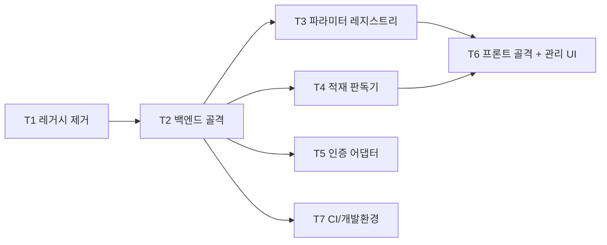

# Phase 0 — 리셋 + 기반 (작업 계획)

> 목표: 레거시 코드를 걷어내고, **파라미터 레지스트리**와 **적재 판독기**를 중심으로 한 새 골격을 세운다.
> 이후 모든 Phase가 이 기반 위에 올라가므로, Phase 0의 완료 기준을 만족하기 전에는 Phase 1을 시작하지 않는다.

관련 문서: [01-architecture.md](./01-architecture.md) · [02-data-model.md](./02-data-model.md) · [04-roadmap.md](./04-roadmap.md)

## 완료 기준 (Exit Criteria) — 재확인

- [ ] EC1. 관리자가 UI에서 파라미터를 추가/수정/비활성화할 수 있다
- [ ] EC2. fixture 적재 데이터에서 process 목록과 layer 구성을 API로 조회할 수 있다
- [ ] EC3. **"파라미터 1개 추가"에 앱 코드 수정이 0줄이다** (P1 원칙 검증 — 레지스트리 행 추가만으로 끝나야 함)
- [ ] EC4. CI(lint + typecheck + test)가 그린이다
- [ ] EC5. `docker compose up` 한 번으로 앱 DB·백엔드·프론트가 로컬에서 뜬다

---

## 작업 분해 (Work Breakdown)

의존 관계: T1 → T2 → {T3, T4, T5} → T6, 그리고 T7은 T2 직후 병행.



### T1. 레거시 제거 및 스냅샷

기존 코드는 참고 자료로만 두고 작업 트리에서 제거한다.

- `git tag pre-rebuild-snapshot`으로 현재 상태를 태그해 언제든 참조 가능하게 보존 (git 히스토리로 남으므로 별도 백업 불필요)
- 제거 대상: `backend/app/**`, `backend/alembic/versions/**`(29개), `frontend/src/**`, `airflow/**`, `spec/**`, 루트 `docker-compose*.yml`, `nginx/**`
- **보존**: `plan/**`, `.claude/**`, `.moai/**`, `CLAUDE.md`, `README.md`
- **`docs/**` 처리 (확정)**: 전부 제거. 단 `08-glossary.md`는 **도메인 용어만 발췌해 보존**하고 전산출력(출력/export) 관련 항목은 삭제. 구현·아키텍처 가이드(01~07, 09, 10)는 구식이므로 제거
- `backend/tests/**`도 제거 (새 구조 기준으로 재작성)
- **일괄 삭제 (확정)**: 새 골격을 나란히 세우지 않고 T1에서 한 번에 제거. `pre-rebuild-snapshot` 태그로 대조 가능

산출물: 빈 골격만 남은 작업 트리, `pre-rebuild-snapshot` 태그.

### T2. 백엔드 골격

[01-architecture.md](./01-architecture.md) §3 구조를 실제 디렉토리로 생성.

```
backend/app/
  core/
    config.py        # pydantic-settings, 앱/적재 DB URL 분리
    db.py            # app_engine + ingest_engine(읽기 전용) 이중 세션 팩토리
    auth.py          # 인증 어댑터 경계 (T5)
    errors.py        # 공통 예외 → HTTP 매핑
  ingest/            # (T4)
  domain/            # 순수 규칙 (프레임워크 무의존)
  features/          # 기능별 수직 슬라이스
  models/            # SQLAlchemy 모델 (앱 DB 전용)
  main.py            # 앱 조립, 라우터 등록
```

- 패키지 관리 (확정): `requirements.txt` → **uv + pyproject.toml + uv.lock** 전환. 폐쇄망에서 lockfile 기반 재현성 확보
- **이중 DB 커넥션**(핵심): `app_engine`(async, Alembic 소유) 와 `ingest_engine`(async, 읽기 전용). 같은 인스턴스의 타 DB URL 허용(D-11). ingest 세션은 `AUTOCOMMIT` + 읽기 전용으로 강제
- async SQLAlchemy 2.0 유지 (기존 스택 승계)
- `main.py`에 헬스체크 + 라우터 등록만. 비즈니스 로직 금지

산출물: 임포트 가능한 빈 골격, 앱 부팅(`GET /health` 200), 이중 엔진 초기화 확인.

### T3. 파라미터 레지스트리 (Phase 0의 핵심)

[02-data-model.md](./02-data-model.md) §2를 구현. 시스템의 축이므로 가장 공들여 만든다.

- `models/parameter.py`: `Parameter`, `ParameterCategory`, `ParameterOption`
  - `code` UNIQUE·불변, `display_name` 가변, `value_type`(number/text/choice), `category_id`, number 부가속성(unit/min/max), `is_active`(soft delete), `sort_order`
- `domain/parameters/`: 순수 규칙
  - `code` 불변 강제 (수정 시 code 변경 거부)
  - 하드 삭제 금지 → `is_active=false` 만
  - choice 타입은 최소 1개 option 필요 등 무결성 규칙
  - `snapshot()`: 레지스트리 전체를 JSONB 직렬화 (Phase 5에서 사용하나 규칙은 여기서 정의)
- `features/parameters/`: `router`(관리자 CRUD) + `service` + `repository` + `schema`
- Alembic: `0001_parameter_registry` 마이그레이션 (fresh start)
- 테스트: domain 규칙 단위 테스트(DB 무의존) + CRUD API 테스트

산출물: 파라미터/카테고리/선택지 CRUD API, 마이그레이션, 테스트. **EC1·EC3 충족.**

### T4. 적재 판독기 (ingest reader)

[02-data-model.md](./02-data-model.md) §7의 판독 계약을 구현. 실제 적재 스키마 미확정이므로 **계약 + fixture**로 선구현.

- `ingest/reader.py`: 판독 계약 인터페이스(Protocol) 3종
  - `list_processes() -> [ProcessInfo]`
  - `get_layers(process_key) -> [LayerInfo]`
  - `get_condition_values(process_key) -> [(layer_key, source_param_id, value)]` (백본 소스, Phase 1에서 사용)
- `ingest/fixture_reader.py`: fixture 스키마 기반 구현 (계약 검증용). 실 스키마 확정 시 `ingest/pg_reader.py`로 교체, 인터페이스는 불변
- fixture: **layer 구성이 서로 다른 2개 process** 포함 (동적 구조 검증의 씨앗)
- `features/processes/`: process 목록·layer 조회 조회 API (판독기를 통해서만 접근)
- 테스트: 계약 테스트(fixture 스키마로 3종 판독 검증)

산출물: 판독기 인터페이스 + fixture 구현, process/layer 조회 API. **EC2 충족.**

### T5. 인증 어댑터 경계

SSO 상세 미확정(D-10)이므로 **경계만 확보하고 개발 스텁**으로 채운다.

- `core/auth.py`: `get_current_user` FastAPI 의존성 인터페이스 (요청 → `UserContext{ id, roles }`)
- 개발 스텁: 고정 admin 사용자 반환 (env 플래그로 활성화)
- 라우터는 처음부터 `Depends(get_current_user)` 를 통과하도록 배선 (나중에 구현만 교체)
- RBAC 역할 enum 자리만 정의(admin/reviewer/editor), 실제 인가 규칙은 Phase 5

산출물: 인증 의존성 경계 + 스텁. 확정 시 스텁만 실제 SSO로 교체.

### T6. 프론트 골격 + 파라미터 관리 UI

[01-architecture.md](./01-architecture.md) §4 구조. AG Grid는 아직 도입하지 않는다(Phase 1 PoC에서 결정).

```
frontend/src/
  app/          # 라우터, QueryClient/프로바이더, 인증 가드(스텁)
  api/          # axios 클라이언트 + 타입
  features/
    parameters/ # 관리자 UI: 목록 / 생성·수정 폼 / 비활성화
    processes/  # process 목록·layer 조회 뷰(확인용 최소)
  grid/         # 어댑터 인터페이스 정의만 (구현은 Phase 2)
  shared/       # 공통 UI
```

- 기존 의존성 중 AG Grid·tiptap 제거, TanStack Query·Zustand·Tailwind 유지
- 파라미터 관리 UI: 레지스트리 CRUD를 붙여 **EC1을 눈으로 확인** (관리자가 파라미터 추가 → 즉시 목록 반영)
- 서버 상태는 TanStack Query, 전역 스토어에 서버 데이터 복제 금지

산출물: 부팅되는 프론트 + 파라미터 관리 화면 + process/layer 확인 화면.

### T7. CI + 개발 환경

- `docker-compose.yml`: postgres(앱 DB) + (fixture용 적재 스키마) + backend + frontend. **EC5 충족**
- backend: ruff(lint) + **pyright**(typecheck, 확정) + pytest, `pyproject.toml`에 설정
- frontend: eslint 또는 biome + `tsc -b` + vitest
- CI 워크플로: 위 검사를 PR에서 실행. **EC4 충족**
- 폐쇄망 대비: 의존성 사내 미러/이미지 번들 방침 문서화(README), CDN 의존 0

산출물: 원커맨드 로컬 실행, CI 그린.

---

## 결정 확정 (실행 전 확인 완료)

1. **`docs/**` 처리**: 전부 제거. `08-glossary.md`는 도메인 용어만 발췌 보존, 전산출력(출력/export) 항목은 삭제
2. **패키지 관리**: `uv` + pyproject.toml + uv.lock 전환
3. **타입체커**: pyright
4. **레거시 제거 타이밍**: T1에서 일괄 삭제

## 실행 순서 요약

1. T1 레거시 제거 + 스냅샷 태그
2. T2 백엔드 골격 (이중 DB)
3. T7 CI/compose 뼈대 (조기 착수)
4. T3 파라미터 레지스트리 ← 가장 중요
5. T4 적재 판독기 (fixture)
6. T5 인증 어댑터 스텁
7. T6 프론트 골격 + 관리 UI
8. 완료 기준 EC1~EC5 점검 → Phase 1 착수 판단
