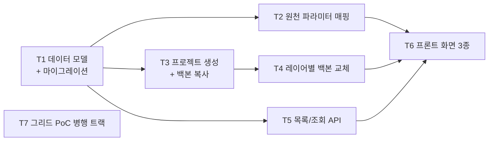

# Phase 1 — 프로젝트 + 백본 (작업 계획)

> 목표: 적재된 process 구조를 선택해 프로젝트를 생성하고(`sheet_layer` 파생 + 백본 복사), 레이어별 백본 교체까지 **데이터로 동작을 확인**한다. 그리드 PoC를 병행해 Phase 2 편집기의 기반(라이브러리 + 어댑터 인터페이스)을 확정한다.

관련 문서: [01-architecture.md](./01-architecture.md) · [02-data-model.md](./02-data-model.md) · [03-grid-evaluation.md](./03-grid-evaluation.md) · [04-roadmap.md](./04-roadmap.md) · [05-ui-wireframe.md](./05-ui-wireframe.md) · [wireframes/phase1-ui-wireframe.html](./wireframes/phase1-ui-wireframe.html)

## 완료 기준 (Exit Criteria)

- [ ] EC1. **layer 구성이 서로 다른 두 process** 각각에서 프로젝트를 생성하면, 각자의 구조대로 시트(`sheet_layer` + `cell_value`)가 만들어진다 — 동적 구조의 핵심 검증
- [ ] EC2. 백본 복사/레이어별 교체 결과가 데이터로 확인되고, 두 작업 모두 `change_event`가 남는다
- [ ] EC3. 그리드 라이브러리가 PoC로 확정되고(결정 로그 기재), 그리드 어댑터 인터페이스 초안이 `frontend/src/grid/`에 있다
- [ ] EC4. 프로젝트 목록에서 생성된 프로젝트를 검색·조회할 수 있다 (상태는 draft 고정 표시)
- [ ] EC5. 원천 파라미터 매핑을 관리자가 UI에서 편집할 수 있고, 매핑 누락이 프로젝트 생성 화면에 표시된다

## 선행 확정 필요 (결정 항목)

| # | 항목 | 내용 | 권고 |
|---|------|------|------|
| P1-D1 | 매핑 누락 시 생성 정책 | source parameter mapping 누락이 있을 때 프로젝트 생성을 막을지, 경고 후 허용할지 ([05-ui-wireframe.md](./05-ui-wireframe.md) §9 보류 항목) | **경고 후 생성 허용**. 누락 파라미터의 셀은 빈 값으로 초기화하고, 생성 요약에 누락 건수를 기록 |
| P1-D2 | 실제 적재 스키마 | Prefect 적재 스키마 확정 여부. 미확정이면 fixture reader로 계속 진행 | fixture 유지, 확정 시 `ingest/pg_reader.py` 교체 (계약 불변) |
| P1-D3 | Layer/Step 명칭 | UI에서 `Layer` 단독 표기 vs `Step` 병기 | Phase 1 UI 구현 전 확정 |
| P1-D4 | 카테고리 탭 라벨 | 와이어프레임의 파라미터 카테고리 탭이 layer 유형 이름(Photo/Etch/계측)으로 표기되어 있음 — 도메인상 파라미터 카테고리(SP/SC/OVL/DEV 등 레지스트리 관리)와 layer 유형은 다른 개념 | 탭은 **레지스트리 카테고리에서 동적 생성**으로 구현 (와이어프레임 하드코딩 라벨은 예시로만 취급) |

## 작업 분해 (Work Breakdown)

의존 관계: T1 → {T2, T3, T5} → T4 → T6. T7(그리드 PoC)은 전 구간 병행.

### T1. 프로젝트 데이터 모델 + 마이그레이션

[02-data-model.md](./02-data-model.md) §4~5를 구현.

- `models/`: `Project`, `SheetLayer`, `CellValue`, `ChangeEvent`, `SourceParameterMapping`
  - `cell_value`: `UNIQUE(layer_id, parameter_code)`, `parameter_code`는 **FK 아님**(스냅샷 독립성), 값은 TEXT
  - `change_event`: append-only(UPDATE/DELETE 금지), `payload` JSONB에 벌크 배치 식별자
  - `project.status`는 이번 Phase에서 `draft` 고정 (상태 머신은 Phase 5)
  - `edit_lock`은 Phase 2로 이연
- Alembic: `0002_project_and_backbone` 마이그레이션
- `domain/`에 append-only 규칙, 셀 유일성 규칙의 단위 테스트

산출물: 모델 + 마이그레이션 + domain 규칙 테스트.

### T2. 원천 파라미터 매핑 (테이블 + CRUD + 관리 UI)

원천 파라미터 식별자 ↔ `parameter.code`가 1:1이 아닐 경우 대비 ([02-data-model.md](./02-data-model.md) §7).

- `source_parameter_mapping`: `source_param_id`, `parameter_code`, `is_active`, 감사 필드
- 관리자 CRUD API + 파라미터 관리 UI에 매핑 화면 추가 (Phase 0 `features/parameters` 확장 또는 별도 feature)
- **매핑 커버리지 조회**: process별 원천 파라미터 대비 매핑 비율/누락 목록 API — Process Preview의 "Mapping n%" / Create 화면의 "누락 n건" 표시에 사용

산출물: 매핑 테이블 + CRUD + 커버리지 API + 관리 UI. **EC5 충족.**

### T3. 프로젝트 생성 + 백본 복사 (Phase 1의 핵심)

- `POST /projects` (`features/projects`):
  1. `ingest reader.get_layers(process_key)` → `sheet_layer` 파생 (layer_key/name/sort_order)
  2. `ingest reader.get_condition_values(process_key)` → 매핑 테이블로 `parameter.code` 해석 → `cell_value` bulk insert
  3. `change_event(backbone_copy)` 기록 — payload에 배치 id, 복사 건수, 매핑 누락 건수
- `domain/backbone/`: 매핑 누락 처리 규칙(P1-D1 정책), 값은 타입 보정 없이 원문 TEXT 저장 (해석은 조회 시 value_type 기준)
- **생성 전 미리보기(dry-run)**: layer 수/예상 셀 수/매핑 누락 수를 반환하는 조회 — Create 화면의 "생성 정책 확인" 카드가 이 결과를 표시
- 트랜잭션: 파생+복사+이벤트를 단일 트랜잭션으로. 최대 약 2만 행 bulk insert 성능 확인

산출물: 생성 API + dry-run + domain 규칙 테스트 + "서로 다른 두 process → 서로 다른 구조" 통합 테스트. **EC1 핵심.**

### T4. 레이어별 백본 교체

특정 layer만 다른 process의 조건으로 교체 (도메인 용어: Layer Backbone Replacement).

- `POST /projects/{id}/layers/{layer_key}/backbone-replace` — body: `{source_process_key, source_layer_key}`
- 대상 layer의 `cell_value`를 소스 조건으로 UPSERT(전체 교체), `change_event(backbone_layer_replace)` 기록 (old/new 값은 셀 이벤트 배치 + payload 묶음)
- 소스 후보 탐색 API: process 검색 → 해당 process의 layer 목록 (T5의 catalog API 재사용)
- UI는 최소한으로: 프로젝트 상세에서 layer 선택 → 소스 process/layer 선택 → 교체 확인. **와이어프레임에 이 흐름이 누락되어 있으므로 T6에서 화면 추가**

산출물: 교체 API + 이벤트 기록 + 최소 UI. **EC2 충족.**

### T5. 프로젝트 목록/조회 + Process Catalog API

와이어프레임의 API 계약([05-ui-wireframe.md](./05-ui-wireframe.md) §8)을 구체화.

- `GET /processes?query=&limit=&cursor=` — 검색 + 커서 페이징 (수천 개 전제). 검색/필터 속성은 적재 스키마 확정 전까지 fixture 기준 최소(P1-D2)
- `GET /processes/{process_key}` — preview 요약 (layer 수, 매핑 커버리지)
- `GET /processes/{process_key}/layers` — layer 구성 (Phase 0 API 확장)
- `GET /projects?query=&status=&cursor=` / `GET /projects/{project_id}` — 목록·검색·상세. 상태 필터는 배선만 (draft 고정)

산출물: catalog/프로젝트 조회 API + API 테스트. **EC4 충족.**

### T6. 프론트: Process Catalog / Project Create / Project List (+ 레이어 교체 진입점)

[wireframes/phase1-ui-wireframe.html](./wireframes/phase1-ui-wireframe.html) 기반. 단 검토에서 확인된 보완점 반영:

- **Process Catalog**: 검색/필터 툴바 + 결과 테이블(커서 페이징) + 선택 preview(요약 metric, layer 목록) + "프로젝트 생성" 진입
- **Project Create**: 선택 process 요약, 이름/설명 입력, layer preview, 생성 정책 확인(dry-run 결과), 매핑 누락 경고(P1-D1 정책 표시)
- **Project List** (와이어프레임 누락분 — 추가): 프로젝트 검색/목록/상태 뱃지, 상세 진입
- **레이어별 백본 교체** (와이어프레임 누락분 — 추가): 프로젝트 상세 layer 목록에서 교체 flow
- `features/projects/`, `features/backbone/` 슬라이스. 서버 상태는 TanStack Query, 전역 복제 금지

산출물: 화면 3종 + 교체 진입점, EC1·EC2를 눈으로 확인 가능한 상태.

### T7. 그리드 PoC (병행 트랙)

[03-grid-evaluation.md](./03-grid-evaluation.md) §5 시나리오 6종을 후보별로 수행.

- 후보: **Glide Data Grid vs RevoGrid** (+ AG Grid Community 기준선)
- PoC 첫 단계에서 각 후보 최신 버전 기준으로 C1(붙여넣기) 지원 여부 재검증
- 판정: 시나리오 3(붙여넣기)·2(성능) 우선, 동률이면 C7(성숙도)
- PoC 코드는 `poc/grid/` 등 앱 코드와 분리된 위치에 두고 머지 대상에서 제외 가능하게 관리
- 산출물:
  - 비교 결과를 [03-grid-evaluation.md](./03-grid-evaluation.md)에 추기
  - 결정 로그(README D-14)에 확정 라이브러리 기재
  - **그리드 어댑터 인터페이스 초안** (`frontend/src/grid/`): 동적 컬럼 정의, 셀 타입 에디터, 범위 선택 + TSV 붙여넣기, 컬럼 그룹/고정/가상화, 셀 상태 표시 — [01-architecture.md](./01-architecture.md) §4 계약

산출물: 라이브러리 확정 + 어댑터 인터페이스 초안. **EC3 충족.**

## 실행 순서 요약

1. 결정 항목 P1-D1~D4 확정 (특히 매핑 누락 정책)
2. T7 그리드 PoC 착수 (독립 트랙, 조기 시작)
3. T1 데이터 모델 + 마이그레이션
4. T2 원천 파라미터 매핑 / T5 조회 API (병행 가능)
5. T3 프로젝트 생성 + 백본 복사 ← 가장 중요
6. T4 레이어별 백본 교체
7. T6 프론트 화면
8. EC1~EC5 점검 → Phase 2 착수 판단
