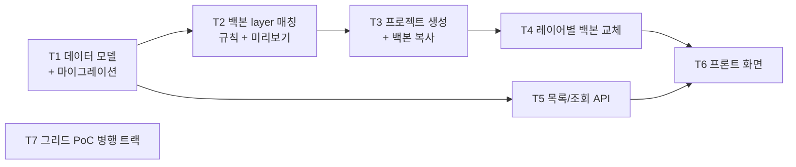

# Phase 1 — 프로젝트 + 백본 (작업 계획)

> 목표: 적재된 process(구조)를 선택하고 **백본 프로젝트(값)를 layer 매칭**해 프로젝트를 생성한다 — "파라미터가 프로세스에 매칭되며 프로젝트로 변신"(D-14). 레이어별 백본 교체까지 **데이터로 동작을 확인**하고, 그리드 PoC를 병행해 Phase 2 편집기의 기반을 확정한다.

관련 문서: [01-architecture.md](./01-architecture.md) · [02-data-model.md](./02-data-model.md) §7~8 · [03-grid-evaluation.md](./03-grid-evaluation.md) · [04-roadmap.md](./04-roadmap.md) · [05-ui-wireframe.md](./05-ui-wireframe.md) · [wireframes/phase1-ui-wireframe.html](./wireframes/phase1-ui-wireframe.html)

## 도메인 전제 (D-14)

- **Process** = 적재로 들어오는 구조(뼈대). 실제 적재 컬럼은 `line_id`, `process_id`, `step_seq`, `layer_id`, `eqp_type`, `eqp_type_desc`, `area_name`이다. 조건 값 없음, 읽기 전용.
- **Project** = process 하나를 골라 만든 조건표 (구조 사본 + 셀 값 + 상태/버전/이력).
- **백본** = 값의 원천이 되는 **기존 프로젝트**. 생성 시 백본 프로젝트의 `cell_value`를 layer 매칭으로 복사한다. 파라미터 축은 전 프로젝트 공통(레지스트리)이므로 매칭은 **layer 축에서만** 일어난다.
- **layer 매칭 (D-15)**: 자동 매칭 키 = `step_seq + layer_id` 조합. `layer_id`가 기존 계획의 `layer_no` 역할을 한다. 자동 실패분은 사용자가 수동 매칭, 최종 미매칭은 빈 값 시작.
- **다중 조건 행 + POR (D-16)**: 같은 layer/step에 여러 조건 행(`layer_condition`)이 존재할 수 있다. 시트의 행 = 조건 행이며, 파라미터는 컬럼, `cell_value`는 조건 행 × 파라미터의 값이다. 조건 행에는 최소 라벨(`label`)과 순서(`condition_index`)를 둔다. POR은 layer당 최대 1개(`is_por` + partial unique). UI 명칭은 Layer/Step 병기.
- 장기적으로 process당 활성 프로젝트 1개로 수렴 (프로젝트 ≈ 프로세스).

## 완료 기준 (Exit Criteria)

- [ ] EC1. **layer 구성이 서로 다른 두 process** 각각에서 프로젝트를 생성하면, 각자의 구조대로 시트(`sheet_layer` + `cell_value`)가 만들어진다 — 동적 구조의 핵심 검증
- [ ] EC2. 백본 프로젝트 복사(layer 매칭)와 레이어별 교체 결과가 데이터로 확인되고, 두 작업 모두 `change_event`가 남는다
- [ ] EC3. 그리드 라이브러리가 PoC로 확정되고(결정 로그 기재), 그리드 어댑터 인터페이스 초안이 `frontend/src/grid/`에 있다
- [ ] EC4. 프로젝트 목록에서 생성된 프로젝트를 검색·조회할 수 있다 (상태는 draft 고정 표시)
- [ ] EC5. 생성 화면에서 백본 후보별 layer 매칭률과 미매칭 layer 목록이 생성 전에 표시되고(dry-run), 자동 매칭 실패분을 사용자가 수동 매칭으로 보완할 수 있다
- [ ] EC6. CSV 파라미터 목록을 붙여넣기 임포트(미리보기 → 적용)해 레지스트리에 일괄 등록/갱신할 수 있다 (D-17)

## 선행 확정 필요 (결정 항목)

| # | 항목 | 내용 | 상태/권고 |
|---|------|------|------|
| P1-D1 | 미매칭 layer 처리 | 자동 매칭 실패 시 처리 | **확정 (D-15)**: 수동 매칭 제공, 최종 미매칭은 빈 값 시작. 생성은 막지 않고 매칭 미리보기에 명시. 이후 레이어별 교체·CSV 붙여넣기로 채움 |
| P1-D2 | 실제 적재 스키마 | **확정**: `line_id`, `process_id`, `step_seq`, `layer_id`, `eqp_type`, `eqp_type_desc`, `area_name`. `layer_id`가 기존 `layer_no` 역할이며 매칭 키의 절반이다. `step_seq`/`layer_id`는 문자 타입이고, 같은 process 안에서 `step_seq + layer_id`는 unique이다. 프로젝트 생성 시 사용자가 `part_id`를 입력하며 PCM 내부 project identity는 `line_id + process_id + part_id`로 둔다. | fixture도 실제 컬럼명 기준으로 정리하고, 확정 시 `ingest/pg_reader.py` 교체 (계약 불변) |
| P1-D3 | Layer/Step 명칭 | UI 표기 | **확정**: 병기 — "Layer (Step)" 형태로 표기 |
| P1-D4 | 카테고리 탭 라벨 | 파라미터 카테고리 탭은 레지스트리(SP/SC/OVL/DEV 등)에서 동적 생성 — layer의 area와 혼동 금지 | 하드코딩 금지, 레지스트리 기반 동적 생성 |
| P1-D5 | layer 매칭 키 | 신규 process layer ↔ 백본 프로젝트 layer 매칭 기준 | **확정 (D-15)**: 자동 = `step_seq + layer_id` 조합. 수동 매칭은 자동 매칭을 override할 수 있고, 같은 백본 source layer를 여러 target layer에 매칭할 수 있다. 수동 매칭분은 UI/API에서 `manual`로 표시한다. |
| P1-D6 | 중복 프로젝트 정책 | 이미 조건표(프로젝트)가 있는 process에서 또 생성할 수 있는가 | **확정: 차단.** 기존 프로젝트로 유도 — Draft면 "이어서 편집", Approved면 "Revision 생성"(Phase 5 기능, 그 전까지는 기존 프로젝트 열기 안내만) |
| P1-D7 | 레거시 데이터 이관 스파이크 | 기존 시스템 데이터를 초기 백본 풀로 이관할 수 있는지 (D-04 전면 리셋의 예외, 희망 사항) | Phase 1 중 **실현 가능성 평가만** 수행 (데이터 상태 확인). 이관 작업 자체는 범위 외 — 결과에 따라 별도 배정 |
| P1-D8 | 백본 복사 시 조건 행 범위 | 백본 layer에 다중 조건 행이 있을 때의 복사 범위 (D-16) | **확정**: 조건 행(`layer_condition`) 전부 복사 + 조건 행 라벨(`label`) + POR 플래그 그대로 유지. 미매칭 layer는 기본 조건 1행 + 기본 라벨 + POR 미지정으로 생성 |

## 작업 분해 (Work Breakdown)

의존 관계: T1 → {T2, T5} → T3 → T4 → T6. T7(그리드 PoC)은 전 구간 병행.

### T1. 프로젝트 데이터 모델 + 마이그레이션

[02-data-model.md](./02-data-model.md) §4~5를 구현.

- `models/`: `Project`, `SheetLayer`, `LayerCondition`, `CellValue`, `ChangeEvent`
  - `project`에 identity 보존: `line_id`, `process_id`, 사용자가 입력한 `part_id`. 같은 identity에 프로젝트가 하나라도 있으면 Phase 1에서는 신규 생성을 차단한다.
  - `sheet_layer`에 구조 속성 보존: `step_seq`, `layer_id`, `eqp_type`, `eqp_type_desc`, `area_name` 등 실제 적재 컬럼 반영 (P1-D2 확정분). 정렬은 `step_seq` 기준으로 충분하며, `eqp_type_desc`는 내부 필터링용으로만 쓰고 디스플레이명으로 사용하지 않는다.
  - `layer_condition` (D-16): layer당 다중 조건 행, `label`, `condition_index`, `is_por` + **partial unique index** `UNIQUE(layer_id) WHERE is_por` — POR layer당 1개를 DB가 강제
  - `cell_value`: `UNIQUE(condition_id, parameter_code)` — 행 = 조건 행. `parameter_code`는 **FK 아님**(스냅샷 독립성), 값은 TEXT
  - `change_event`: append-only(UPDATE/DELETE 금지), `payload` JSONB에 벌크 배치 식별자
  - `project.status`는 이번 Phase에서 `draft` 고정 (상태 머신은 Phase 5). `edit_lock`은 Phase 2로 이연
  - ~~`SourceParameterMapping`~~ — **D-14로 폐기** (백본이 프로젝트이므로 파라미터 매핑 불필요)
- **ingest reader 계약 축소**: `get_condition_values`(조건 값 판독)를 계약과 fixture reader에서 제거 — Phase 0 산출물 정리
- Alembic: `0002_project_and_backbone` 마이그레이션

산출물: 모델 + 마이그레이션 + domain 규칙 테스트 + 판독 계약 2종으로 축소.

### T2. 백본 layer 매칭 (자동 규칙 + 수동 보완 + 미리보기 API)

Phase 1의 새 축 — 신규 process의 layer와 백본 프로젝트의 layer를 잇는다.

- `domain/backbone/`: **자동 매칭 규칙** 순수 로직 — 키는 `step_seq + layer_id` 조합 (D-15). 입력: 신규 process layer 목록 + 백본 프로젝트 layer 목록 → 출력: (자동 매칭 쌍, 미매칭 목록)
- **수동 매칭 오버라이드**: 사용자가 백본 layer를 직접 지정하며, 자동 매칭 결과도 override할 수 있다. 같은 백본 source layer를 여러 target layer에 매칭하는 것도 허용한다. 오버라이드 목록은 매칭 결과에 병합되어 생성 요청(T3)에 전달되고, UI/API에서는 `manual`로 표시한다
- **백본 후보 조회 API**: 기존 프로젝트 검색 (Approved 우선 정렬) + 후보별 자동 매칭률 요약 — 생성 화면 ② 단계
- **매칭 미리보기(dry-run) API**: (process_key, backbone_project_id, 수동 오버라이드) → 자동/수동/미매칭 layer 목록, 복사 예정 셀 수 — 생성 화면 ③ 단계. 수동 매칭용 백본 layer 검색도 이 API 계열에서 제공
- "백본 없이 시작"도 유효한 선택지 (매칭 0, 전체 빈 값 — 부트스트랩 경로)

산출물: 매칭 규칙(순수 단위 테스트: 자동 키 조합·오버라이드 병합·중복 처리) + 후보/미리보기 API. **EC5 충족.**

### T3. 프로젝트 생성 + 백본 복사 (Phase 1의 핵심)

- `POST /projects` (`features/projects`) — body: `line_id`, `process_id`, 사용자가 입력한 `part_id`, 백본 project_id(선택), **수동 매칭 오버라이드 목록**, 이름/설명:
  1. `ingest reader.get_layers(line_id, process_id)` → `sheet_layer` 파생 (구조 사본, `step_seq`/`layer_id` 보존)
  2. 백본 지정 시: T2 매칭 결과(자동 + 수동 오버라이드)대로 백본 layer의 **조건 행 구성(`layer_condition.label`, `condition_index`, POR 플래그)과 `cell_value`를 함께 복사** (P1-D8). 최종 미매칭 layer는 기본 조건 1행 + 기본 라벨 + POR 미지정 + 빈 값 (P1-D1)
  3. `change_event(backbone_copy)` 기록 — payload에 배치 id, 백본 project_id, 자동/수동/미매칭 수
- 트랜잭션: 파생+복사+이벤트를 단일 트랜잭션으로. 최대 약 2만 행 bulk insert 성능 확인
- P1-D6 정책 반영 (조건표 있는 process 중복 생성 시 경고/차단)

산출물: 생성 API + domain 규칙 테스트 + "서로 다른 두 process → 서로 다른 구조" 통합 테스트. **EC1 핵심.**

### T4. 레이어별 백본 교체

특정 layer만 **다른 프로젝트의** layer 조건으로 교체 (도메인 용어: Layer Backbone Replacement).

- `POST /projects/{id}/layers/{layer_key}/backbone-replace` — body: `{source_project_id, source_layer_key}`
- 대상 layer의 기존 조건 행(`layer_condition`)과 `cell_value`를 소스 프로젝트 layer 기준으로 전체 교체한다. 파라미터 컬럼 정의는 현재 프로젝트의 레지스트리 기준을 유지한다. `change_event(backbone_layer_replace)` 기록 (배치 id + before/after 요약 payload)
- 소스 탐색: 프로젝트 검색(T5 재사용) → 해당 프로젝트의 layer 목록 (이름 일치 우선 추천)
- UI: 프로젝트 상세에서 layer 선택 → 소스 프로젝트/layer 선택 → **diff 미리보기** → 적용

산출물: 교체 API + 이벤트 기록 + 최소 UI. **EC2 충족.**

### T5. 프로젝트 목록/조회 + Process Catalog API

와이어프레임의 API 계약([05-ui-wireframe.md](./05-ui-wireframe.md) §8)을 구체화.

- `GET /processes?query=&limit=&cursor=` — 검색 + 커서 페이징 (수천 개 전제). 검색/필터 속성은 적재 스키마 확정 전까지 fixture 기준 최소(P1-D2)
- `GET /processes/{process_key}` — 구조 요약 (step 수, area 목록) + **대응 프로젝트(조건표) 유무** — 카탈로그의 "조건표" 컬럼과 "조건표 없는 process만" 필터의 근거. `process_key`는 API 표현용이며 내부 identity는 `line_id + process_id + part_id`를 사용한다
- `GET /processes/{process_key}/layers` — layer 구성 (Phase 0 API 확장: `step_seq`, `layer_id`, `eqp_type`, `eqp_type_desc`, `area_name` 속성 포함)
- `GET /projects?query=&status=&cursor=` / `GET /projects/{project_id}` — 목록·검색·상세

산출물: catalog/프로젝트 조회 API + API 테스트. **EC4 충족.**

### T6. 프론트: Project List / Process Catalog / Project Create / Project Detail

[wireframes/phase1-ui-wireframe.html](./wireframes/phase1-ui-wireframe.html) (v3, light) 기반.

- **Project List** (홈): 검색/상태 필터/목록, 상세 진입
- **Process Catalog**: 구조 탐색 (`line_id`, `process_id`, `step_seq`, `layer_id`, `area_name`), 조건표 유무 표시, "조건표 없는 process만" 필터, 구조 preview. 프로젝트 생성 단계에서 사용자가 `part_id`를 입력한다
- **Project Create**: ① process 확인 → ② **백본 프로젝트 선택** (후보별 자동 매칭률) → ③ 매칭 확인(dry-run: 자동/수동/미매칭/복사 셀 수) + **수동 매칭 UI**(자동 실패 layer에 백본 layer 검색 드롭다운) → 생성
- **Project Detail**: layer 백본 구성 테이블 (백본 소스·값 채움율·미매칭 표시) + 교체 modal (소스 프로젝트 → layer → diff)
- `features/projects/`, `features/backbone/` 슬라이스. 서버 상태는 TanStack Query, 전역 복제 금지

산출물: 화면 4종, EC1·EC2·EC5를 눈으로 확인 가능한 상태.

### T8. 파라미터 레지스트리 CSV 붙여넣기 임포트 (D-17)

약 200개 파라미터를 관리 UI에서 한 건씩 등록하는 것은 비현실적 — 사용자가 보유한 CSV 파라미터 목록을 붙여넣기로 일괄 주입한다. 파라미터는 지속적으로 추가/변경되므로(D-07) 일회성 스크립트가 아니라 **반복 사용 가능한 임포트 기능**으로 만든다.

- 흐름: **CSV 붙여넣기 우선** → 컬럼 매핑 확인 → **dry-run 미리보기** (신규 n / 갱신 n / 오류 n — 중복 code, 타입 불일치, choice 옵션 누락) → 적용
- 적용 규칙: `code` 기준 UPSERT — 신규는 insert, 기존은 update (단 **code 불변** 규칙 유지, code 변경 시도는 오류). 파일에 없는 기존 파라미터는 건드리지 않음 (비활성화는 UI에서 명시적으로만)
- 매핑 대상 필드: `code`(필수), `display_name`, `value_type`(number/text/choice), `category`(없으면 자동 생성), `unit`/`min`/`max`, choice 옵션 목록, `description`, `sort_order` — CSV에 없는 필드는 기본값 (value_type 기본 text 등). 헤더 셀에 줄바꿈이 들어간 경우 줄바꿈을 제거하고 표준 필드명으로 매핑한다. choice 옵션 구분자는 콤마이며, CSV 셀 안에서는 따옴표로 감싼 값을 기대한다
- 초기 1회 주입: 사용자 CSV 붙여넣기 → 이 기능으로 주입 (기능 완성 전이면 동일 로직의 시드 스크립트로 선주입 후 기능화)
- `features/parameters` 확장 (Phase 0 CRUD 위에 얹음), 임포트 이력은 결과 요약 로그로 남김

산출물: 임포트 API + 관리 UI (CSV 붙여넣기→미리보기→적용) + UPSERT/오류 케이스 테스트. **EC6 충족.**

### T7. 그리드 PoC (병행 트랙)

[03-grid-evaluation.md](./03-grid-evaluation.md) §5 시나리오 6종을 후보별로 수행.

- 후보: **Glide Data Grid vs RevoGrid** (+ AG Grid Community 기준선)
- PoC 첫 단계에서 각 후보 최신 버전 기준으로 C1(붙여넣기) 지원 여부 재검증
- 판정: 시나리오 3(붙여넣기)·2(성능) 우선, 동률이면 C7(성숙도)
- PoC 코드는 임시로 작성하고 폐기 가능하다. 최종 산출물은 결정 로그와 어댑터 인터페이스 초안 중심으로 남긴다
- 산출물: 비교 결과를 03 문서에 추기, 결정 로그(README)에 확정 라이브러리 기재, **그리드 어댑터 인터페이스 초안**(`frontend/src/grid/`)

산출물: 라이브러리 확정 + 어댑터 인터페이스 초안. **EC3 충족.**

## 실행 순서 요약

1. 사용자 CSV 파라미터 목록 붙여넣기 → T8 임포트로 레지스트리 초기 주입 (이후 작업의 재료)
2. T7 그리드 PoC 착수 (독립 트랙, 조기 시작) + P1-D7 레거시 이관 스파이크 병행
3. T1 데이터 모델 + 마이그레이션 + 판독 계약 축소
4. T2 백본 layer 매칭 / T5 조회 API (병행 가능)
5. T3 프로젝트 생성 + 백본 복사 ← 가장 중요
6. T4 레이어별 백본 교체
7. T6 프론트 화면
8. EC1~EC5 점검 → Phase 2 착수 판단
