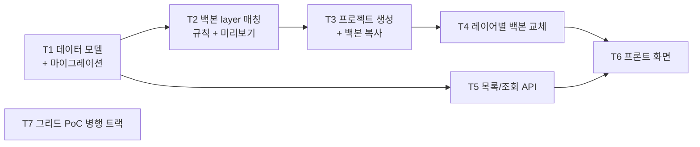

# Phase 1 — 프로젝트 + 백본 (작업 계획)

> 목표: 적재된 process(구조)를 선택하고 **백본 프로젝트(값)를 layer 매칭**해 프로젝트를 생성한다 — "파라미터가 프로세스에 매칭되며 프로젝트로 변신"(D-14). 레이어별 백본 교체까지 **데이터로 동작을 확인**하고, 그리드 PoC를 병행해 Phase 2 편집기의 기반을 확정한다.

관련 문서: [01-architecture.md](./01-architecture.md) · [02-data-model.md](./02-data-model.md) §7~8 · [03-grid-evaluation.md](./03-grid-evaluation.md) · [04-roadmap.md](./04-roadmap.md) · [05-ui-wireframe.md](./05-ui-wireframe.md) · [wireframes/phase1-ui-wireframe.html](./wireframes/phase1-ui-wireframe.html)

## 도메인 전제 (D-14)

- **Process** = 적재로 들어오는 구조(뼈대). partid, processid, stepseq, area 같은 컬럼으로 된 layer/step 목록. 조건 값 없음, 읽기 전용.
- **Project** = process 하나를 골라 만든 조건표 (구조 사본 + 셀 값 + 상태/버전/이력).
- **백본** = 값의 원천이 되는 **기존 프로젝트**. 생성 시 백본 프로젝트의 `cell_value`를 layer 매칭으로 복사한다. 파라미터 축은 전 프로젝트 공통(레지스트리)이므로 매칭은 **layer 축에서만** 일어난다.
- 장기적으로 process당 활성 프로젝트 1개로 수렴 (프로젝트 ≈ 프로세스).

## 완료 기준 (Exit Criteria)

- [ ] EC1. **layer 구성이 서로 다른 두 process** 각각에서 프로젝트를 생성하면, 각자의 구조대로 시트(`sheet_layer` + `cell_value`)가 만들어진다 — 동적 구조의 핵심 검증
- [ ] EC2. 백본 프로젝트 복사(layer 매칭)와 레이어별 교체 결과가 데이터로 확인되고, 두 작업 모두 `change_event`가 남는다
- [ ] EC3. 그리드 라이브러리가 PoC로 확정되고(결정 로그 기재), 그리드 어댑터 인터페이스 초안이 `frontend/src/grid/`에 있다
- [ ] EC4. 프로젝트 목록에서 생성된 프로젝트를 검색·조회할 수 있다 (상태는 draft 고정 표시)
- [ ] EC5. 생성 화면에서 백본 후보별 layer 매칭률과 미매칭 layer 목록이 생성 전에 표시된다 (dry-run)

## 선행 확정 필요 (결정 항목)

| # | 항목 | 내용 | 권고 |
|---|------|------|------|
| P1-D1 | 미매칭 layer 처리 | 백본에 대응 layer가 없을 때의 처리 | **빈 값으로 시작** — 생성은 막지 않고 매칭 미리보기에 명시. 이후 레이어별 교체·엑셀 붙여넣기로 채움 |
| P1-D2 | 실제 적재 스키마 | partid/processid/stepseq/area 등 실제 컬럼 확정 여부. 미확정이면 fixture reader로 계속 진행 | fixture 유지, 확정 시 `ingest/pg_reader.py` 교체 (계약 불변) |
| P1-D3 | Layer/Step 명칭 | UI에서 `Layer` 단독 표기 vs `Step` 병기 | Phase 1 UI 구현 전 확정 |
| P1-D4 | 카테고리 탭 라벨 | 파라미터 카테고리 탭은 레지스트리(SP/SC/OVL/DEV 등)에서 동적 생성 — layer의 area와 혼동 금지 | 하드코딩 금지, 레지스트리 기반 동적 생성 |
| P1-D5 | **layer 매칭 키** | 신규 process layer ↔ 백본 프로젝트 layer를 무엇으로 매칭하는가 (layer 이름? stepseq? area 조합?) | **착수 전 확정 필수** — 매칭 규칙이 T2~T4 전부의 전제. 이름 기준을 기본 가설로 두되 사용자 확인 필요 |
| P1-D6 | 중복 프로젝트 정책 | 이미 조건표(프로젝트)가 있는 process에서 또 생성할 수 있는가 | 장기 목표(process당 활성 1개) 기준 경고 후 허용 또는 차단 — 확정 필요 |

## 작업 분해 (Work Breakdown)

의존 관계: T1 → {T2, T5} → T3 → T4 → T6. T7(그리드 PoC)은 전 구간 병행.

### T1. 프로젝트 데이터 모델 + 마이그레이션

[02-data-model.md](./02-data-model.md) §4~5를 구현.

- `models/`: `Project`, `SheetLayer`, `CellValue`, `ChangeEvent`
  - `sheet_layer`에 구조 속성 보존: layer_key, layer_name, sort_order(stepseq), area 등 적재 컬럼 반영 (P1-D2 확정분)
  - `cell_value`: `UNIQUE(layer_id, parameter_code)`, `parameter_code`는 **FK 아님**(스냅샷 독립성), 값은 TEXT
  - `change_event`: append-only(UPDATE/DELETE 금지), `payload` JSONB에 벌크 배치 식별자
  - `project.status`는 이번 Phase에서 `draft` 고정 (상태 머신은 Phase 5). `edit_lock`은 Phase 2로 이연
  - ~~`SourceParameterMapping`~~ — **D-14로 폐기** (백본이 프로젝트이므로 파라미터 매핑 불필요)
- **ingest reader 계약 축소**: `get_condition_values`(조건 값 판독)를 계약과 fixture reader에서 제거 — Phase 0 산출물 정리
- Alembic: `0002_project_and_backbone` 마이그레이션

산출물: 모델 + 마이그레이션 + domain 규칙 테스트 + 판독 계약 2종으로 축소.

### T2. 백본 layer 매칭 (규칙 + 미리보기 API)

Phase 1의 새 축 — 신규 process의 layer와 백본 프로젝트의 layer를 잇는다.

- `domain/backbone/`: 매칭 규칙 순수 로직 (P1-D5 확정 키 기반). 입력: 신규 process layer 목록 + 백본 프로젝트 layer 목록 → 출력: (매칭 쌍, 미매칭 목록)
- **백본 후보 조회 API**: 기존 프로젝트 검색 (Approved 우선 정렬) + 후보별 매칭률 요약 — 생성 화면 ② 단계
- **매칭 미리보기(dry-run) API**: (process_key, backbone_project_id) → sheet_layer 파생 예정 수, 매칭/미매칭 layer 목록, 복사 예정 셀 수 — 생성 화면 ③ 단계
- "백본 없이 시작"도 유효한 선택지 (매칭 0, 전체 빈 값 — 부트스트랩 경로)

산출물: 매칭 규칙(순수 단위 테스트) + 후보/미리보기 API. **EC5 충족.**

### T3. 프로젝트 생성 + 백본 복사 (Phase 1의 핵심)

- `POST /projects` (`features/projects`) — body: process_key, 백본 project_id(선택), 이름/설명:
  1. `ingest reader.get_layers(process_key)` → `sheet_layer` 파생 (구조 사본)
  2. 백본 지정 시: T2 매칭 결과대로 백본 프로젝트의 `cell_value`를 신규 layer에 bulk 복사. 미매칭 layer는 빈 값 (P1-D1)
  3. `change_event(backbone_copy)` 기록 — payload에 배치 id, 백본 project_id, 매칭/미매칭 수
- 트랜잭션: 파생+복사+이벤트를 단일 트랜잭션으로. 최대 약 2만 행 bulk insert 성능 확인
- P1-D6 정책 반영 (조건표 있는 process 중복 생성 시 경고/차단)

산출물: 생성 API + domain 규칙 테스트 + "서로 다른 두 process → 서로 다른 구조" 통합 테스트. **EC1 핵심.**

### T4. 레이어별 백본 교체

특정 layer만 **다른 프로젝트의** layer 조건으로 교체 (도메인 용어: Layer Backbone Replacement).

- `POST /projects/{id}/layers/{layer_key}/backbone-replace` — body: `{source_project_id, source_layer_key}`
- 대상 layer의 `cell_value`를 소스 프로젝트 layer의 값으로 UPSERT(전체 교체), `change_event(backbone_layer_replace)` 기록 (배치 + payload 묶음)
- 소스 탐색: 프로젝트 검색(T5 재사용) → 해당 프로젝트의 layer 목록 (이름 일치 우선 추천)
- UI: 프로젝트 상세에서 layer 선택 → 소스 프로젝트/layer 선택 → **diff 미리보기** → 적용

산출물: 교체 API + 이벤트 기록 + 최소 UI. **EC2 충족.**

### T5. 프로젝트 목록/조회 + Process Catalog API

와이어프레임의 API 계약([05-ui-wireframe.md](./05-ui-wireframe.md) §8)을 구체화.

- `GET /processes?query=&limit=&cursor=` — 검색 + 커서 페이징 (수천 개 전제). 검색/필터 속성은 적재 스키마 확정 전까지 fixture 기준 최소(P1-D2)
- `GET /processes/{process_key}` — 구조 요약 (step 수, area 목록) + **대응 프로젝트(조건표) 유무** — 카탈로그의 "조건표" 컬럼과 "조건표 없는 process만" 필터의 근거
- `GET /processes/{process_key}/layers` — layer 구성 (Phase 0 API 확장: stepseq/area 속성 포함)
- `GET /projects?query=&status=&cursor=` / `GET /projects/{project_id}` — 목록·검색·상세

산출물: catalog/프로젝트 조회 API + API 테스트. **EC4 충족.**

### T6. 프론트: Project List / Process Catalog / Project Create / Project Detail

[wireframes/phase1-ui-wireframe.html](./wireframes/phase1-ui-wireframe.html) (v3, light) 기반.

- **Project List** (홈): 검색/상태 필터/목록, 상세 진입
- **Process Catalog**: 구조 탐색 (partid/processid/stepseq/area), 조건표 유무 표시, "조건표 없는 process만" 필터, 구조 preview
- **Project Create**: ① process 확인 → ② **백본 프로젝트 선택** (후보별 매칭률) → ③ 매칭 확인(dry-run: 매칭/미매칭/복사 셀 수) → 생성
- **Project Detail**: layer 백본 구성 테이블 (백본 소스·값 채움율·미매칭 표시) + 교체 modal (소스 프로젝트 → layer → diff)
- `features/projects/`, `features/backbone/` 슬라이스. 서버 상태는 TanStack Query, 전역 복제 금지

산출물: 화면 4종, EC1·EC2·EC5를 눈으로 확인 가능한 상태.

### T7. 그리드 PoC (병행 트랙)

[03-grid-evaluation.md](./03-grid-evaluation.md) §5 시나리오 6종을 후보별로 수행.

- 후보: **Glide Data Grid vs RevoGrid** (+ AG Grid Community 기준선)
- PoC 첫 단계에서 각 후보 최신 버전 기준으로 C1(붙여넣기) 지원 여부 재검증
- 판정: 시나리오 3(붙여넣기)·2(성능) 우선, 동률이면 C7(성숙도)
- PoC 코드는 `poc/grid/` 등 앱 코드와 분리된 위치에 두고 머지 대상에서 제외 가능하게 관리
- 산출물: 비교 결과를 03 문서에 추기, 결정 로그(README)에 확정 라이브러리 기재, **그리드 어댑터 인터페이스 초안**(`frontend/src/grid/`)

산출물: 라이브러리 확정 + 어댑터 인터페이스 초안. **EC3 충족.**

## 실행 순서 요약

1. 결정 항목 확정 — 특히 **P1-D5 layer 매칭 키** (T2~T4의 전제)
2. T7 그리드 PoC 착수 (독립 트랙, 조기 시작)
3. T1 데이터 모델 + 마이그레이션 + 판독 계약 축소
4. T2 백본 layer 매칭 / T5 조회 API (병행 가능)
5. T3 프로젝트 생성 + 백본 복사 ← 가장 중요
6. T4 레이어별 백본 교체
7. T6 프론트 화면
8. EC1~EC5 점검 → Phase 2 착수 판단
