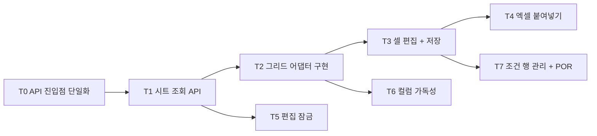

# Phase 2 — 조건표 편집기 + 데이터 모델 (작업 계획)

> 목표: Phase 1에서 확정한 그리드 라이브러리(Glide Data Grid — D-18) 위에 layer × parameter 조건표 편집기를 완성한다. **엑셀 범위 붙여넣기**(D-12 핵심 요구)와 **편집 잠금**(D-09)이 이 Phase의 성패를 가른다.

관련 문서: [01-architecture.md](./01-architecture.md) · [02-data-model.md](./02-data-model.md) · [03-grid-evaluation.md](./03-grid-evaluation.md) · [04-roadmap.md](./04-roadmap.md) · [05-ui-wireframe.md](./05-ui-wireframe.md)

선행 조건: Phase 1 완료 (그리드 라이브러리 확정 + 어댑터 인터페이스 초안 `frontend/src/grid/types.ts` + `cell_value` 데이터 존재). Phase 1 검증 결과 2026-07-10 확인 완료 (CSV 임포트 / Catalog / 생성·중복 차단 / 백본 dry-run·수동 매칭·복사 / 레이어 교체).

## 완료 기준 (Exit Criteria)

- [ ] EC1. 엑셀에서 복사한 다중 행×열 데이터가 범위 선택 후 붙여넣기로 정확히 반영된다 (타입 불일치 셀은 적용 전 표시)
- [ ] EC2. 200 컬럼 시트에서 편집·스크롤이 쾌적하다 (컬럼 가상화 동작 확인)
- [ ] EC3. 두 브라우저로 동시 접근 시 한쪽만 편집 가능하고, 비보유자에게는 읽기 전용 + "누가 편집 중"이 표시된다
- [ ] EC4. 더티 셀만 배치 UPSERT로 저장되고, 저장마다 `change_event(cell_update)`가 셀 단위로 남는다
- [ ] EC5. 카테고리 탭·컬럼 고정·헤더 툴팁·컬럼 검색-점프가 레지스트리 데이터 기반으로 동적으로 동작한다
- [ ] EC6. 같은 layer/step의 다중 조건 행이 그룹핑되어 표시되고, 조건 행 추가/복제/삭제와 POR 이양이 동작하며, layer당 POR 1개가 서버에서 강제된다 (D-16)

## 결정 항목 (2026-07-10 확정)

| # | 항목 | 확정 내용 | 비고 |
|---|------|-----------|------|
| P2-D1 | 자동 임시저장 트리거 | **혼합**: 편집 유휴 3초 디바운스 + flush 트리거(화면 이탈, 잠금 해제 직전, 조건 행 CRUD·POR 등 구조 변경 API 호출 직전). 실패 시 지수 백오프 재시도 최대 3회 → 배너 + 수동 저장 버튼 | 상수는 조정 가능하게 |
| P2-D2 | 붙여넣기 검증 위치 | **클라이언트 1차**(레지스트리 `value_type` 기반 즉시 피드백) + **저장 시 서버 최종 검증**. 별도 paste-preview API는 미도입 — 클라 검증 한계가 실제로 확인되면 재검토 | |
| P2-D3 | 셀 적용성(readonly) 개념 | **미도입** — 모든 셀 편집 가능, 빈 값 허용. 적용성 규칙이 실제 요구로 확인되면 레지스트리/검증(Phase 3) 확장으로 처리 | 와이어프레임의 "해당 없는 파라미터 = readonly" 표현은 보류 |
| P2-D4 | 잠금 TTL/하트비트 | **TTL 3분 + 하트비트 45초** — settings 상수로 조정 가능하게 | |
| P2-D5 | API 진입점 | **`/api` 단일 프리픽스로 통합, 버저닝(v1) 미도입** — 소비자가 동반 배포되는 자사 SPA 하나뿐. SPA 페이지 경로(`/projects` 등)와 API 경로의 이름공간 충돌 제거, dev proxy·운영 리버스 프록시 규칙 1개로 축소. `/health`는 컨테이너 헬스체크용으로 루트 유지 | README [D-19](./README.md). T0로 선행 실행 |
| P2-D6 | 잠금 소유 식별 | **사용자 + 세션 토큰(lock_token)** — 획득 시 서버가 토큰 발급, 편집 계열 API는 토큰 검증. 같은 계정 두 탭도 한쪽만 편집 가능하고, TTL 만료 후 탈취된 잠금에 이전 탭이 뒤늦게 저장하는 사고를 차단. dev 인증 스텁(고정 dev-admin)에서도 EC3 검증 가능 | `edit_lock.lock_token` 컬럼 |
| P2-D7 | 셀 이벤트 기록 방식 | **`change_event`에 구조화 컬럼 추가**: `condition_id`, `parameter_code`, `old_value`, `new_value` (nullable, 0003 마이그레이션 동승). 셀 단위 이벤트만 채우고 벌크 이벤트는 기존처럼 `payload` 사용. Phase 4 "임의 셀 변천사" 조회를 일반 인덱스로 해결 | JSONB 검색 의존 제거 |
| P2-D8 | 조건 행 삭제 | **하드 삭제** + `change_event(condition_remove)` payload에 스냅샷(label, is_por, condition_index, 셀 값). 감사 추적은 append-only 이벤트가 담당. POR 행 삭제 허용 → layer POR 미지정 상태 (Review 게이트 P5-D5가 차단). **layer당 최소 1행 유지**(마지막 조건 행 삭제 차단 — 그리드에서 layer가 사라지는 막다른 상태 방지) | soft delete는 POR partial unique·condition_index 유니크·시트 조회 전부에 필터를 강요해 기각 |

## 범위 가드 (이번 Phase의 비목표)

- **낙관적 동시성(버전 컬럼) 없음** — 잠금(P2-D6)이 단일 작성자를 보장한다
- **웹소켓/실시간 알림 없음** — 비보유자의 잠금 상태 갱신은 폴링으로 충분
- **undo/redo 없음** — 저장 전 더티 버퍼 전체 폐기(변경 취소)만 제공
- **개인 컬럼 프리셋 없음** (후순위 — 로드맵 운영 원칙에 따라 기재만)
- **조건 행 라벨 rename 없음** — 자동 부여 라벨로 시작, 실요구 확인 시 후속
- **paste-preview 서버 API 없음** (P2-D2) · **셀 적용성 readonly 없음** (P2-D3)
- **시트 응답 포맷 최적화는 측정 게이트 통과 시에만** (T1) — 선제 최적화 금지

## 작업 분해 (Work Breakdown)

의존 관계: T0 → T1 → T2 → {T3, T6}, T5는 T1 이후 T2와 병행. T3 → {T4, T7}.

### T0. API 진입점 단일화 (P2-D5 / D-19)

Phase 1까지의 흔적 정리 — 기능별 루트 경로(`/projects`, `/parameters`, `/processes`)가 SPA 페이지 경로와 충돌하고, vite proxy의 `/api` 항목은 대상이 없으며 `/projects`는 proxy 목록에 누락되어 있다.

- backend: `create_app()`에서 기능 라우터를 부모 `APIRouter(prefix="/api")`로 묶어 등록 — 각 feature 라우터 코드는 불변. `/health`는 루트 유지 (compose 헬스체크가 직접 조회)
- frontend: `api/client.ts` baseURL `/api` (VITE_API_BASE_URL 기본값), vite proxy를 `/api` 단일 규칙로 교체 (죽은 `/parameters`·`/processes` 항목 제거)
- backend 테스트 경로 일괄 갱신 (기계적 치환)
- 확인: dev에서 `/processes` 화면 새로고침이 JSON이 아니라 화면을 반환한다 (이름공간 분리 검증)

산출물: 단일 진입점 + proxy 1규칙 + 전체 테스트 통과. **이후 모든 신규 API는 `/api` 아래에만 추가한다.**

### T1. 시트 조회 API

- `GET /api/projects/{project_id}/sheet` (`features/sheets` 슬라이스):
  - **컬럼 정의**: live 레지스트리(`is_active=true`)의 파라미터/카테고리/선택지 — "컬럼 정의 공급자" 함수를 service 내부에서 분리해 둔다 (Phase 5 스냅샷 분기가 이 함수 교체로 끝나도록)
  - **본문**: `layers → layer_conditions → cell_values` 조인 → 조건 행 × parameter 매트릭스. 행 형태: `{condition_id, layer_key, layer_label("layer_id (step_seq)" — P1-D3), condition_label, is_por, cells: {parameter_code: value}}`. 값 없는 셀은 생략(희소) — 프론트가 null 처리
  - **잠금 요약 포함**: `{locked_by, locked_at, expires_at, is_mine}` — 비보유자 "누가 편집 중" 표시의 데이터 공급 경로 (T5와 계약 공유)
- 성능 측정: 100 layer × 200 parameter(약 2만 셀) 응답 크기·직렬화 시간 기록. **게이트**: 명백히 느릴 때만(예: 응답 >1초 또는 >5MB) 행 배열 + 컬럼 인덱스 포맷으로 전환
- **개발 시드 스크립트**: 파라미터 200개(기존 CSV 임포트 로직 재사용) + 60~100 layer × 다중 조건 프로젝트 — EC2·성능 측정·T2 데모의 공용 재료
- 프론트는 받은 컬럼 정의만으로 그리드를 구성한다 (P1 원칙: 코드가 파라미터를 모름)

산출물: 시트 조회 API + 시드 스크립트 + 성능 측정 기록 + API 테스트.

### T2. 그리드 어댑터 구현

Phase 1 인터페이스 초안(`frontend/src/grid/types.ts`)을 Glide Data Grid로 구현 (`frontend/src/grid/`).

- **스텝 0 — D-18 확인 게이트**: Glide로 붙여넣기·200컬럼 스크롤 대화형 체감을 재확인한다. 판정이 뒤집히면 어댑터 뒤 구현체만 RevoGrid로 교체 (계약·상위 코드 불변)
- Glide 구현 노트: 컬럼 가상화 내장, `freezeColumns`로 좌측 layer 식별 컬럼 고정, **row span 없음** → 조건 행 그룹핑(D-16)은 커스텀 셀 렌더링(그룹 첫 행에만 layer 라벨 표시 + 그룹 경계선)으로 구현, `onPaste` 가로채기(false 반환)로 기본 붙여넣기를 막고 스테이징(T4) 경유
- **어댑터 계약 보강**: `scrollToColumn(parameterCode)` 추가 (T6 컬럼 검색-점프용), 행 그룹 렌더 개념 명시 — types.ts 확장
- 동적 컬럼 정의 (레지스트리 → 컬럼), 셀 타입별 에디터: number(단위 표시) / text / choice(드롭다운)
- 셀 상태 렌더링: dirty / 검증 오류(Phase 3에서 연결) / 코멘트(Phase 5에서 연결) — 상태 표시 계약만 먼저 구현
- **라이브러리 API가 어댑터 밖으로 새어나가지 않는지**를 리뷰 기준으로 삼는다 (P4)

산출물: 어댑터 구현 + 60행×200컬럼 렌더링 데모 (T1 시드 사용). **EC2 충족.**

### T3. 셀 편집 + 저장 파이프라인

- 더티 셀 버퍼: Zustand 로컬 스토어 (서버 데이터 복제 금지 — 변경분만 보관). 저장 전 전체 폐기(변경 취소) 버튼 제공
- `PATCH /api/projects/{project_id}/cells` — body `{cells: [{condition_id, parameter_code, value}]}` + 잠금 토큰 헤더(T5) 필수. 단일 트랜잭션:
  - `cell_value` 배치 UPSERT — 값 정규화: trim, 빈 문자열 → null(셀 비우기)
  - 셀 단위 `change_event(cell_update)` — **구조화 컬럼**(`condition_id`, `parameter_code`, `old_value`, `new_value` — P2-D7) + payload `{batch_id, origin: "manual" | "paste"}`
- 응답: 셀별 서버 확정 값 + batch_id → 더티 상태 해제
- 자동 임시저장: P2-D1 정책 (유휴 3초 + flush 트리거). 실패 시 지수 백오프 최대 3회 → 배너 + 수동 저장
- **잠금 상실(409) 시 데이터 보호**: 더티 버퍼 보존 + 그리드 읽기 전용 전환 + "잠금 재획득" 안내 — 편집분 유실 금지

산출물: 편집→저장→이벤트 파이프라인 + API 테스트 (이벤트 구조화 컬럼 검증 포함). **EC4 충족.**

### T4. 엑셀 범위 붙여넣기 (핵심 요구)

- 파이프라인: 클립보드 TSV 파싱 → 선택 범위에 매핑(행×열 크기 검사) → 레지스트리 `value_type` 기반 타입 검사 → **스테이징 표시**(적용될 셀/불일치 셀 하이라이트) → 적용(더티 버퍼 진입) 또는 취소
- 타입 검사 규칙: number는 엄격 파싱(콤마 등 서식 문자열은 불일치로 표시 — 스테이징에서 사용자가 확인·수정), choice는 옵션 일치 검사, 빈 셀 → null(셀 비우기)
- **적용 시 즉시 flush**: 스테이징 적용분은 단일 PATCH 배치로 바로 저장하고 payload에 `origin: "paste"` 표시 — Phase 4 "붙여넣기 묶음 표시"의 근거
- 스테이징 UI: 하단 패널(와이어프레임 "Paste Staging") — 대기 건수, 타입 불일치 목록, 적용/취소
- 엣지 케이스: 카테고리 탭(컬럼 부분집합) 상태의 붙여넣기는 **화면에 보이는 컬럼 순서** 기준으로 매핑, 시트 경계 초과분은 잘라내고 스테이징에 표시
- P2-D2: 서버 paste-preview 없음, 저장 시 서버가 레지스트리 타입 최종 재검증

산출물: 붙여넣기 E2E 시나리오(10행×20열) 통과. **EC1 충족.**

### T5. 편집 잠금

[02-data-model.md](./02-data-model.md) §6 구현 + P2-D6 (lock_token) 확장.

- **0003 마이그레이션 (Alembic)**: `edit_lock`(project_id PK, locked_by, **lock_token**, locked_at, expires_at) + `change_event` 구조화 컬럼(P2-D7) 동승
- API: 획득 `POST /api/projects/{id}/lock`(토큰 발급, 만료 잠금 탈취 허용, 충돌 시 409 + 보유자 정보) / 하트비트(연장) / 해제
- **잠금 검사 적용 범위**: 공용 의존성(require_edit_lock — 토큰 헤더 검증)으로 편집 계열 API 전체에 적용 — cells(T3), **조건 행 CRUD·POR(T7)**, 그리고 **Phase 1의 backbone-replace 소급 적용**. 비보유·토큰 불일치 시 409
- UI: 편집 화면 진입 시 획득, 주기 하트비트(45초), 이탈 시 해제 — beforeunload는 `sendBeacon`(keepalive)으로 해제 시도 + TTL 만료가 최종 보험. 비보유자: 읽기 전용 + "누가 편집 중" 표시(시트 응답 잠금 요약) + 하트비트 주기와 같은 간격의 폴링으로 해제 감지
- 검증: 두 세션(서로 다른 lock_token) 시뮬레이션 테스트 — dev 스텁 고정 사용자(dev-admin)여도 토큰으로 구분되어 EC3 검증 가능

산출물: 잠금 API + UI + 동시 접근 테스트(두 세션 시뮬레이션). **EC3 충족.**

### T6. 컬럼 가독성 (100~200 컬럼 전략)

[03-grid-evaluation.md](./03-grid-evaluation.md) §6의 라이브러리 무관 설계.

- **카테고리 탭 동적 생성**: 레지스트리 카테고리에서 생성 (하드코딩 금지 — P1-D4 결정 반영). "전체" 탭 + 카테고리별 컬럼 부분집합
- 핵심 컬럼 고정(layer 식별 컬럼 상시 좌측 고정), 헤더 툴팁(레지스트리 `description`)
- 컬럼 검색-점프: 컬럼명 검색 → `scrollToColumn`(T2에서 보강한 어댑터 계약)으로 해당 컬럼 스크롤
- 개인 컬럼 프리셋은 후순위 (이번 Phase 범위 아님 — 로드맵 운영 원칙에 따라 기재만)

산출물: 가독성 장치 4종 동작. **EC5 충족.**

### T7. 조건 행 관리 + POR 선택 (D-16)

**즉시 커밋 원칙**: 행 추가/복제/삭제/POR 이양은 더티 버퍼와 분리된 즉시 API 호출 — 구조 변경과 셀 편집 버퍼를 섞지 않는다. 호출 직전 더티 셀 flush (P2-D1 트리거에 포함).

- **조건 행 CRUD API**:
  - `POST /api/projects/{id}/layers/{layer_key}/conditions` — 추가(빈 행) / 복제(`source_condition_id` 지정 시 원본 조건 행의 셀 값 복사). label 자동 부여("C{n}" — 해당 layer의 기존 라벨과 충돌하지 않는 다음 번호), `condition_index = max+1`. `change_event(condition_add)`
  - `DELETE .../conditions/{condition_id}` — **하드 삭제 (P2-D8)**: `cell_value` 캐스케이드, `change_event(condition_remove)` payload에 스냅샷. POR 행 삭제 허용(layer POR 미지정 상태 — Review 게이트 P5-D5가 차단), **layer당 최소 1행 유지**. 삭제 후 `condition_index` 재순번 없음(gap 허용 — 정렬용이므로 무해)
- **POR 이양 API**: `PUT .../conditions/{condition_id}/por` — 트랜잭션 안에서 기존 POR 해제 + 새 POR 지정, partial unique 제약이 최종 방어선. `change_event(por_change)` (payload에 old/new condition_id)
- UI: "조건 · POR" 컬럼 — POR 라디오(●/○) 클릭으로 이양, 행 컨텍스트 메뉴로 추가/복제/삭제. POR 미지정 layer는 경고 표시
- 전 API에 잠금 검사(T5 공용 의존성) 적용

산출물: 조건 행 CRUD + POR 이양 + 그룹핑 UI + layer당 POR 1개 강제 테스트. **EC6 충족.**

## 실행 순서 요약

1. T0 API 진입점 단일화 (P2-D5) — 이후 작업의 경로 기준
2. T1 시트 조회 API + 대형 시드
3. T2 그리드 어댑터 (스텝 0: D-18 확인 게이트) / T5 편집 잠금 (병행)
4. T3 셀 편집 + 저장
5. T4 엑셀 붙여넣기 ← 핵심 요구
6. T7 조건 행 관리 + POR / T6 컬럼 가독성 (병행)
7. EC1~EC6 점검 + **문서 동기화** → Phase 3 착수 판단

문서 동기화 (Phase 경계 — 운영 원칙): [02-data-model.md](./02-data-model.md) §4를 실모델로 정정(`cell_value`는 `value_text`이며 `updated_by/updated_at` 없음 — 이력은 `change_event` 담당), §5에 구조화 컬럼(P2-D7), §6에 `lock_token`(P2-D6) 반영. [03-grid-evaluation.md](./03-grid-evaluation.md) §7에 D-18 확인 게이트 결과 기재.
