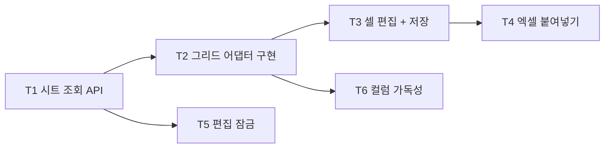

# Phase 2 — 조건표 편집기 + 데이터 모델 (작업 계획)

> 목표: Phase 1에서 확정한 그리드 라이브러리 위에 layer × parameter 조건표 편집기를 완성한다. **엑셀 범위 붙여넣기**(D-12 핵심 요구)와 **편집 잠금**(D-09)이 이 Phase의 성패를 가른다.

관련 문서: [01-architecture.md](./01-architecture.md) · [02-data-model.md](./02-data-model.md) · [03-grid-evaluation.md](./03-grid-evaluation.md) · [04-roadmap.md](./04-roadmap.md) · [05-ui-wireframe.md](./05-ui-wireframe.md)

선행 조건: Phase 1 완료 (그리드 라이브러리 확정 + 어댑터 인터페이스 초안 + `cell_value` 데이터 존재).

## 완료 기준 (Exit Criteria)

- [ ] EC1. 엑셀에서 복사한 다중 행×열 데이터가 범위 선택 후 붙여넣기로 정확히 반영된다 (타입 불일치 셀은 적용 전 표시)
- [ ] EC2. 200 컬럼 시트에서 편집·스크롤이 쾌적하다 (컬럼 가상화 동작 확인)
- [ ] EC3. 두 브라우저로 동시 접근 시 한쪽만 편집 가능하고, 비보유자에게는 읽기 전용 + "누가 편집 중"이 표시된다
- [ ] EC4. 더티 셀만 배치 UPSERT로 저장되고, 저장마다 `change_event(cell_update)`가 셀 단위로 남는다
- [ ] EC5. 카테고리 탭·컬럼 고정·헤더 툴팁·컬럼 검색-점프가 레지스트리 데이터 기반으로 동적으로 동작한다

## 선행 확정 필요 (결정 항목)

| # | 항목 | 내용 | 권고 |
|---|------|------|------|
| P2-D1 | 자동 임시저장 트리거 | 주기(N초) vs 이벤트(포커스 이탈/셀 이동) vs 혼합 | 혼합: 편집 유휴 수 초 + 화면 이탈 시 flush |
| P2-D2 | 붙여넣기 검증 위치 | 타입 검사를 클라이언트 단독으로 할지, `POST paste-preview`로 서버 검증을 병행할지 | 클라이언트 1차(즉시 피드백) + 저장 시 서버 최종 검증. 별도 paste-preview API는 클라 검증 한계 확인 후 도입 |
| P2-D3 | 셀 적용성(readonly) 개념 | 와이어프레임에 "layer 유형에 해당 없는 파라미터 = readonly 셀" 표현이 있으나, 현 데이터 모델에는 layer 유형별 파라미터 적용성 개념이 없음 | Phase 2에서는 도입하지 않음 — 모든 셀 편집 가능, 빈 값 허용. 적용성 규칙이 실제 요구로 확인되면 레지스트리/검증(Phase 3) 확장으로 처리 |
| P2-D4 | 잠금 TTL/하트비트 주기 | 만료 시간과 하트비트 간격 | TTL 2~5분 + 하트비트 30초~1분, 구현 시 상수로 조정 가능하게 |

## 작업 분해 (Work Breakdown)

의존 관계: T1 → T2 → {T3, T4, T6}, T5는 T1 이후 병행. T3 → T4.

### T1. 시트 조회 API

- `GET /projects/{project_id}/sheet` (`features/sheets`):
  - **컬럼 정의**: live 레지스트리(`is_active=true`)의 파라미터/카테고리/선택지 — Phase 5에서 스냅샷 분기가 추가되므로 "컬럼 정의 공급자"를 service 내부에서 분리해 둔다
  - **본문**: `layers → cell_values` 단일 조인 쿼리 → layer×parameter 매트릭스로 변환해 반환
- 100 layer × 200 parameter(약 2만 셀) 응답 크기·직렬화 시간 측정, 필요 시 응답 포맷 최적화(행 배열 + 컬럼 인덱스 방식)
- 프론트는 받은 컬럼 정의만으로 그리드를 구성한다 (P1 원칙: 코드가 파라미터를 모름)

산출물: 시트 조회 API + 성능 측정 기록 + API 테스트.

### T2. 그리드 어댑터 구현

Phase 1 인터페이스 초안을 확정 라이브러리로 구현 (`frontend/src/grid/`).

- 동적 컬럼 정의 (레지스트리 → 컬럼), 셀 타입별 에디터: number(단위 표시) / text / choice(드롭다운)
- 셀 상태 렌더링: dirty / 검증 오류(Phase 3에서 연결) / 코멘트(Phase 5에서 연결) — 상태 표시 계약만 먼저 구현
- 범위 선택, 컬럼 가상화, 좌측 layer 식별 컬럼 고정
- **라이브러리 API가 어댑터 밖으로 새어나가지 않는지**를 리뷰 기준으로 삼는다 (P4)

산출물: 어댑터 구현 + 60행×200컬럼 렌더링 데모. **EC2 충족.**

### T3. 셀 편집 + 저장 파이프라인

- 더티 셀 버퍼: Zustand 로컬 스토어 (서버 데이터 복제 금지 — 변경분만 보관)
- `PATCH /projects/{project_id}/cells`: 더티 셀 배치 UPSERT + 셀 단위 `change_event(cell_update, source=manual)` 기록, 단일 트랜잭션
- 자동 임시저장: P2-D1 정책 구현, 실패 시 재시도 + 사용자 알림
- 저장 응답으로 서버 확정 값을 받아 더티 상태 해제 (충돌 감지의 기초)

산출물: 편집→저장→이벤트 파이프라인 + API 테스트. **EC4 충족.**

### T4. 엑셀 범위 붙여넣기 (핵심 요구)

- 파이프라인: 클립보드 TSV 파싱 → 선택 범위에 매핑(행×열 크기 검사) → 레지스트리 `value_type` 기반 타입 검사 → **스테이징 표시**(적용될 셀/불일치 셀 하이라이트) → 적용(더티 버퍼로 진입) 또는 취소
- 스테이징 UI: 하단 패널(와이어프레임 "Paste Staging") — 대기 건수, 타입 불일치 목록, 적용/취소
- 엣지 케이스: 붙여넣기 범위가 카테고리 탭 경계·시트 경계를 넘는 경우, choice 값 불일치, 빈 셀 처리
- P2-D2 정책에 따른 서버 검증 연동

산출물: 붙여넣기 E2E 시나리오(10행×20열) 통과. **EC1 충족.**

### T5. 편집 잠금

[02-data-model.md](./02-data-model.md) §6 구현.

- `edit_lock` 테이블 (project_id PK, locked_by, locked_at, expires_at) + Alembic 마이그레이션
- API: 획득(`POST /projects/{id}/lock`) / 하트비트(연장) / 해제. 편집 계열 API(cells, backbone-replace)는 잠금 보유자 검사 → 비보유 시 409
- UI: 편집 화면 진입 시 획득, 주기 하트비트, 이탈 시 해제(beforeunload + TTL 만료 보험), 비보유자는 읽기 전용 + "누가 편집 중" 표시
- 만료 잠금 정리: 획득 시도 시 만료 잠금 탈취 허용

산출물: 잠금 API + UI + 동시 접근 테스트(두 세션 시뮬레이션). **EC3 충족.**

### T6. 컬럼 가독성 (100~200 컬럼 전략)

[03-grid-evaluation.md](./03-grid-evaluation.md) §6의 라이브러리 무관 설계.

- **카테고리 탭 동적 생성**: 레지스트리 카테고리에서 생성 (하드코딩 금지 — P1-D4 결정 반영). "전체" 탭 + 카테고리별 컬럼 부분집합
- 핵심 컬럼 고정(layer 식별 컬럼 상시 좌측 고정), 헤더 툴팁(레지스트리 `description`)
- 컬럼 검색-점프: 컬럼명 검색 → 해당 컬럼으로 스크롤
- 개인 컬럼 프리셋은 후순위 (이번 Phase 범위 아님 — 로드맵 운영 원칙에 따라 기재만)

산출물: 가독성 장치 4종 동작. **EC5 충족.**

## 실행 순서 요약

1. 결정 항목 P2-D1~D4 확정
2. T1 시트 조회 API
3. T2 그리드 어댑터 구현 / T5 편집 잠금 (병행)
4. T3 셀 편집 + 저장
5. T4 엑셀 붙여넣기 ← 핵심 요구
6. T6 컬럼 가독성
7. EC1~EC5 점검 → Phase 3 착수 판단
