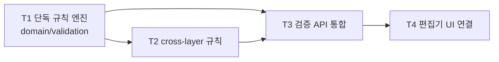

# Phase 3 — 검증 엔진 (작업 계획)

> 목표: 레지스트리 속성 기반의 파라미터 단독 규칙과 cross-layer 규칙을 **순수 도메인 로직**(`domain/validation`)으로 구현하고, 편집기와 연결해 오류를 즉시 보이게 한다. Phase 5의 Review 게이트(검증 오류 0건)가 이 엔진을 그대로 사용한다.

관련 문서: [01-architecture.md](./01-architecture.md) · [02-data-model.md](./02-data-model.md) · [04-roadmap.md](./04-roadmap.md)

선행 조건: Phase 2.6 완료 (편집기 + 셀 상태 표시 계약, Project Profile,
관리형 ChoiceSet/ChoiceOption과 검색형 choice editor).

## 완료 기준 (Exit Criteria)

- [ ] EC1. 규칙 위반 셀이 편집 즉시 표시된다 (저장 전 클라이언트 피드백 + 저장 시 서버 확정)
- [ ] EC2. cross-layer 규칙이 fixture 시나리오로 검증된다 (규칙 정의 → 위반 데이터 → 위반 검출)
- [ ] EC3. 검증 엔진 단위 테스트가 **DB 없이** 실행된다 (domain 순수성 검증)
- [ ] EC4. 시트 전체 검증 API가 오류 목록(셀 좌표 + 사유)을 반환하고, UI 오류 패널에서 셀로 점프할 수 있다
- [ ] EC5. 편집기 오류·경고 문구가 내부 판정문을 그대로 노출하지 않고, **문제 원인 + 사용자가 할 다음 행동**을 자연스러운 한국어로 안내한다

## 선행 확정 필요 (결정 항목)

| # | 항목 | 내용 | 권고 |
|---|------|------|------|
| P3-D1 | 레지스트리 속성 확장 | Phase 2.6 스키마의 number 부가속성(unit/min/max)과 ChoiceSet 외에 `required`, `pattern` 속성 추가 필요 | 레지스트리 컬럼 추가(마이그레이션) + 관리 UI 확장. parameter/option code 불변·soft delete 규칙은 그대로 |
| P3-D2 | cross-layer 규칙 표현 | 규칙을 선언적 JSON(연산자 트리)으로 표현할지, 제한된 DSL 문자열로 할지 | **선언적 JSON** — 파싱 불필요, 스키마 검증 가능, UI 빌더로 확장 용이. 초기 연산자는 비교/사칙/참조(다른 layer·parameter 값) 최소 세트 |
| P3-D3 | 검증 결과 저장 여부 | 위반 상태를 테이블에 캐시할지, 조회 시마다 계산할지 | **매번 계산** — 프로젝트당 최대 2만 셀 규모에서는 온디맨드 계산으로 충분. Review 게이트도 요청 시 전체 검증 실행. 성능 문제가 실측되면 캐시 도입 |
| P3-D4 | cross-layer 규칙 관리 주체 | 관리자 CRUD UI를 이번 Phase에 포함할지, 초기에는 시드/API만 둘지 | Phase 3는 규칙 테이블 + API + 시드까지. 규칙 빌더 UI는 실사용 규칙이 쌓인 뒤 별도 배정 |
| P3-D5 | 검증 대상 조건 행 범위 | 다중 조건 행(D-16)의 검증 범위 | **확정**: 전 조건 행 검증 (편집 중 오류는 어느 행이든 표시). cross-layer 규칙의 layer 간 참조는 **POR 행 값 기준** |

## 작업 분해 (Work Breakdown)

의존 관계: T1 → {T2, T3} → T4.

### T1. 파라미터 단독 규칙 엔진 (`domain/validation`)

- 규칙 4종: **range**(number min/max), **required**, **pattern**(정규식), **choice 해석**
  (미등록 code는 error, 이미 저장된 비활성 code는 non-blocking warning)
- 입력: 파라미터 정의+ChoiceSet(레지스트리 또는 snapshot version 2) + 셀 값(TEXT) → 출력: 위반 목록(코드화된 사유)
- FastAPI·SQLAlchemy 무의존 순수 함수 — 컬럼 정의를 인자로 받으므로 live/스냅샷 어느 쪽으로도 동작 (Phase 5 대비)
- P3-D1: 레지스트리에 `required`/`pattern` 속성 추가 마이그레이션 + 파라미터 관리 UI 폼 확장
- Phase 2.6 canonical decimal 문자열과 `NUMERIC` min/max를 `Decimal`로 비교한다. malformed
  저장값은 방어적으로 error지만, 정상 API 쓰기에서는 Phase 2.6 hard validation이 먼저 거부한다.

산출물: 규칙 4종 + 순수 단위 테스트 (DB 무의존). **EC3의 축.**

### T2. Cross-layer 규칙 (테이블 + 평가기)

- `validation_rule` 테이블: id, name, description, `expression`(JSONB — P3-D2), severity(error/warning), is_active, 감사 필드 + Alembic 마이그레이션
- 평가기(`domain/validation`): 시트 매트릭스(layer×parameter 값 맵)를 입력으로 규칙 표현식 평가 → 위반 셀 좌표 목록
  - layer 참조 방식: layer_key 직접 참조 + 상대 참조(예: 특정 유형의 모든 layer)는 실규칙 확인 후 확장
- 규칙 CRUD API (관리자) — UI는 P3-D4에 따라 이연
- fixture 시나리오: 규칙 2~3종 + 위반/정상 데이터 세트

산출물: 규칙 테이블 + 평가기 + 계약 테스트. **EC2 충족.**

### T3. 검증 API 통합

- `POST /projects/{project_id}/validate`: 시트 전체 검증 — 단독 규칙 + cross-layer 규칙 실행, 오류 목록(layer_key, parameter_code, rule, message, severity) 반환
- 셀 저장 경로 통합: `PATCH cells` 저장 시 대상 셀 단독 규칙 검증을 함께 실행해 응답에
  포함한다. Phase 2.6의 숫자 문법과 신규 choice code 유효성은 hard rejection을 유지하고,
  Phase 3의 range/required/pattern 위반은 Draft 저장을 허용하되 표시한다. 이미 저장된 비활성
  choice는 warning으로 남아 Review gate를 막지 않는다.
- 프론트 즉시 검증: 단독 규칙은 컬럼 정의만으로 클라이언트에서도 평가 가능 — 동일 규칙 사양을 클라에 이식하되, **서버 결과를 최종 판정**으로 삼는다

산출물: 전체/셀 검증 API + 저장 경로 통합 테스트.

### T4. 편집기 UI 연결

- 오류 셀 하이라이트: Phase 2 어댑터의 셀 상태 표시 계약에 검증 결과 연결
- 오류 목록 패널: 사유/심각도별 목록, 항목 클릭 → 해당 셀로 스크롤 점프 (컬럼 검색-점프 재사용)
- 편집 즉시 피드백: 셀 편집 시 클라이언트 단독 규칙 평가 → 즉시 표시, 저장 응답으로 확정
- "검증" 버튼: 전체 검증 실행 → 패널 갱신
- **사용자 메시지 카피 패스**: 검증 code/파라미터와 화면 문구를 분리하고, 붙여넣기·저장·잠금·조건 작업을 포함한 편집기 알림을 행동 지향 문구로 통일한다. 예: `숫자 형식이 아니다` → `숫자로 입력해 주세요`, `선택지에 없는 값이다` → `목록에 있는 값으로 선택해 주세요`. 오류 패널에는 가능한 경우 허용 범위·선택지·재시도 방법을 함께 표시한다
- 서버의 원문 message나 내부 code는 진단 근거로 유지하되 사용자 화면에 그대로 출력하지 않는다. 공통 프론트 메시지 매퍼를 두고 붙여넣기 1차 검증도 같은 문구 정책으로 이관한다

산출물: 오류 표시 + 패널 + 점프 동작 + 편집기 사용자 메시지 정리. **EC1·EC4·EC5 충족.**

## 실행 순서 요약

1. 결정 항목 P3-D1~D5 확정 (특히 표현식 형태)
2. T1 단독 규칙 엔진 + 레지스트리 속성 확장
3. T2 cross-layer 규칙 테이블 + 평가기
4. T3 검증 API 통합
5. T4 편집기 UI 연결
6. EC1~EC5 점검 → Phase 4 착수 판단
