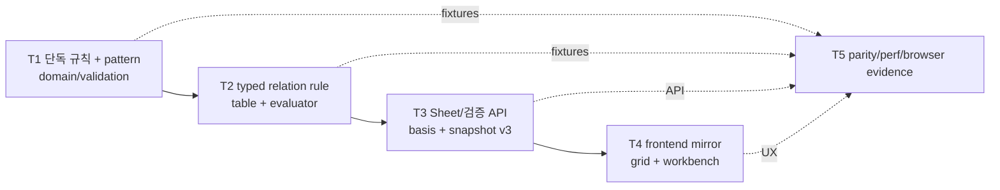

# Phase 3 — 검증 엔진 (작업 계획)

> 목표: 레지스트리 속성 기반의 파라미터 단독 규칙과 typed relation 규칙을 **순수 도메인
> 로직**(`domain/validation`)으로 구현하고 편집기와 연결한다. Phase 5의 Review/Approval
> 게이트는 이 엔진과 동일한 validation basis를 사용한다.

상세 승인 설계: [2026-07-15 Phase 3 Validation Engine Design](../docs/superpowers/specs/2026-07-15-phase-3-validation-engine-design.md)

관련 문서: [01-architecture.md](./01-architecture.md) · [02-data-model.md](./02-data-model.md) · [04-roadmap.md](./04-roadmap.md)

선행 조건: Phase 2.6 완료 (편집기 + 셀 상태 표시 계약, Project Profile,
관리형 ChoiceSet/ChoiceOption과 검색형 choice editor).

## 완료 기준 (Exit Criteria)

- [ ] EC1. 규칙 위반 셀이 편집 즉시 표시된다 (저장 전 클라이언트 피드백 + 저장 후 서버 확정)
- [ ] EC2. `required_if`와 모든 이전 layer POR membership 규칙이 공유 fixture 시나리오로 검증된다
- [ ] EC3. 검증 엔진 단위 테스트가 **DB 없이** 실행된다 (domain 순수성 검증)
- [ ] EC4. 시트 전체 검증 API가 stable issue(셀 좌표 + code + typed details)를 반환하고 UI에서 셀로 점프한다
- [ ] EC5. 편집기 오류·경고가 내부 판정문이나 정규식을 노출하지 않고 **문제 원인 + 다음 행동**을 자연스러운 한국어로 안내한다
- [ ] EC6. snapshot v3와 validation `basis_hash`가 결정적으로 생성되고 Phase 5가 재사용할 수 있다
- [ ] EC7. 20,000셀·관계 규칙 50개 reference 성능 evidence가 기록된다

## 확정 결정

| # | 항목 | 결정 |
|---|---|---|
| P3-D1 | 레지스트리 속성 | `required`, bounded portable `pattern`, 필수 사용자 안내 `pattern_hint` 추가. min/max는 number에만 허용 |
| P3-D2 | 관계 규칙 표현 | 범용 AST가 아닌 typed declarative JSON union: `required_if`, `value_exists_in_prior_por` |
| P3-D3 | 결과 저장 | 저장하지 않고 매번 계산. 성능 문제는 실측 뒤 최적화 |
| P3-D4 | 규칙 관리 | immutable code + monotonic version + expected_version API. Phase 3 UI 없음, production seed 추측 없음 |
| P3-D5 | 조건 행 범위 | 현재 layer의 모든 조건 행 검증. cross-layer 후보는 앞선 모든 layer의 POR 행만 사용 |
| P3-D6 | prior membership | source가 비면 skip, typed exact equality, 위반은 현재 source 셀에 anchor |
| P3-D7 | 규칙 scope | 전역 기본 + 선택적 line/process/현재 layer 속성 필터 |
| P3-D8 | 클라이언트 판정 | 모든 Phase 3 규칙을 TS로 즉시 mirror 평가하고 저장 성공 뒤 서버 전체 검증으로 확정 |
| P3-D9 | pattern 방언 | 전체 문자열 일치, 256자/반복 상한 256, 16 alternatives/16 quantified atoms/branch max 1,024, overlapping adjacent quantifier 금지 |
| P3-D10 | 승인 basis | snapshot v3에 parameter validation metadata와 적용 relation rule을 동결하고 SHA-256 `basis_hash` 제공 |
| P3-D11 | 사용자 문구 | issue code + typed details + parameter display metadata를 프론트 mapper가 행동 지향 한국어로 변환 |
| P3-D12 | Phase 4 handoff | 복사/교체 시점 immutable backbone snapshot과 현재 전체 조건 행/셀 diff를 Phase 4에 추가 |

## 작업 분해 (Work Breakdown)

의존 관계: T1 → T2 → T3 → T4, T5는 각 단계와 함께 누적한다.

### T1. 파라미터 단독 규칙 엔진

- `backend/app/domain/validation/`: immutable input/output types와 순수 evaluator
- standalone issue: `required`, `number_malformed`, `range_min`, `range_max`,
  `pattern_mismatch`, `choice_unknown`, `choice_inactive`
- Decimal 기반 inclusive range; null은 range/pattern skip
- known inactive choice는 warning, unknown stored choice는 error
- bounded portable pattern parser/validator:
  - 전체 문자열 일치, 최대 256자
  - literal, dot, explicit class/range, top-level `|`, `?`, `{m}`, `{m,n}`
  - anchor, `*`, `+`, group, lookaround, backreference, inline flag, shorthand 금지
  - alternatives/atoms/quantified atoms/max-match-length 제한 + adjacent quantified overlap 거부
- parameter migration/API/admin form: `required`, `pattern`, `pattern_hint`
- pattern과 hint pair 및 non-number min/max/unit 무결성
- nullable update의 omitted/explicit-null 구분
- parameter snapshot serializer v3 기반 추가

산출물: DB-free standalone engine, pattern contract, parameter schema/API/UI, shared fixture 축.

### T2. Typed relation rule

`validation_rule`:

- id, immutable code, name, description, severity
- strict `scope` JSONB, strict discriminator `spec` JSONB
- version, is_active, created_at, updated_at
- optimistic concurrency with `expected_version`

Rule family:

1. `required_if`: 같은 조건 행의 typed equality → target required
2. `value_exists_in_prior_por`: 현재 모든 조건 행 source를 앞선 모든 layer POR candidate 누적 집합과 비교

평가기 요구:

- `(sort_order, layer_key)` 결정 순서
- current layer 평가 후 current POR candidate 추가(자기 자신으로 만족 금지)
- source/candidate same value type; choice는 same ChoiceSet
- source null skip, empty candidate set + present source는 violation
- cumulative set으로 선형 평가
- scope는 line/process/current layer 속성에 적용
- active rule이 참조하는 parameter deactivation 차단
- corrupted rule은 configuration failure이며 zero-issue로 처리 금지

산출물: rule CRUD API, pure relation evaluator, DB/API tests, generic dev fixture.

### T3. Sheet와 검증 API 통합

Sheet response:

- column: min/max/required/pattern/pattern_hint
- row: layer_sort_order/condition_index
- applicable relation rules + `validation_basis_hash`

전체 검증:

- `POST /api/projects/{project_id}/validate`
- summary, deterministic issues, evaluated_at, basis_hash, rule_versions 반환
- raw backend message와 raw pattern은 반환하지 않음
- 결과 저장 없음; read authorization만 적용

저장 경로:

- malformed number/new invalid or inactive choice는 atomic hard rejection 유지
- required/range/pattern/relation issue는 Draft 저장 허용
- partial issue를 CellsPatchOut에 넣지 않고 durable save 뒤 whole-project validation 실행

Versioning:

- canonical parameter/ChoiceSet/rule definitions에서 `basis_hash` 생성
- snapshot v3에 적용 relation rules 포함
- Phase 5 Review/Approval이 same service와 basis를 사용하도록 application boundary 제공

산출물: migration, rule/validation repository-service-router-schema, Sheet 계약, snapshot v3, API tests.

### T4. 프론트 즉시 검증과 workbench

- 공용 JSON fixture를 읽는 pure TypeScript evaluator
- display rows의 dirty edit와 accepted paste를 즉시 평가
- 저장 성공 뒤 500ms idle debounce로 server validate; 연속 요청 coalesce
- project/sheet/persisted generation fencing, stale response 폐기
- basis mismatch 시 Sheet definition refetch
- 명시적 검증은 autosave durable idle 뒤 실행; 저장 실패면 차단

Grid status:

- validation severity + dirty + future comment를 결합 가능한 aggregate로 변경
- priority: paste staging > error > warning > dirty > comment
- validation surface와 dirty/comment marker 분리

Workbench:

- issue 또는 첫 명시적 검증 뒤에만 content-gated mount
- collapsed summary + authoritative/failure 상태
- responsive tile flow, error/warning filter
- focusable separator와 keyboard resize
- tile 활성화 → hidden category 전환 → scroll/select/focus
- 마지막 성공 결과를 네트워크 실패 시 보존

Message mapper:

- stable issue code와 typed details만 소비
- parameter display name, bound, pattern_hint, relation parameter를 자연어로 구성
- unknown code safe fallback; raw server message/pattern 금지

산출물: API types/client, pure mirror, validation state, grid overlay, workbench, accessibility tests.

### T5. Parity, performance, browser evidence

- pytest/Vitest가 같은 language-neutral fixture를 읽고 normalized issue array byte parity 확인
- DB-free domain import boundary test
- migration PostgreSQL test
- rule concurrency/reference/type/scope tests
- soft-save/hard-reject 회귀 tests
- 20,000셀/50 relation rule reference benchmark:
  - pure target ≤ 500ms
  - load+API target ≤ 1.5s
- Chromium flow:
  - immediate → autosave → authoritative → correction clear
  - required_if / prior-POR / inactive warning
  - explicit validation save ordering
  - issue tile cell focus
  - 1024/1440/1920 and keyboard accessibility

산출물: automated suites + reference performance/browser evidence. EC1~EC7의 증거.

## 실행 순서 요약

1. migration + parameter validation metadata + pattern grammar
2. pure standalone domain + shared fixtures
3. validation_rule model/API + typed relation evaluator
4. Sheet definition/basis + whole-project API + snapshot v3
5. frontend pure mirror + generation-safe server confirmation
6. composite grid status + workbench + message mapper
7. parity/performance/accessibility/browser evidence
8. EC1~EC7 점검 및 Phase 4 immutable backbone diff handoff 확인
