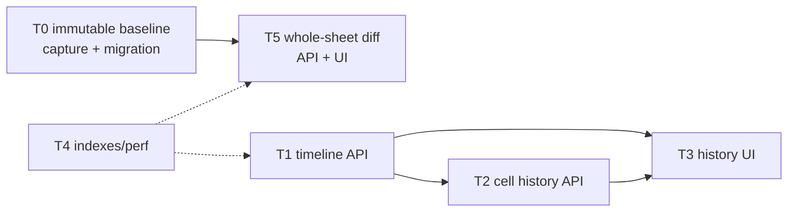

# Phase 4 — 변경 이력 + 백본 기준 비교 (작업 계획)

> 목표: Phase 1~3에서 append-only로 쌓아 온 `change_event`를 사용자에게 보여주고, 프로젝트
> 생성·layer 교체 당시의 immutable backbone snapshot과 현재 조건표 전체를 비교한다. 타임라인은
> 기존 이벤트를 조회하며, backbone diff를 위해서는 복사 시점 기준값을 별도로 보존한다.

관련 문서: [02-data-model.md](./02-data-model.md) §5·§8 · [04-roadmap.md](./04-roadmap.md) · [Phase 3 승인 설계 §19](../docs/superpowers/specs/2026-07-15-phase-3-validation-engine-design.md#19-phase-4-backbone-baseline-diff-handoff)

선행 조건: Phase 3 완료. cell/backbone/condition/POR 이벤트가 실제로 쌓여 있어야 하며,
Phase 3 workbench·셀 점프 계약을 재사용한다.

## 완료 기준 (Exit Criteria)

- [ ] EC1. Phase 1~3 이벤트(backbone_copy / backbone_layer_replace / cell_update / 조건/POR)가 타임라인에 정확히 나타난다
- [ ] EC2. 임의 셀의 값 변천사를 추적할 수 있다 (셀 우클릭 → 해당 셀의 변경 연대기)
- [ ] EC3. 타임라인 필터(layer / 이벤트 유형 / 사용자 / 소스)가 동작하고 항목에서 해당 셀로 점프한다
- [ ] EC4. 벌크 이벤트(백본 복사, 엑셀 붙여넣기)가 배치 단위로 묶이고 펼치면 셀 상세가 보인다
- [ ] EC5. 복사·교체 시점 backbone 값이 이후 source 프로젝트 수정과 무관하게 immutable baseline으로 남는다
- [ ] EC6. baseline과 현재의 모든 조건 행·셀을 `added/changed/cleared/removed/unchanged`로 일괄 비교하고 drill-down할 수 있다

## 확정 결정

| # | 항목 | 결정 |
|---|---|---|
| P4-D1 | 붙여넣기 이벤트 배치화 | Phase 2의 `batch_id`와 `origin=paste` 사용 |
| P4-D2 | 타임라인 페이징 | 최신순 bigserial cursor + 기간 필터 |
| P4-D3 | 이벤트 표시명 | 프론트 사용자 문구 mapper로 관리 |
| P4-D4 | backbone 비교 기준 | source 프로젝트의 live 값이 아니라 프로젝트 생성·최근 layer 교체 **당시 snapshot** |
| P4-D5 | 비교 범위 | POR만이 아니라 baseline/current의 **모든 조건 행과 모든 셀** |
| P4-D6 | 행 매칭 | copied `source_condition_id` lineage 우선; lineage 없는 현재 행은 added, 후손 없는 baseline 행은 removed |
| P4-D7 | baseline 없는 기존 행 | live source로 가장하지 않고 `baseline_unavailable`로 명시 |

## 작업 분해

### T0. Immutable backbone baseline capture

- nullable `sheet_layer.backbone_snapshot` JSONB; payload schema version은 storage version이며 최신 copy/replacement baseline 한 개를 나타냄
  - source project/layer identity, captured_at, schema version
  - every source condition identity, label, order, POR
  - sparse parameter code → value map
- project creation의 matched layer마다 source를 복사하기 직전에 capture
- layer backbone 교체 때 해당 layer baseline을 새 source snapshot으로 atomic reset; superseded baseline historical diff는 비범위
- backbone 없이 시작하거나 unmatched layer는 baseline 없음
- nullable migration으로 기존 row를 보존하되 신뢰할 수 없는 소급 baseline을 만들지 않음
- capture/apply가 한 transaction에서 성공하거나 함께 rollback

산출물: migration, deterministic serializer, create/replace integration tests. **EC5의 축.**

### T1. 통합 타임라인 조회 API

- `GET /api/projects/{project_id}/events`
- 필터: layer_key, event_type, actor, source, 기간
- cursor: `change_event.id` 역순
- payload batch_id 기반 batch summary + lazy detail
- append-only: history repository에 write method를 두지 않음

산출물: timeline API, filter/cursor/batch tests.

### T2. 셀 단위 이력 API

- condition identity + parameter code 기반 history endpoint
- old_value → new_value, origin, actor, time
- 삭제된 condition도 append-only event snapshot에서 조회
- inactive parameter code도 registry에서 표시명 해석

산출물: cell history API와 삭제/비활성 회귀 tests. **EC2의 축.**

### T3. 이력 UI

- project/sheet workbench의 History tab
- layer/type/user/source filters + infinite cursor list
- batch summary expand → lazy cell detail
- item activation → category 전환 + scroll/select/focus
- cell context action → 해당 cell chronology

산출물: timeline, cell history, keyboard/accessibility tests. **EC1·EC3·EC4 충족.**

### T4. 인덱스와 성능

- `(project_id, id DESC)`와 cell history coordinate index
- 실제 모델에 없는 `layer_key` 컬럼을 가정하지 않고 event type별 구조화 컬럼/payload 조회를 확인
- batch_id JSON 조회가 느릴 때만 구조화 컬럼 승격
- baseline JSON은 layer 단위로 읽고 전체 프로젝트 diff에서 N+1 금지
- 수만~수십만 event와 20,000-cell baseline fixture로 계획/메모리 측정

산출물: indexes, query plans, performance evidence.

### T5. Whole-sheet backbone diff

- `GET /api/projects/{project_id}/backbone-diff`
- project summary → layer → condition → cell 계층 결과
- 모든 baseline/current condition과 parameter를 비교
- classification:
  - `added`: baseline absent, current present
  - `changed`: both present, typed unequal
  - `cleared`: baseline present, current absent
  - `removed`: baseline condition has no current descendant
  - `unchanged`: typed equal
- default response는 summary/count와 changed items; unchanged detail은 요청 시 lazy load
- parameter code 기준 비교, number는 Decimal equality, choice는 code equality, text는 exact equality
- UI filter: classification/layer/category/parameter, changed cell jump
- baseline unavailable layer는 별도 상태로 표시하고 diff count에 섞지 않음

산출물: pure diff engine, API, drill-down UI, immutable-source regression tests. **EC6 충족.**

## 실행 순서 요약

1. T0 baseline snapshot migration + creation/replacement capture
2. T1 timeline API + T4 index/performance 기반
3. T2 cell history API / T5 pure diff + API
4. T3 History UI / T5 diff UI
5. EC1~EC6 및 source-project mutation independence 검증
6. Phase 5 Review/Approval 착수 판단
