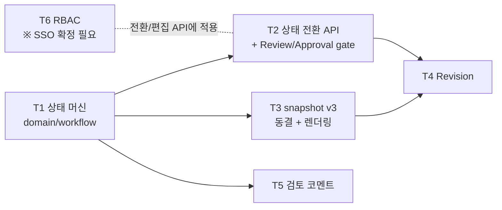

# Phase 5 — 승인 워크플로우 + Revision (작업 계획)

> 목표: Draft → Review → Approved/Rejected → Archived 상태 머신을 `domain/workflow`에 두고, **승인 시 파라미터/ChoiceSet/검증 규칙 스냅샷 동결**(D-08 정책 a, Phase 3 snapshot v3)과 Revision 체계를 완성한다. RBAC이 처음으로 실질 적용되는 Phase이므로 **SSO 인증 구조 확정이 필수 선행 조건**이다.

관련 문서: [01-architecture.md](./01-architecture.md) · [02-data-model.md](./02-data-model.md) §3 · [04-roadmap.md](./04-roadmap.md) · [domain-glossary.md](./domain-glossary.md) (프로젝트 상태 / Revision)

선행 조건: Phase 3 완료 (Review/Approval 게이트가 검증 엔진과 basis_hash 사용) · **SSO 인증 구조 상세 확정** (D-10 — 미확정 시 T6 차단, Phase 5 착수 전 반드시 수신).

## 완료 기준 (Exit Criteria)

- [x] EC1. 승인 후 레지스트리에 파라미터를 추가하거나 Choice label을 바꿔도 승인본 시트·Project Profile 화면이 변하지 않는다 (snapshot v3 검증)
- [x] EC2. Revision 생성 시 새 Draft에는 새 파라미터가 나타난다 (live 복귀 검증)
- [x] EC3. 역할별 허용 동작이 테스트로 고정된다 (권한 매트릭스 테스트)
- [x] EC4. 검증 오류가 1건이라도 있으면 Review 요청이 거부되고, Approval은 같은 validation basis를 확인하거나 재검증한다
- [x] EC5. Approved/Archived 프로젝트는 편집 API가 전면 거부되고 UI가 읽기 전용으로 렌더링된다
- [x] EC6. 검토 코멘트를 프로젝트/셀 레벨로 남기고 조회할 수 있다

## 선행 확정 필요 (결정 항목)

| # | 항목 | 내용 | 권고 |
|---|------|------|------|
| P5-D1 | SSO/RBAC 상세 | IdP 연동 방식, 역할 소스(IdP 클레임 vs PCM 자체 역할 테이블) | **확정** — OIDC-aware gateway가 Authorization Code + PKCE와 세션을 소유하고 PCM은 정규화·서명된 헤더만 신뢰한다. 그룹→역할과 역할→권한은 서버 소유. 상세: `docs/phase-5-d10-sso-rbac.md` |
| P5-D2 | Rejected 복귀 처리 | Rejected → Draft 복귀 시 기존 코멘트/검증 상태 처리 | 코멘트는 보존(resolve 표시), Draft 복귀는 status_change 이벤트만 |
| P5-D3 | Revision 셀 복사 범위 | Archived 본에는 현재 비활성화된 파라미터의 셀 값이 있을 수 있음. 새 Draft는 live 레지스트리를 따르므로 이 값들의 처리 | **전체 복사** — narrow 테이블에서 무해하며 이력 연속성 유지. live 컬럼 정의에 없는 code는 화면에 나타나지 않을 뿐 데이터는 보존. 해당 파라미터 재활성화 시 값이 되살아나는 동작을 명세로 문서화 |
| P5-D4 | Review 중 편집 잠금 | Review 상태에서 편집 불가는 상태 머신이 보장 — edit_lock과의 관계 정리 | Review 진입 시 기존 잠금 해제, Review/Approved/Archived에서는 잠금 획득 자체를 거부 |
| P5-D5 | POR 완결성 게이트 | Review 요청 게이트에 "모든 layer에 POR 1개 지정"(D-16)을 포함할지 | **확정**: 포함 — 편집 중에는 POR 미지정 layer 허용, Review 요청 시 검증 오류 0건 게이트와 함께 검사 |
| P5-D6 | Review→Approval validation basis | Review 뒤 registry/rule이 바뀐 경우 승인 기준 | **확정**: Review 성공 `basis_hash`와 현재 basis가 다르면 Approval transaction 안에서 재검증. error가 있으면 거부하고, 통과한 v3 정의와 basis를 snapshot/event에 기록 |

## 작업 분해 (Work Breakdown)

의존 관계: T1 → {T2, T3} → T4, T5는 T1 이후 병행, T6은 P5-D1 수신 후 착수 (T2~T4에 인가 적용).

### T1. 상태 머신 (`domain/workflow`)

- 상태·전환 규칙을 순수 로직으로: Draft→Review(검증 error 0건 전제; 이미 저장된 비활성 Choice warning은 허용), Review→Approved/Rejected, Rejected→Draft, Approved→Archived(Revision 생성 시)
- 각 전환의 부수 규칙 선언: 승인 시 스냅샷 동결 필요, Archived는 최종 상태, 편집 가능 상태는 Draft뿐
- FastAPI·SQLAlchemy 무의존 — 전환 가능 여부 판정과 사유를 반환하는 순수 함수/클래스

산출물: 상태 머신 + 전이표 전수 단위 테스트 (DB 무의존).

### T2. 상태 전환 API + Review/Approval gate

- `POST /projects/{id}/transitions` (또는 전환별 엔드포인트): domain/workflow 판정 → 통과 시 상태 변경 + `change_event(status_change)` 기록
- **Review 게이트**: Draft→Review 요청 시 Phase 3 전체 검증 실행 → 오류(severity=error) 1건 이상이면 409 + 오류 목록 반환; 성공 basis_hash와 rule_versions 기록
- **Approval gate**: Review 성공 basis와 현재 definition basis가 다르면 승인 transaction 안에서 재검증; error면 승인 거부. 같으면 기존 성공 basis를 사용하되 snapshot/event 기록은 같은 transaction에서 수행
- 상태별 편집 차단: Draft 외 상태에서 cells/backbone 계열 API 거부 (P5-D4 잠금 정리 포함)
- UI: 프로젝트 상세에 상태 뱃지 + 전환 버튼(권한별 노출은 T6), Review 요청 실패 시 오류 패널 연결

산출물: 전환 API + 게이트 + 상태별 차단 테스트. **EC4·EC5 충족.**

### T3. snapshot v3 동결 + 렌더링 (D-08 정책 a)

- 승인 전환 시 Phase 3 snapshot v3 serializer로 레지스트리 정의·카테고리·parameter validation metadata, top-level ChoiceSet, 프로젝트에 적용된 relation rule code/version/scope/spec을 `project.parameter_snapshot`(JSONB)에 기록
- snapshot과 status_change event에 validation `basis_hash`와 rule version map을 함께 기록해 승인 판정 근거를 재현
- **시트 조회 API 분기**: Draft/Review → live 레지스트리, Approved/Archived → 스냅샷을 컬럼 정의로 반환 (Phase 2 T1에서 분리해 둔 "컬럼 정의 공급자"에 스냅샷 구현 추가). 프론트는 구분 없이 받은 정의로 렌더링
- Approved/Archived 읽기 전용 렌더링: 그리드 편집 비활성, 툴바 저장/붙여넣기 숨김
- 검증: 승인 → 레지스트리 parameter/rule/Choice label 변경 → 승인본 시트·validation definition·Profile 화면 불변 확인을 자동 테스트로

산출물: 스냅샷 동결 + 조회 분기 + EC1 자동 테스트. **EC1 충족.**

### T4. Revision

- `POST /projects/{id}/revisions`: Approved에서만 허용
  1. 새 프로젝트 생성: version+1, status=draft, `parameter_snapshot=NULL`(live 복귀)
  2. `sheet_layer` + `cell_value` 복사 (P5-D3 정책: 전체 복사)
  3. 기존 프로젝트 Archived 전환, 양쪽에 `change_event(revision_create)` 기록
- 프로젝트 목록/상세에 버전 계보 표시 (v1 Archived ← v2 Draft)
- 검증: Revision 후 새 Draft에 신규 파라미터 컬럼 노출 확인을 자동 테스트로

산출물: Revision API + 계보 표시 + EC2 자동 테스트. **EC2 충족.**

### T5. 검토 코멘트

- `comment` 테이블: project_id, 대상(프로젝트 레벨 또는 layer_key+parameter_code 셀 레벨), body, author, resolved 여부, 감사 필드 + 마이그레이션
- CRUD API (`features/approval` 내): 작성/조회/resolve. 삭제는 soft로
- UI: 프로젝트 레벨 코멘트 스레드 + 셀 코멘트(그리드 셀 상태 표시 계약의 "코멘트" 슬롯 연결, 셀 선택 시 하단 패널 표시)

산출물: 코멘트 API + UI. **EC6 충족.**

### T6. RBAC (※ SSO 확정 후)

- `core/auth` 스텁을 확정된 SSO 구현으로 교체 (Phase 0 T5에서 잡아둔 어댑터 경계 — 라우터 배선 변경 없음)
- 역할 모델 확정(admin/reviewer/editor 초안 기준) + **권한 매트릭스** 문서화: 역할 × {레지스트리 관리, 프로젝트 생성/편집, Review 요청, 승인/반려, Revision, 출력}
- 전환·편집·관리 API에 인가 규칙 적용, UI는 권한별 버튼 노출 제어
- 권한 매트릭스 전수 테스트 (역할별 허용/거부 고정)

산출물: SSO 연동 + 인가 적용 + 매트릭스 테스트. **EC3 충족.**

## 실행 순서 요약

1. **SSO 확정분 수신 확인** (미수신 시 T6 제외하고 착수하되 Phase 완료 불가)
2. 결정 항목 P5-D2~D4 확정
3. T1 상태 머신
4. T2 전환 API + Review/Approval gate / T3 snapshot v3 (병행)
5. T4 Revision
6. T5 검토 코멘트
7. T6 RBAC
8. EC1~EC6 점검 → Phase 6 착수 판단

## 완료 기록 (2026-07-20 KST)

- D-10 계약, Approval/Revision PRD 및 테스트 명세를 확정했다.
- T1~T6와 EC1~EC6 자동 검증을 완료했다.
- 브라우저 QA는 production build + 결정적 API mock 경계에서 8/8 통과했다.
- 실제 IdP tenant 적합성 및 PostgreSQL migration/race/performance 게이트는 외부 인프라가 없어 pending이며, 실행 절차와 상태는 `docs/phase-5-sso-gateway-runbook.md`, `docs/evidence/phase-5-sso-tenant-conformance.json`, `docs/evidence/phase-5-verification.md`에 기록한다.
